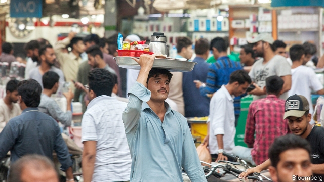

###### Catch 22

# The IMF has agreed to break Pakistan’s fall. Again 

##### Pakistan has borrowed from the multilateral lender as often as Argentina has 

 

> May 16th 2019 

FAMILIARITY, THEY say, breeds contempt. Few countries are as familiar with the IMF as Pakistan, which has previously obtained 21 loans from the fund, as many as Argentina. On May 12th this familiarity deepened further. The government, led by Imran Khan, a former cricketer who heads the Pakistan Tehreek-e-Insaf party, said it had reached a deal to borrow $6bn more over three years. The agreement now awaits formal approval from the fund’s bosses in Washington and the support of other international lenders, including the World Bank and Asian Development Bank. 

The loan will relieve Pakistan’s dollar shortage but do little to improve the IMF’s standing in the country. In return for its money, the fund expects the government to raise tax revenues and utility prices, impose discipline on provincial spending—and let the currency fall, if need be. That will help narrow Pakistan’s wide trade and budget deficits. But it will also curb growth and increase inflation in the short term. 

Targets include cutting the budget deficit (before interest payments) to 0.6% of GDP next fiscal year (which starts in July) from the 1.9% that the IMF reportedly expects for this year. The government has talked about removing tax breaks worth about 350bn rupees ($2.5bn or 1% of GDP) and raising the price of gas and electricity for large consumers. It has pledged to give the central bank more autonomy in its fight against inflation, currently over 8%. It will also let market forces dictate the rupee’s exchange rate, which has been devalued by 18% against the dollar in the past year. 

To ease the public’s pain, the IMF will allow more spending on welfare schemes, such as a cash-transfer programme named after Benazir Bhutto, a former prime minister who was assassinated in 2007. But her son, Bilawal Bhutto Zardari, who now leads her party in opposition, seems unimpressed. After the government this month appointed a former IMF official to head the central bank, Mr Bhutto Zardari accused it of surrendering Pakistan’s autonomy. “How can IMF negotiate with IMF?” he asked. A cartoon in the Friday Times, a local news weekly, showed Christine Lagarde, head of the fund, negotiating with herself. 

In truth, Mr Khan’s government tried hard to keep its distance from the fund. Instead of agreeing to a deal as soon as it came to power last August, it turned for help to friendly countries, including Saudi Arabia (which gave $3bn and deferred a similar amount of oil payments), the United Arab Emirates ($2bn already and more to come) and China ($2.2bn). China is investing heavily in Pakistan’s roads, ports and power plants: the so-called China-Pakistan Economic Corridor (CPEC). Some view this lending with suspicion, seeing Pakistan as a victim of China’s “debt-trap diplomacy”. 

Such an assessment seems premature. CPEC spending may have contributed to the increase in Pakistan’s imports (the country’s current-account deficit exceeded 6% of GDP in the year to June 2018). But because this import spending was presumably matched by an inflow of Chinese capital, it cannot have been responsible for the dangerous dwindling of Pakistan’s foreign-currency reserves over the past year. 

That was Pakistan’s own fault. The previous government maintained an exchange rate that was too strong for exporters and fiscal spending that was too strong for its revenue-raising powers. Restoring stability was always going to require the kind of painful policy reforms the IMF often prescribes and oversees. 

Not that the IMF will find it easy. Pakistan is a regular taker of its loans but not a diligent follower of its advice. Many of the reforms it has just promised have been pledged repeatedly before, including widening the tax net, rationalising utility prices and respecting the central bank’s autonomy. Successive governments have been slow to follow through, afraid of angering powerful domestic constituencies. 

But the IMF has been similarly reluctant to cut Pakistan off, for fear of the upheaval that would ensue. “Governments have tried to ‘game’ the IMF, and achieved partial success each time,” write Ehtisham Ahmad and Azizali Mohammed, former IMF advisers. Pakistan’s public might dislike the IMF less, if they knew how frequently their leaders disregard it. 

