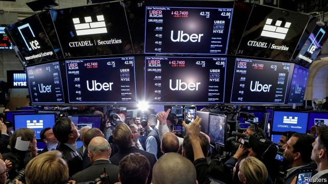

###### NOIPO?

# Uber’s listing and a new stock exchange may herald change 

##### Valley bigwigs think they have found the secret of long-term thinking 

 

> May 16th 2019 

ON MAY 10TH Uber, the world’s biggest ride-hailing firm, listed on the New York Stock Exchange—and promptly tanked. As The Economist went to press it was trading at $41.29, 8% below its listing price. On the first day of trading investors lost about $650m. Some have called it the worst initial public offering (IPO) ever. 

But it could give a boost to fresh thinking on how fast-growing startups should go public. And even as Uber’s first shares were trading, one such innovation got the go-ahead from the Securities and Exchange Commission (SEC), America’s main financial regulator. 

The Long-Term Stock Exchange (LTSE) is based in San Francisco and backed by Silicon Valley luminaries including Marc Andreessen, Reid Hoffman and Peter Thiel. They are animated by the weaknesses of conventional exchanges when it comes to startups. Things such as quarterly results, short-sellers and high-frequency trading distract from building businesses for the long term, says Eric Ries, the LTSE’s boss and the author of “The Lean Startup”. 

Such distractions are not all unwelcome. Public markets can bring discipline to badly governed startups. Short-sellers help keep companies honest. It would probably not have taken them long to sniff out the fraud at Theranos, for instance, had the blood-testing firm been public. 

Nevertheless, the LTSE’s backers are onto something. Startups have been staying private as long as possible and granting shares conferring greater voting rights to their founders when they do finally go public. In turn big private investors, including sovereign-wealth and hedge funds, have pumped billions into “unicorns” (private firms valued at more than $1bn), capturing most of the value they create and leaving little for investors in public markets. 

The LTSE wants to give entrepreneurs stability and smaller investors more of the upside. It aims for listing requirements that will encourage long-term thinking. One idea is to give longer-term shareholders more voting power. Instead of charging for transactions or data, as most stock exchanges do (though some offer rebates), it will charge for add-ons that appeal to startups, says Mr Ries, such as software enabling them to track which shareholders are “tourists” moving in and out and which are “citizens of the republic”. 

He is cagey about specifics, for fear of derailing negotiations with the SEC, which must approve them before the LTSE’s launch later this year or early next. Within the limits set by the regulator and the LTSE’s philosophy, he says, companies should have “maximum discretion” in how they reward investors’ loyalty. The biggest difficulty, says Joseph Grundfest, a former SEC commissioner now at Stanford University, will be finding the right mix of listing requirements—a “sweet spot” where firms’ desire for stability meets investors’ desire for attractive returns. 

Some see the LTSE as a disguised ploy to entrench the power of founders, early investors and, ultimately, the Silicon Valley elite, who would like to take over public markets. But if it becomes attractive established bourses, such as the New York Stock Exchange and NASDAQ, are likely to launch “panels” of firms that sign up to similar listing requirements while continuing to be traded on these exchanges. 

Indeed, instead of fighting the newcomer, incumbent exchanges should be rooting for it. Since a peak in 1996 the number of publicly traded companies in America has fallen by nearly half. The experience of Uber and Lyft, a smaller competitor whose share price has fallen by even more since it floated in March, will have done nothing to make IPOs more appealing. 

Rather, it is likely to speed up efforts under way in both Silicon Valley and New York to avoid IPOs altogether. Listings these days mostly happen to enable early investors and employees with stock options to cash out. But financial whizz-kids are already working on a fair, transparent way to value the shares of fast-growing private companies without taking them public. How about calling it NOIPO? 

