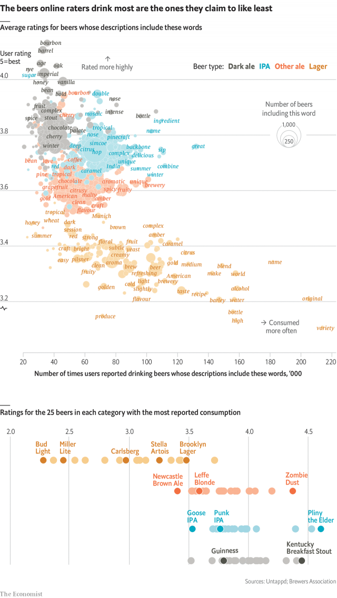

###### Familiarity Fosters contempt

# Why beer snobs guzzle lagers they claim to dislike 

##### The historical dominance of mass-market brands makes them hard to avoid 

 

> May 18th 2019 

CARLSBERG, A DANISH brewery, used to boast that its lager was “probably the best beer in the world”. No longer. In March it began selling a new pilsner—a pale, Czech-style lager—after admitting that drinkers had soured on its original recipe. 

Data from Untappd, a beer-rating site with 7m (mostly American) users, confirm that pontificating pint-swillers turn their noses up at mass-market lager. Among the 5,000 beers its users reported drinking most often, lagers—made with “bottom-fermenting” yeast, which yields a light-bodied, mild brew—are rated 3.29 out of 5 on average. The rest get an average of 3.69. 

Moreover, the lagers online raters like most don’t taste like lager. When grouped by the words in Untappd descriptions (many copied from labels), the best-rated terms are ones mostly used for ale, such as “tropical” and “dark”. Yet despite such poor reviews, the specific beers Untappd users say they drink most often are lagers. Why? 

One explanation is fragmentation. Though reported consumption tends to be higher for individual lagers than for ales, there are far more ales than lagers. As a result, ales account for 73% of drinking of the 5,000 leading beers recorded on Untappd. 

But crowd-sourced data are a poor measure of overall demand. According to IWSR, a research firm, Americans buy six times as much mass-market lager as craft beer. 

Most drinkers are not beer snobs, and even ale devotees might secretly enjoy a frosty lager on a hot day. And most importantly, lagers dominate supply chains. Craft ales abound at organic grocers and hipster bars; Carlsberg (rated 2.96) and Budweiser (2.54) are everywhere. 

Low costs originally gave lager its distribution advantage. Its cold fermentation translates well to large batches, and using fewer hops saves money. In the 19th century these economies of scale let big firms flood America with watery lager. Prohibition reinforced this pattern: most craft houses closed shop for good, while large producers resumed brewing afterwards. 

In recent years the market as a whole has inched closer to Untappd users’ preferences. In 2010-18 American consumption of mass-market lager fell by 12.5%, while that of craft beer doubled—even though craft costs 67% more than lager on average. 

Unfortunately for the beer industry, it sells so much lager that this switch has hurt it. Real revenues in America are down 9% since 2010. Giants like Carlsberg face an extra obstacle. Even if they launch or buy a rich, craft-style ale, snobs may shun it because it was made by a behemoth. 

