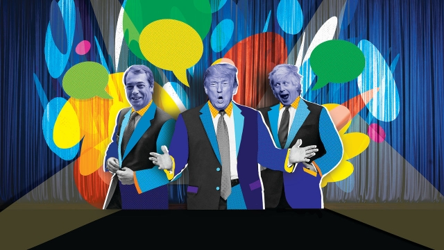
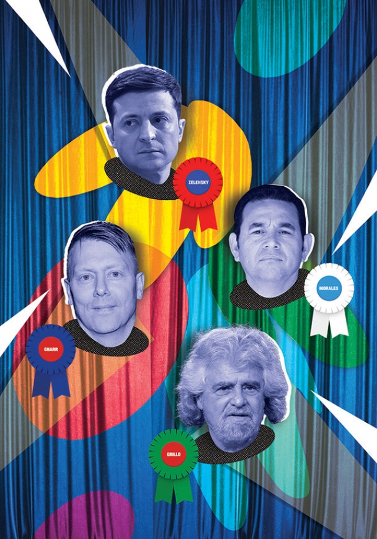

###### Laughing matters

# The boundaries between politics and stand-up comedy are crumbling 

##### Comics are running for office; politicians are trying to be funny 

 

> May 16th 2019 

OF ALL DONALD TRUMP’s beefs with the “mainstream media”, it may be the least likely. Those po-faced purveyors of fake news, claims the president, do not take him seriously as a comedian. “He has a great sense of humour that he doesn’t get credit for,” explains a White House official. 

So, credit where credit is due. The expansive, largely unscripted, disquisitions with which Mr Trump entertains his rallies are less traditional “speeches” than a stand-up comedy routine. Instead of tedious policy pronouncements and fine phrasemaking, his audience is treated to an impromptu circus of gags, pouts, gibes, mimicry and put-downs: “Pocahontas” for Elizabeth Warren, a Democratic senator and candidate for presidential nomination (because of allegations that she exaggerated her native-American heritage); “One Per Cent” for another Democratic contender, Joe Biden (a wildly inaccurate summary of his poll ratings), and so on. 

David Litt, who used to write jokes for Barack Obama, acknowledges that Mr Trump has a great feel for his audience and the “skill-set of a comedian”. In treating politics as a joke-filled prank, Mr Trump is, as so often, right on trend. Ukraine has just gone one better. On April 21st it elected Volodymyr Zelensky, a professional comedian and television star, as president. 

He made his name in “The Servant of the People”, a television show, playing a teacher who accidentally becomes president after a foul-mouthed rant about the country’s politics that goes viral. Mr Zelensky’s real campaign eschewed traditional rallies in favour of comedy performances. One joke became a reliable hit, asking why Petro Poroshenko, the incumbent, wanted a second term in office: “So he doesn’t get a [prison] term.” (It’s the way he tells them.) A stand-up joke likened Ukraine’s attitude to money to a German porn star who “takes it from every side and in any amount”. 

Mr Zelensky is not alone. Last year Slovenia elected a satirist, Marjan Sarec, as prime minister. He honed his talents on a radio programme and spoofing the former prime minister, Janez Jansa, on television. In 2015 Guatemalans elected as president Jimmy Morales, a comedian. Jón Gnarr, a stand-up comic and former punk-rocker, served as mayor of Reykjavik, capital of Iceland, from 2009 to 2014. In the general election last year in Italy, the Five Star Movement, founded in 2009 by Beppe Grillo, another comedian, became the largest party in parliament and part of the governing coalition. 

In Britain the successor as prime minister to the hapless Theresa May may well be Boris Johnson. He is a career politician—a former mayor of London and foreign secretary, and a leading Brexiteer. But an important part of his persona—comic buffoonery—was fixed by his appearances on a satirical news show, “Have I Got News for You”, cementing an image as a flawed but lovably self-mocking man-of-the-people. As mayor, he tickled Londoners with a joke. When Mr Trump called parts of their city “no-go areas”, he retorted: “The only reason I wouldn’t go to some parts of New York is the real risk of meeting Donald Trump.” On the campaign trail, Mr Johnson promised that “voting Tory will cause your wife to have bigger breasts and increase your chance of owning a BMW.” 

Oddly, since he was hardly famed for his sense of humour, it may have been Richard Nixon who began the crossover between politics and comedy. In 1968, just before winning the presidential election, he popped up on a hit television sketch-show, “Rowan and Martin’s Laugh-In” to repeat, in typically lugubrious deadpan, its catchphrase: “Sock it to me”. 

Politicians have long appeared on comedy shows and employed gag-writers to pepper their speeches with jokes. But politics and comedy remained discrete professions. Winston Churchill had a reputation for funny—and withering—put-downs. Disturbed in the lavatory by a message that the Lord Privy Seal wanted to speak to him, he is supposed to have replied: “Tell His Lordship I’m sealed on the privy and can only deal with one shit at a time.” But no one mistook the war leader for a comic. 

The boundaries broke down after the 2008 financial crisis. Reacting to the perceived corruption, incompetence and complacency of the political class, comedians started to lead, as well as reflect, the new populist era. As Mr Gnarr quipped, “when the going gets funny, the funny get going.” This new breed of “cometicians” are primarily insurgents. Comedy is a weapon to destabilise the established political order. In this respect they recall George Orwell’s observation in 1945: “Every joke is a tiny revolution. If you have to define humour in a single phrase, you might define it as dignity sitting on a tintack.” 

Mr Gnarr was among the first to sow the tintacks. Satirising politicians’ promises, his “Best Party” offered free towels at swimming pools and a “drug-free parliament by 2020”. He joined the race for mayor for fun, but with every prank his poll ratings climbed. Since then, some comedians have at times come to be taken seriously. In authoritarian countries, such as Venezuela or Iraq, this means that they are among the first to be persecuted or chased out of the country. In the West, however, they are more likely to be courted by politicians. 

In the French presidential election campaign in 2017 Emmanuel Macron toured the Paris banlieues with Yassine Belattar, a stand-up comedian and the son of a Moroccan cleaning lady and a taxi-driver. His routine takes on touchy issues such as Islamophobia and jihadism. After the massacre at the Bataclan theatre in Paris in 2015, Mr Belattar started his shows with “Don’t be afraid. I know it’s a bit scary to see an Arab bloke walking into a theatre.” 

If the first cometicians were only accidentally successful, their successors have actively cultivated their comedy personas as springboards for office. Mr Trump, like Mr Johnson, appeared as host of one of his country’s leading satirical shows, “Saturday Night Live”. SNL first poked fun at Mr Trump, already host of “The Apprentice”, in 1998. In November 2015, as a contender for the Republican presidential nomination he led the opening segment. He was greeted with rapturous applause by his young, liberal audience, and joshed along with his SNL impersonators. This, and other appearances on late-night shows, such as Jimmy Fallon’s, helped to foster an image of a good bloke who could take a joke. 

Mr Trump, like Mr Johnson, in effect controlled the demolition of his own dignity, thereafter ensuring that he was almost joke-proof. Nigel Farage, leader of the Brexit Party (see Bagehot), pulled off the same trick on “Have I Got News for You” for his former vehicle, the UK Independence Party, gamely laughing along with his fellow panellists when asked to identify UKIP members as either Fruitcakes or Loonies. 

Cometicians also use humour for plausible deniability. As they consciously blur the lines between comedy and politics, so they can try to wriggle out of anything that might return to haunt them. Another UKIP politician has brushed aside criticism of a tweet about raping a female Labour Party MP, saying it was “satire”. When boasts by Mr Trump about sexual assaults on women were caught on tape, he dismissed them as “locker-room banter”. 

Countries such as Britain, America, France and Italy have rich comic traditions, often best known for challenging conventional bourgeois society and conservative norms. This humour tends to be wordy and sophisticated, appealing to a university-educated audience; think of Britain’s “Monty Python’s Flying Circus”, “Not the Nine O’Clock News”, and more recently “The Thick of It”, a satire showing politicians as vain, inept and vicious. Likewise in America with SNL and the “Daily Show”. 

 

Many of today’s cometicians, however, are drawing on alternative, more bawdy comic traditions that the elites disdain. These traditions are often more popular—and, in being defiantly “politically incorrect”, more populist. The culture wars have been played out by the countries’ comics. “Monty Python” was merely a fleeting success compared with the “Benny Hill Show”. Smutty, crass and full of scantily clad women, Benny Hill ran for 36 years, in various iterations, and was exported to 140 countries. The tubby, bespectacled, lecherous Hill remains Britain’s greatest comic export; he is a cult figure in France. 

Sophisticates such as the Pythons, or Dario Fo in Italy, have “punched up”. They provoke laughs by attacking those who at least know how to fight back. In contrast, and despite their “anti-elite” pretensions, many cometicians “punch down”, identifying with the majority by making fun of those at the bottom of the socioeconomic scale, often underprivileged minorities. The Guatemalan president, Jimmy Morales, used to perform in blackface, portraying a bumbling character called Black Pitaya, or Black Dragonfruit. Crude and offensive, Mr Morales claimed that the character was a harmless joke enjoyed by all Guatemalans. Black Pitaya would not even get an airing on American or European television. Mr Morales’s son has recently promised to resurrect the character. 

As president, Mr Obama used to make (extremely gentle) fun of himself before mocking others. In 2011, to an audience of journalists, he devoted an entire skit to the hilarious idea that Mr Trump might one day be president, suggesting that he would turn the White House into a casino with a “Trump” sign on top. The gag somehow seems less funny today. Mr Trump jokes about anyone—even the disabled. When self-deprecation seemed called for in a dinner speech in 2016, he teased the media and his wife instead. (“Michelle Obama gives a speech and everyone loves it…My wife Melania gives the exact same speech and people get on her case.”) 

It is too early to know how the cometicians will fare in office. Like many populists, they defy conventional categories of Left and Right. The Five Star Movement has left-wing policies such as handing out free money, but shares power with the right-wing, anti-immigration League. Some cometicians, such as Slovenia’s Mr Sarec, a rare centrist, have promised to knuckle down to solemn policy wonkery. 

Mr Gnarr was an unlikely success as Reykjavik’s mayor. He took tough decisions (including doubling the price of swimming-pool towels) and cut budgets and jobs to balance the books after the financial crash. Others, such as Mr Morales—and perhaps Mr Zelensky—may turn out to have been useful idiots, helped into office by utterly conventional political forces bent on maintaining the status quo. Mr Morales himself is fending off charges of corruption against himself and members of his family. And Mr Trump? He could well improv his way to a second term. That would be his best punchline yet. 

