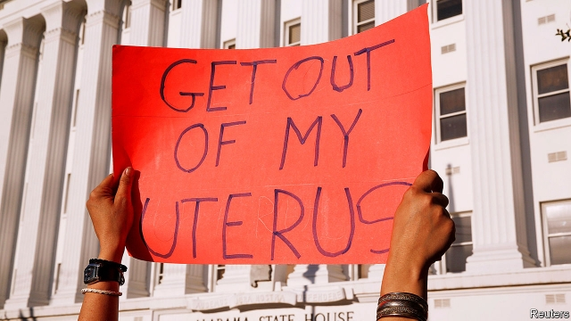

###### Supremely wrong

# A majority of Americans want abortion to be legal in the first two trimesters 

##### That is what the law should be 

 

> May 16th 2019 

IF THE ALABAMA legislature gets its way, abortion will soon become illegal there. A doctor convicted of performing an abortion could be sentenced to up to 99 years in prison. With no exemptions in cases of rape or incest, this would be the most restrictive such law in the country. But other states with Republican-controlled legislatures have passed “heartbeat” laws that are almost as absolute—they ban abortion from 6 weeks, at which point many women do not yet realise they are pregnant. These laws will be struck down by lower courts because they contradict Roe v Wade, the 1973 Supreme Court ruling that made abortion legal throughout America. At which point the court will have to decide whether it wants to look at Roe again. 

In the abortion argument, both sides long ago drove each other to extremes. The pro-life, fundamentalist view behind the Alabama bill is that a fertilised egg is no different from a person, and thus should enjoy the same legal rights. Accept that, and what right does a woman have to take a morning-after pill, or to end a pregnancy after a rape? The pro-choice extreme is that any restriction on abortion is an unacceptable attempt by government to control women’s bodies. With debate gridlocked, the focus is on the courts. 

The latest abortion bills are about two things: preventing women from making a choice that is properly theirs, and getting a challenge to Roe to the Supreme Court where, campaigners hope, they can smoke out the new conservative majority. Were Alabama’s law to come into force, the price would be paid by women too poor or browbeaten to travel to where abortions are legal. Some of them will end up attempting to perform abortions themselves, with drink, drugs or worse. 

Compared with other Western countries, America is not such an outlier on abortion as it sometimes appears. The number of abortions is, thankfully, in long-term decline as the number of teenage pregnancies falls. A large, stable majority of Americans favours keeping abortion legal in the first two trimesters and banning it thereafter, with some medical exemptions: a position that balances the rights of women with the intuition that a fetus able to survive outside the womb deserves some legal protection. This is roughly what the law says in Britain, where controversy about abortion is now largely over. Rather than reflecting public opinion, though, America’s lawmakers have for decades found it more useful to inflame it. 

Alabama illustrates how this happens. As in many other states, the only political competition most Republican members of Alabama’s statehouse face is during primaries and comes from the right. In these races there is no political cost, and considerable advantage, in taking the most extreme position possible on abortion. Thus a fringe idea becomes a litmus test for primary candidates, handing power to a small but highly motivated group of cranks. Meanwhile in Democratic-run places, lawmakers have some reason to fear that anything short of the relatively permissive approach followed in some states since Roe will infuriate their own activists. 

Legislators should be aiming for a law that lives up to a decent ethical standard and commands general consent. But, because they cannot bear to compromise, the only way to resolve their disputes is for the courts to step in. That turns what should be a political decision into a legal one—as it also has with gay marriage and Obamacare. This does double damage to American democracy, first by absolving elected politicians of their proper responsibility to govern, and then by making the Supreme Court seem too politicised, which undermines its legitimacy. 

Whatever the fate of the new abortion laws in the courts, this cycle looks likely to become more destructive. If the five conservative justices voted to overhaul abortion law in a way that contradicted public opinion, then Donald Trump would have fulfilled a campaign promise to appoint justices who will overturn Roe, but at the cost of women’s freedoms and of the further politicisation of America’s highest court. If the justices take up a challenge but rule narrowly against the new abortion laws, activists will go back to their campaigns with the conviction that one more attempt or one more sympathetic member on the court is all they need to win. 

The only way to stop this cycle is for lawmakers to compromise on what most Americans think reasonable. That looks unlikely now. But in democracies problems often look insoluble—until, suddenly, something changes. 

