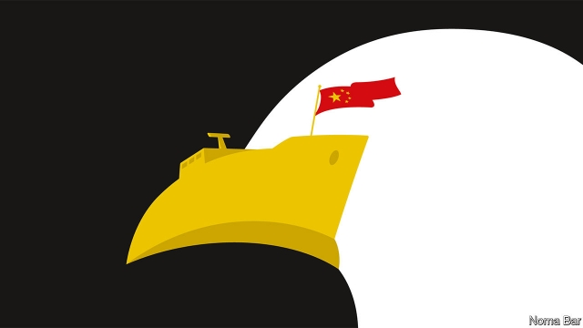

###### China v America

# A new kind of cold war 

##### How to manage the growing rivalry between America and a rising China 

 

> May 16th 2019 

FIGHTING OVER trade is not the half of it. The United States and China are contesting every domain, from semiconductors to submarines and from blockbuster films to lunar exploration. The two superpowers used to seek a win-win world. Today winning seems to involve the other lot’s defeat—a collapse that permanently subordinates China to the American order; or a humbled America that retreats from the western Pacific. It is a new kind of cold war that could leave no winners at all. 

As our special report in this week’s issue explains, superpower relations have soured. America complains that China is cheating its way to the top by stealing technology, and that by muscling into the South China Sea and bullying democracies like Canada and Sweden it is becoming a threat to global peace. China is caught between the dream of regaining its rightful place in Asia and the fear that tired, jealous America will block its rise because it cannot accept its own decline. 

The potential for catastrophe looms. Under the Kaiser, Germany dragged the world into war; America and the Soviet Union flirted with nuclear Armageddon. Even if China and America stop short of conflict, the world will bear the cost as growth slows and problems are left to fester for lack of co-operation. 

Both sides need to feel more secure, but also to learn to live together in a low-trust world. Nobody should think that achieving this will be easy or quick. 

The temptation is to shut China out, as America successfully shut out the Soviet Union—not just Huawei, which supplies 5G telecoms kit and was this week blocked by a pair of orders, but almost all Chinese technology. Yet, with China, that risks bringing about the very ruin policymakers are seeking to avoid. Global supply chains can be made to bypass China, but only at huge cost. In nominal terms Soviet-American trade in the late 1980s was $2bn a year; trade between America and China is now $2bn a day. In crucial technologies such as chipmaking and 5G, it is hard to say where commerce ends and national security begins. The economies of America’s allies in Asia and Europe depend on trade with China. Only an unambiguous threat could persuade them to cut their links with it. 

It would be just as unwise for America to sit back. No law of physics says that quantum computing, artificial intelligence and other technologies must be cracked by scientists who are free to vote. Even if dictatorships tend to be more brittle than democracies, President Xi Jinping has reasserted party control and begun to project Chinese power around the world. Partly because of this, one of the very few beliefs which unite Republicans and Democrats is that America must act against China. But how? 

For a start America needs to stop undermining its own strengths and build on them instead. Given that migrants are vital to innovation, the Trump administration’s hurdles to legal immigration are self-defeating. So are its frequent denigration of any science that does not suit its agenda and its attempts to cut science funding (reversed by Congress, fortunately). 

Another of those strengths lies in America’s alliances and the institutions and norms it set up after the second world war. Team Trump has rubbished norms instead of buttressing institutions and attacked the European Union and Japan over trade rather than working with them to press China to change. American hard power in Asia reassures its allies, but President Donald Trump tends to ignore how soft power cements alliances, too. Rather than cast doubt on the rule of law at home and bargain over the extradition of a Huawei executive from Canada, he should be pointing to the surveillance state China has erected against the Uighur minority in the western province of Xinjiang. 

As well as focusing on its strengths, America needs to shore up its defences. This involves hard power as China arms itself, including in novel domains such as space and cyberspace. But it also means striking a balance between protecting intellectual property and sustaining the flow of ideas, people, capital and goods. When universities and Silicon Valley geeks scoff at national-security restrictions they are being naive or disingenuous. But when defence hawks over-zealously call for shutting out Chinese nationals and investment they forget that American innovation depends on a global network. 

America and its allies have broad powers to assess who is buying what. However, the West knows too little about Chinese investors and joint-venture partners and their links to the state. Deeper thought about what industries count as sensitive should suppress the impulse to ban everything. 

Dealing with China also means finding ways to create trust. Actions that America intends as defensive may appear to Chinese eyes as aggression that is designed to contain it. If China feels that it must fight back, a naval collision in the South China Sea could escalate. Or war might follow an invasion of Taiwan by an angry, hypernationalist China. 

A stronger defence thus needs an agenda that fosters the habit of working together, as America and the USSR talked about arms-reduction while threatening mutually assured destruction. China and America do not have to agree for them to conclude it is in their interest to live within norms. There is no shortage of projects to work on together, including North Korea, rules for space and cyberwar and, if Mr Trump faced up to it, climate change. 

Such an agenda demands statesmanship and vision. Just now these are in short supply. Mr Trump sneers at the global good, and his base is tired of America acting as the world’s policeman. China, meanwhile, has a president who wants to harness the dream of national greatness as a way to justify the Communist Party’s total control. He sits at the apex of a system that saw engagement by America’s former president, Barack Obama, as something to exploit. Future leaders may be more open to enlightened collaboration, but there is no guarantee. 

Three decades after the fall of the Soviet Union, the unipolar moment is over. In China, America faces a vast rival that confidently aspires to be number one. Business ties and profits, which used to cement the relationship, have become one more matter to fight over. China and America desperately need to create rules to help manage the rapidly evolving era of superpower competition. Just now, both see rules as things to break. 

 

