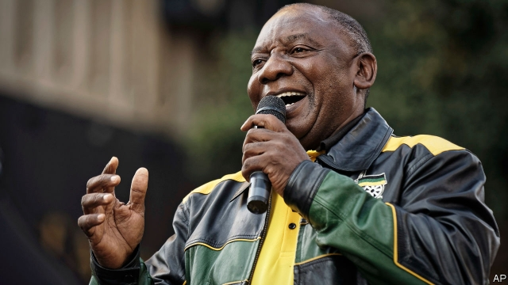
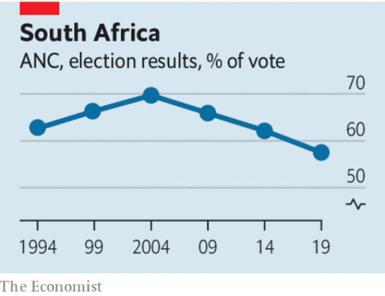

###### Now for the hard part

# Cyril Ramaphosa must put South Africa before his party 

##### But the president has a daunting to-do list 

 

> May 16th 2019 

MOST PARTIES would delight in a sixth successive election victory. But South Africans’ endorsement of the African National Congress (ANC) on May 8th was tepid (see article). The ANC’s share of the vote was 57.5%, the first time in a national ballot that it has fallen below 60%. More important, over half of South African adults could not be bothered to go to the polls. Twenty-five years after the jubilant vote that ended apartheid, South Africans are disillusioned. They are not quite ready to abandon the main party of the liberation struggle, but they wish it was better at running the country. 

The result would have been worse for the ANC had it not been for Cyril Ramaphosa. Pre-election polls showed that South Africans admire their president more than his party. On the day, in each of the nine provinces, the ANC’s share of the vote in the national poll was higher than in the provincial ballot held at the same time, suggesting that many South Africans like Mr Ramaphosa more than the idea of living in a region ruled by his ANC comrades. Although the president is picked by parliament, rather than directly by voters, Mr Ramaphosa has a clear mandate. He must use it. 

He urgently needs to assert his authority in three areas. The first is his own party. The ANC is stuffed with inept and corrupt people. Under Jacob Zuma, Mr Ramaphosa’s predecessor, who governed in 2009-18, state-owned enterprises were looted and crime-fighting institutions subverted. Many of those accused of corruption still hold senior positions in the party, including Ace Magashule, the secretary-general. Mr Ramaphosa needs a cabinet of his own choosing, with fewer members than today’s 36. None of his ministers ought to be beholden to Mr Zuma. The president will be stronger if the most important parliamentary positions, such as whips and committee chairs, are held by those who believe in the cause of reform. 

 

He must also see that corruption is rooted out. Since taking over in February 2018 Mr Ramaphosa has replaced cronies of Mr Zuma with new, clean leaders at institutions such as the National Prosecuting Authority (NPA) and the South African Revenue Service. These organisations need to be fully funded, with priority given to the unit set up within the NPA to go after crimes stemming from the era of “state capture” under Mr Zuma. (It would be good if private-sector lawyers volunteered to pitch in.) With Mr Ramaphosa’s consistent political backing to pursue graft, wherever it is found, these units could make a real difference. 

A sustained anti-corruption drive would help change investors’ pessimistic views of South Africa. The economy is perilously weak; official figures released on May 14th showed that unemployment rose from 27.1% to 27.6% in the first quarter of the year. Output may have fallen during the same period, largely because Eskom, the state-run power firm, imposed the most severe blackouts in its history. Restoring investors’ confidence also requires economic reforms, starting with energy—the third area that Mr Ramaphosa needs to change. Eskom is, in effect, insolvent. The president has a plan to break up its monopoly, bring forward auctions so that renewable energy can add to the grid’s capacity and ease regulations on small-scale electricity suppliers. Much will depend on whether he can follow through with his plan. 

In all of these areas Mr Ramaphosa will face fierce opposition. A hefty minority of his own party does not want him to succeed, lest they lose their illicit incomes or end up in prison. It is possible that his preference for consensus over combat will cause him to fail. But Mr Ramaphosa has faced opposition before, most notably in leading the negotiations with the old white National Party over ending apartheid. Through that process he helped define the powers of the South African presidency. Now he should use them to sweep aside the crooks who captured the state and to restore the rule of law. 

