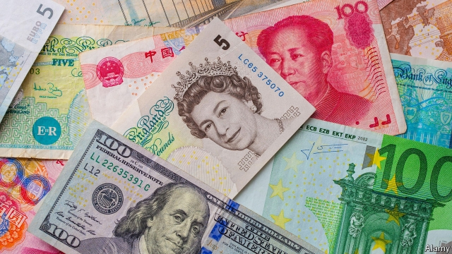
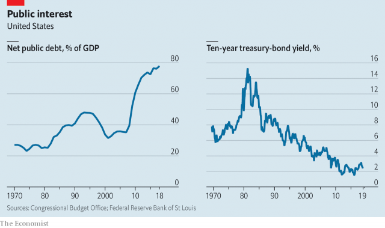

###### Finding balance

# Many governments could bear more debt. That does not mean they should 

##### The risks posed by higher public debt are distant but real 

 

> May 16th 2019 

NOT LONG ago there was a broad consensus that rich-world governments had become too indebted. How times change. Left-wing politicians today say that governments need to spend freely to counter climate change, and should not worry about borrowing more if necessary. America’s Republicans, who not long ago warned of imminent budgetary catastrophe, have in office cut taxes enough to push the deficit above 4% of GDP, despite a healthy economy. Economists, meanwhile, are locked in debate over whether much higher debt-to-GDP ratios might be sustainable (see article). 

Changing attitudes to budget deficits are in part a backlash against the zealous fiscal rectitude that prevailed in much of the rich world after the financial crisis. America began deep and indiscriminate spending cuts in 2013 after a commission failed to agree on alternative measures to contain its deficit. Britain has spent most of a decade chasing balanced-budget targets that were postponed and then partly abandoned. In the euro zone, where currency union leaves countries much more vulnerable to debt crises, austerity pushed Greece into depression, and Germany’s reluctance to loosen its purse-strings has slowed Europe’s economic rebalancing. 

With hindsight, the horror of deficits looks overblown. America will probably enter the next decade with a debt-to-GDP ratio seven percentage points higher than in 2013, but with long-term interest rates roughly unchanged. Japan has gross debts of almost 240% of GDP without any sign of worry in bond or currency markets. Amazingly, even Greek three- and five-year bonds now yield only around 2%. 

In the short term, accurate judgments about fiscal firepower matter because deficits will be an important weapon in the fight against the next downturn. Central banks have little or no room to cut interest rates. The potency of alternative monetary-policy tools, such as bond-buying, is still up for debate. With few other options available, a reluctance to use fiscal stimulus to fight a recession could be self-defeating, because a lack of growth imperils fiscal sustainability at least as much as deficits do. 

In the long term, low interest rates change the dynamics of debt. If growth and inflation together exceed the interest rate, existing debts shrink relative to GDP over time. Happily, this condition holds in many places today. In America it has been the historical norm. The dollar’s dominance of the global financial system results in a seemingly insatiable appetite for safe, dollar-denominated assets. Were the Treasury to issue much more debt, investors would scramble to buy it. 

For the left, especially those who want a “Green New Deal” to fight climate change, this is a reason to cast aside worries about debt and focus on boosting spending. For the right it is a reason to cut taxes today and shrink the government later. 

 

Both attitudes are dangerous. Throwing fiscal caution to the wind runs two risks. The first is that it kills off debate over how to allocate scarce resources, encouraging waste. Although debt-funded investments may be desirable, fiscal free-for-alls are not. The rich world already faces huge upward pressure on health-care and pension spending as societies age. Adding tax cuts and new spending programmes, with their own constituencies to defend and expand them, only makes the eventual necessary compromises harder to reach. 

The second problem with disregarding deficits is that conditions change. Anyone who claims to know with certainty that interest rates will be low for decades to come has not learnt from history that economic paradigms eventually come to an end. When rates rise, heavily indebted countries will find that their budgets are under much greater pressure. Countries can mitigate interest-rate risk by issuing debt at very long maturities today, but indebted nations will always have less room to borrow afresh to fight future emergencies. This applies even in America, because the dollar’s dominance is not guaranteed to last indefinitely. Over the course of this century it could be threatened by the yuan, or even by the euro. When the pound sterling lost its pre-eminence in the early 1930s, Britain, with a debt-to-GDP ratio in excess of 150%, faced a currency crisis. 

Sometimes the risks of debt are worth running. Book-balancing during downturns rarely pays off. Looked at from a global rather than national perspective, climate change is more worrying than fiscal profligacy—although a carbon tax could curb emissions while shrinking deficits. But public debt is not costfree. Fiscal firepower is nice to have, but more often than not it is wisest to keep the powder dry. 

