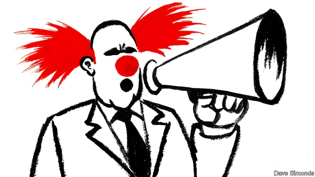

###### You couldn’t make it up

# Some politicians are their own best satirists 

##### Legislators are the unacknowledged comics of the world 

 

> May 16th 2019 

A CURIOUS FEATURE of these turbulent times is the rise of comedian-politicians. Volodymyr Zelensky, president-elect of Ukraine, is only the most recent (see article). But the anti-elite protest propelling comedians into politics is also nurturing comic talent in politicians. President Donald Trump is the master blender of performance and politics, replacing policy pronouncements with a routine of gags and put-downs. But other newcomers are showing talent—if only despite themselves. 

Just as different leaders are inspired by different ideologies, so they lean towards different types of comedy. Vile despots are often their own best satirists. Nicolás Maduro and Abdel-Fattah al-Sisi, presidents of Venezuela and Egypt, find their voice in absurdist humour and their material in economic hardship. Under the hilarious “Plan Conejo” (Plan Rabbit), Mr Maduro set about solving poverty by distributing baby rabbits to the poor. “They will breed—like rabbits,” he quipped. Mr Sisi had the nation clutching its wallets when he suggested that people should fix the country’s fiscal problems by texting him money every morning. He even offered to put himself up for sale. Showing their appreciation of their leaders’ jokes, Venezuelans posted pictures of beribboned bunnies, while some Egyptians placed ads on eBay for one “slightly used field-marshal”. 

Others fall back on verbal wit. The one-liner from Tony Abbott, a former Australian prime minister—“No one, however smart, however well-educated, however experienced, is the suppository of all wisdom”—is among the best in recent memory, though Victor Ponta, former prime minister of Romania, deserves an honourable mention for explaining on television that he lost an election because, in the tricky business of stealing and buying votes, “their system worked better than ours”. But the one to beat is still George W. Bush: “Our enemies are innovative and resourceful, and so are we. They never stop thinking about new ways to harm our country and our people, and neither do we.” 

Sarcasm is politicians’ favoured genre, for it allows them to poke fun at national prejudices. The former Polish foreign minister, Witold Waszczykowski, enjoys taking the mickey out of the nationalist right. “We only want to cure our country of a few illnesses,” he told Bild, a German tabloid. “A new mixture of cultures and races, a world made up of cyclists and vegetarians, who only use renewable energy and who battle all signs of religion.” And it’s not just politicians who have been showing satirical form: in a subtle dig at post-Soviet democracy, the Azerbaijani election commission published the election results the day before voting took place. 

Italy’s transport minister, Danilo Toninelli, has shown promise with his witty commentary on political hypocrisy. When his environmentally conscious party, the Five Star Movement, was pressing the government to use smaller, electric vehicles, Mr Toninelli announced that he had just bought a diesel SUV. But Italy’s current crop of politicians are not in the same league as their former prime minister, who adopted a fantastical persona, “Silvio Berlusconi”, embodying all that was hideous and predatory in Italian manhood, with implausible hair and “bunga bunga” parties at which he frolicked with young women paid to pretend to enjoy his company. Some critics said “Silvio Berlusconi” was too over-the-top to be credible, but the skit was convincing enough to fuel Italian feminism. 

For British self-satirists, class still provides the best material. Lord Young, a former minister, set the tone when he referred to the homeless as “the people you step over when you come out of the opera”, but a younger generation is outdoing him. Jacob Rees-Mogg, a Brexiteer, took pole position as the nation’s most ridiculous toff with a brilliantly crafted denial of the charge that he took his nanny campaigning in a Bentley: “That was wrong. Well, the Nanny bit is right. Of course she came canvassing; she’s part of the family after all...But we took my mother’s Mercedes Estate. I don’t think a Bentley’s a suitable campaigning car.” 

This is a wonderful age for comic performance in public life, but it would be wrong to claim that it is unique. It was Napoleon who once remarked: “In politics, absurdity is not a handicap.” 

