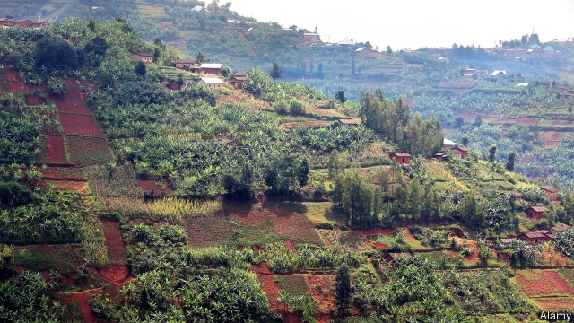

###### After subsistence, what?

# In Rwanda, farming competently is not enough 

##### Even good farmers are one bad harvest away from destitution 

 

> May 16th 2019 

BY AFRICAN STANDARDS, Rwanda is an agricultural success story. Yields of bananas, beans, cassava and maize—the four main crops by land area—have all risen substantially since the turn of the century. Over the five years to 2017, the country’s maize fields were more productive than those in neighbouring Burundi, Kenya or Tanzania, according to the Food and Agriculture Organisation, an arm of the UN. 

A third of Rwanda’s small maize farmers and more than two-thirds of small rice farmers plant improved hybrid seeds in the main growing season, which begins in September. Fertiliser imports are rising; in Western province, an agricultural hub, most farmers use it. Smallholders get sound advice from an army of government-trained “farmer promoters” and from One Acre Fund, a large charity. If you believe the government’s figures, extreme poverty is falling. Even if you do not, more houses have metal roofs and cement floors. 

But talk to Marie, who grows beans and maize on steeply sloping land in the village of Ryaruhanga, and it becomes clear that this is not nearly enough. Although Marie has planted improved seeds and used some fertiliser, her crops have fared poorly. Some seeds rotted in the ground, while others grew slowly because of a lack of rain at a critical time. Necessity has driven her to work as an agricultural labourer, for which she receives a mere 800 Rwandan francs ($0.88) a day. She is struggling to keep her children in primary school. 

Even competent farmers like Marie live close to the edge—a single bad harvest can drive them into destitution. That is partly because their farms are tiny. Rwanda is more densely populated than the Netherlands, with 490 people to each square kilometre. In contrast to the Netherlands, almost everyone is a farmer. Rural population growth means that land holdings are shrinking. A government survey in 2011 found that 52% of farms in Western province were smaller than 0.3 hectares. Six years later the proportion had reached 63%. 

What are smallholder farmers to do? They could up sticks and move to a city. But that may not change their fortunes much. Researchers have found that African cities are less productive than Asian or Latin American ones, perhaps because they lack large industrial employers. A paper by Patricia Jones of Oxford University and others detected a significant wage premium in the biggest cities of Nigeria and Tanzania, but not in other cities in those countries. Only men received the premium. 

A smallholder can try to improve the soil. Like much of western Rwanda, Marie’s land is highly acidic. She has tried adding lime, which helped a little. But lime is expensive and heavy, and pays for itself only slowly. Nor can Marie add much organic matter to the soil, which would help it retain water. In the past she cut grass for a compost heap. Now her neighbours compete for the same tufts. 

The Rwandan government’s policy is to encourage smallholders to grow more valuable crops. It is promoting fruit trees, which can be highly profitable, if slow to mature. One Acre Fund distributed 6m tree seedlings last year. Many were grevilleas, which grow fast and straight and can be used to make furniture or plant supports. Bean farmers can often boost productivity simply by growing the plants up taller poles, says Eric Pohlman of One Acre Fund. 

Not all farmers struggle. A few miles from Marie, Innocent Niyongira grows maize, beans, soya and tomatoes so successfully that he has taken on two workers. He has experimented with plant spacing, finding that sowing maize seeds farther apart produces bigger, more marketable cobs. Having acquired more land, he is thinking of getting into macadamia nuts. How did a man with only five years of schooling become such an excellent farmer? Innocent says that he has been influenced by inspirational stories on the radio, and that he works all the time. Some people are simply better at farming than others. The problem is that poor people in rural areas have almost no alternative. 

