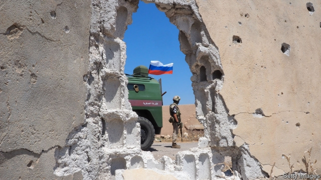
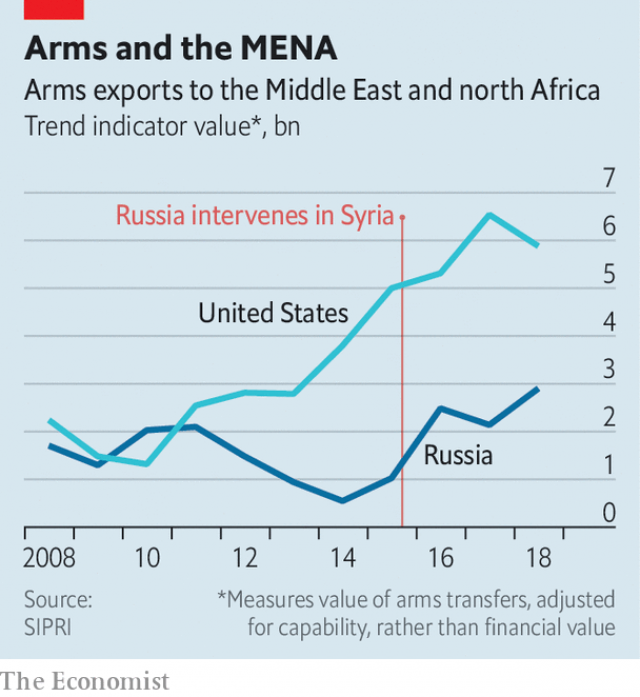
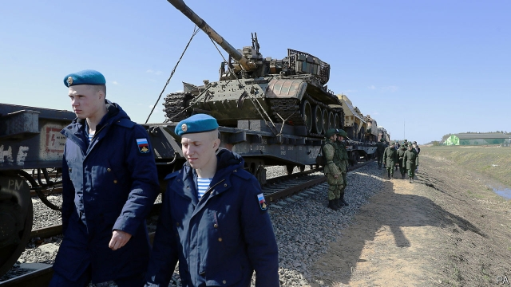

###### Vladimir Putin’s road to Damascus

# Russia’s military gamble in Syria is paying off handsomely 

##### But for how long? 

 

> May 16th 2019 

THE GREAT victory train clattered across eight time zones and back before groaning into a military-exhibition ground outside Moscow last month. It pulled car after car of trophies from Syria, as well as wagonloads of patriotism and conspiracy theories. Here was a pockmarked American-made Humvee; there pickup trucks turned into battering-rams for suicide car-bombers. Various home-made bombs included one hidden in a can of Russian beer. 

Amid the fanfare of military bands, veterans on the platform recounted how Russia had intervened in 2015 to stop Syria falling into the hands of jihadists, notably Islamic State (IS), who had been secretly armed by NATO. “A lot of what you’re seeing here could have been delivered directly by the Americans,” explains one guide. “It’s not just my opinion. Many think so.” Never mind that Russia fought mostly against non-IS groups, or that America did much to crush the IS “caliphate”. 

Another display purported to show a chemical-weapons lab with barrels of precursors labelled in English—an apparent attempt to accuse rebels of using chlorine gas in Douma in 2018. Western powers blamed the regime of Bashar al-Assad and bombed Syrian air bases in retaliation. 

Propaganda aside, Russia is elated by the outcome of its intervention. It saved Mr Assad at relatively small cost to itself, became the kingmaker in Syria and returned as a power-broker in the Middle East for the first time since the dissolution of the Soviet Union. All this is gratifyingly different from the experience of America, whose invasion of Iraq turned into a bloody debacle; or of western Europeans, whose air campaign in Libya to topple its dictator, Muammar Qaddafi, sundered the country. Most important, breaking America’s hegemony in the Middle East shows that Russia is not merely a “regional power”, as Barack Obama once put it, but a global one. 

The “Syrian Breakthrough” tour revives the long tradition of agitpoezd (agit-trains). Stalin, for instance, used them to show off Soviet victories against the Nazis. When the latest train arrived in Moscow, young army cadets clambered onto a tank chanting “To Berlin!” Many Russians—more than one million, according to officials—have come to ogle the loot. “They’re fighting not against some tribesmen shooting arrows, but against people with serious technical capabilities—tanks, armoured vehicles and mortars,” said Anton Sidorov, a salesman and veteran of the Russian navy, who brought his four-year-old son. To stop terrorism in Russia, “we have to battle terrorism outside of our territory.” 

Russia has surprised itself with its prowess. Many Russians recall how the intervention in Afghanistan in 1979 helped destroy the Soviet Union. Russia’s war in Georgia in 2008 exposed many inadequacies, not least the poor performance of the air force. Its annexation of Crimea and its undeclared war in eastern Ukraine in 2014 brought Western sanctions and isolation. 

“The military success was much bigger than anyone expected,” says Fyodor Lukyanov, a foreign-policy adviser to the Russian government. “Russia demonstrated in Syria that it has a degree of efficiency in using military force, compared with the two previous experiences in Georgia and Ukraine. Politically, it was an even bigger surprise.” 

Moscow has turned into a centre for Middle Eastern diplomacy. In 2017 King Salman became the first Saudi monarch to visit Russia. Binyamin Netanyahu, Israel’s prime minister, has met Vladimir Putin, Russia’s president, a dozen times since the intervention. Russian diplomats who spent decades as spectators to America’s management of the Israeli-Palestinian peace process delight in knowing that America must now watch as Russia, Turkey and Iran negotiate the future of Syria. Deaf to warnings of a looming humanitarian catastrophe, the Syrian government, backed by Russian bombers, this month resumed operations to retake Idlib province, the last major area still in rebel hands. 

Strikingly, Russia has been able to keep friends with all sides of the region’s bitter rivalries: Israel and Iran; Turkey and the Kurds; Saudi Arabia and Qatar. For Russian military commanders, the war in Syria has been a proving ground for new tactics and weapons, and a showcase for arms exports. 

Russia and Saudi Arabia struck an unprecedented deal in early 2017 to limit oil output. The so-called OPEC-plus accord has helped lift prices, which fell below $30 a barrel in 2016, to their current level above $60. In Mr Lukyanov’s view, the deal would not have been possible without Russia’s enhanced regional status. 

 

There is a new swagger about Russia in the wider world. Mr Putin has used his Syrian success for advantage elsewhere. He plans to host a summit with African leaders in October, and has sent advisers and private military companies to help some of the continent’s despots. Russia is also helping to prop up the regime of Nicolás Maduro in Venezuela. These days it is America that complains of Russia meddling in its sphere of influence, not the other way round. 

This contest is less the product of ideological conviction than of self-interest. But if America until recently championed democracy, Russia is becoming, in effect, the foremost defender of autocracy—at least in the view of Arab rulers. 

Kremlin-watchers reckon little of all this had been in Mr Putin’s mind when he ordered his forces into Syria. His priority had been to avert the collapse of Mr Assad’s regime, and the risk that Syria might become an exporter of jihadism to Russia. Another reason was to break out of the diplomatic isolation he faced over Ukraine. 

How did Russia succeed where others failed? In part, it absorbed the lessons of America in Iraq, relying mostly on its air power and on local proxies on the ground: the Syrian army, Iranian troops, Hizbullah fighters from Lebanon and others. It also drew on the experience of its Arabists. “Damascus is closer to Sochi than it is to most European cities,” says one Russian think-tanker. “Russia feels a close connection to the Middle East, partly because of the legacy of the Byzantine empire.” 

Israel remembers that the Soviet Union had been the first country to recognise the infant Jewish state de jure, and provided it with vital weapons via what was then Czechoslovakia. Saudis note that the Soviet Union had been the first country to establish diplomatic relations with the new Saudi kingdom in 1926 (alas, the Soviet ambassador was executed during Stalin’s purges). 

Mr Putin is also less troubled than Western leaders are by public opinion or civil-society groups making a fuss about Russia’s actions. He does not ask about democracy and human rights. “We have a common interest in non-intervention in our internal affairs,” says an Arab diplomat. In the view of Arab leaders, Mr Obama forsook Egypt’s dictator, Hosni Mubarak, whereas Mr Putin stood by the vile Mr Assad. Even if Donald Trump is more partial to strongmen than Mr Obama was, they find him mercurial. “We disagree with Russia on many things,” says the diplomat. “But when Putin makes a commitment, he delivers.” Strangely, Israeli and Gulf leaders keep mum about Russia’s role in providing air power to the reviled “Shia axis”; instead, they say Russia is a counterweight to Iran’s influence in Syria. 

 

Perhaps the main reason that Russia can talk to all players in the region is that it is not America. For most of them America remains the all-important protector, so their dismay is all the greater when it appears to be losing interest in them. Israeli and Gulf leaders feared betrayal when Mr Obama negotiated a deal in 2015 to limit Iran’s nuclear programme in exchange for a partial lifting of sanctions. They care much less that Russia is selling Iran civilian nuclear technology, or has set up barter deals to help Iran circumvent sanctions. If the region’s rulers are flirting with Russia, it is mostly to regain America’s commitment. 

Amid the swelling pride in Moscow, there is also much nervousness. Russia’s land may be vast but its economy is only the size of South Korea’s. Real disposable incomes have fallen five years running. For all the shows of patriotism, support for the war is soft: according to the Levada Centre, a pollster, 35% do not approve of Russia’s policy in Syria, against 51% who do. Most think the operation ought to be wound up. 

Opinion could turn more hostile if things go wrong in Syria, which Russian officials know is all too possible. They are learning another lesson from America’s ill-begotten war in Iraq: it is easier to win a short-term military victory than to create a lasting political settlement. Few outsiders want to pay to repair the damage it has wreaked. And Russia is ensnared by its local ally. Mr Assad is strong enough to resist Russian entreaties to make political concessions, but too weak to be threatened without risking his collapse. Then there are more catastrophic risks: a confrontation with Turkey over Idlib, say, or a Turkish invasion to push back Syrian Kurds, or even a war between Israel and Iran. A surprising number of Russian experts worry about the venture “collapsing like a house of cards”. 

In short, the power that Mr Putin tries to project abroad, in the hope that it will enhance his standing at home, is brittle. The multipolar world he has sought to bring about may yet leave Russia on the sidelines; it boasts neither the military power of America nor the economic strength of China. Tellingly, few in Moscow want to see America leave Afghanistan, fearing that might destabilise Russia’s southern flank. 

Right now, Mr Putin may like patriots chanting “To Berlin!” The danger for him is that they may yet start crying: “Bring our boys home!” 

  

