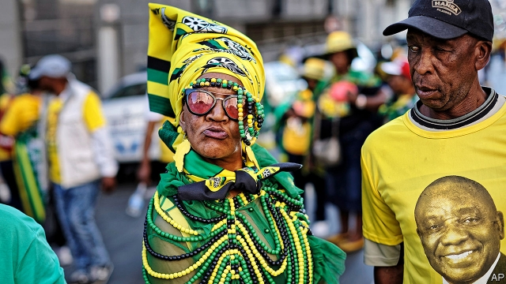
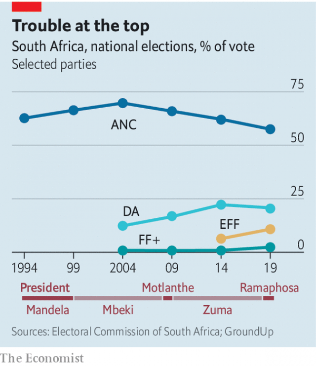

###### Over the rainbow

# South Africa’s election results reflect widespread disillusion 

##### Many voters stayed home; extremists gained ground 

 

> May 16th 2019 

“THIS IS A vote that reminds us of 1994,” said Cyril Ramaphosa as he cast his ballot on May 8th in Soweto, a township on the edge of Johannesburg. According to South Africa’s president, voters “were just as excited as this” 25 years ago. If so, they have a funny way of showing it. 

The first election after the end of apartheid in 1994 saw 86% of adults go to the polls. In his autobiography Nelson Mandela recalled: “The mood of the nation during those days of voting was buoyant.” But in 2019 just 46% of South Africans over the age of 18 bothered to vote. The overwhelming emotion was neither excitement nor buoyancy, but despondency. 

The rainbow nation has suffered a lost decade and a disappointing quarter-century. Under Jacob Zuma, Mr Ramaphosa’s disastrous predecessor from 2009 to 2018, corruption became endemic and the economy stagnated. Average income is lower than in 2013. Levels of unemployment and inequality are among the highest in the world. Many young people feel disillusioned with the post-apartheid settlement. 

All of which could have meant disaster for the African National Congress (ANC), which has ruled since 1994. But Mr Ramaphosa, who, opinion polls suggest, is more popular than his party, helped the ANC to its sixth successive victory in national elections. He also ensured that the ANC kept control of eight of South Africa’s nine provinces in regional ballots. In Gauteng, the most populous province, the ANC’s victory was so slim that Mr Ramaphosa’s appeal almost certainly made the difference. 

 

Yet the ANC’s performance was still its worst ever. The party won 57.5% of the vote, down from 62.2% in 2014. It was the first time that support for the ANC fell below 60% in a national ballot (see chart). The decline can be explained by two trends, says Dawie Scholtz, a psephologist. The first is that, compared with the previous national election, turnout fell by even more in townships, which are mostly black, than in suburbs, which are disproportionately white. Since the vast majority of ANC support comes from the 81% of South Africans who are black, its overall share of the vote was squeezed. 

The second reason is that the ANC won a lower share of the black South Africans who did vote. Mr Scholtz estimates that the party took 79% in 2014, but just 73% in 2019. Most of these “lost” votes went to the Economic Freedom Fighters (EFF), a far-left black-nationalist offshoot of the ANC. 

The EFF won 10.8% of the vote, up from 6.4% in 2014. It is now the second most popular party in three provinces. Given that its base is younger than the ANC’s, it is well placed to do better in future. These voters are not just uneducated young people, as is commonly assumed, but include many students and graduates, too. 

At a polling station near where Mr Ramaphosa voted, Tshego Kgasago, a 28-year-old office worker, explained that while she objected to some EFF policies, such as Zimbabwe-style land seizures, she was voting for the party because it best embodies the idea that black people still get a raw deal. So long as that sentiment endures, the EFF will be a political force. 

The EFF was not the only race-based party that increased its share of the vote. The Freedom Front Plus (FF+) won 2.4%, narrowly surpassing its previous high of 2.2% in 1994, when an earlier version of the party campaigned for an autonomous volkstaat (homeland) for white Afrikaners, the ethnic group that dominated the apartheid state. The party has a green, orange and white emblem, evoking the flag of the South African Republic, which lasted from 1852 to 1902. 

In 2019 the slogan of the FF+ was slaan terug, or hit back, as it appealed to mostly white, conservative voters in the South African hinterland. They are angry at policies such as affirmative action and land expropriation. They are also anxious about what they see as the victimisation of Afrikaners and the alleged failure of the main opposition party, the Democratic Alliance (DA), to stand up for them. The FF+ siphoned off perhaps 250,000 votes from the DA. 

It was probably inevitable that the DA would at some point lose conservative Afrikaner voters to the FF+. What is more worrying for the DA is that it saw its overall share of the vote fall for the first time, to 20.8%, compared with 22.2% in 2014. In part this reflected a failure to make much progress among blacks. It won the support of 4.7% of black voters, estimates Mr Scholtz, just 0.4 percentage points more than in 2014. 

Mr Ramaphosa is a tougher opponent for the DA than an easy target like Mr Zuma. But in recent years the party has made an effort to win over more black voters. This makes sense: it cannot otherwise loosen the ANC’s grip on national politics. Yet its attempt has left it looking incoherent. The DA has long championed liberal policies that would help all South Africans, regardless of race. Today it partially embraces race-based policies such as affirmative action. Its (black) leader, Mmusi Maimane, has spoken of the need to deal with “white privilege and black poverty”. Such moves have proved too much for some erstwhile white supporters, while seeming insufficient (or irrelevant) to potential black voters. Philosophical confusion has, in turn, exacerbated tensions among the party’s ill-disciplined leadership. 

The optimistic take is that these elections showed the durability of South Africa’s political centre. Mr Ramaphosa’s ANC and the DA won nearly four of every five votes. But warning signs for the country’s democracy are flashing. Identity-based parties on the far left and right gained ground, while a majority of eligible South Africans did not even bother to vote. It now falls to Mr Ramaphosa to restore their belief in politics. 

