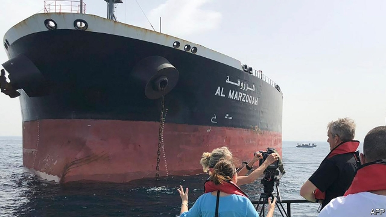
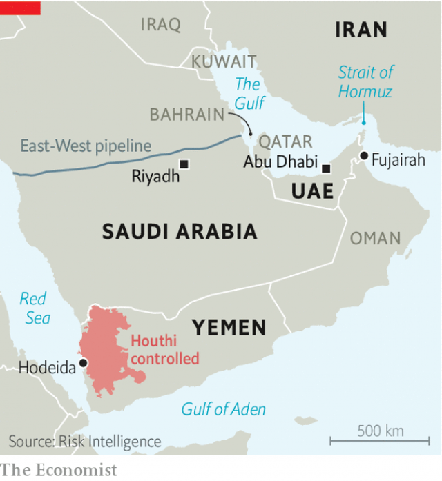

###### Strange manoeuvres

# Tensions between America and Iran worsen 

##### A mysterious attack raises war jitters 

 

> May 16th 2019 

WHEN DONALD TRUMP hired John Bolton to be his national security adviser, he reportedly joked that the mustachioed hawk was “going to get us into a war”. It is easy to see why. When serving under George W. Bush, Mr Bolton embellished intelligence on Cuban and Syrian weapons and lobbied hard for the invasion of Iraq. After leaving government he argued that America should bomb Iran to set back its nuclear programme. Now he is back in government, and on the warpath. 

It was Mr Bolton, not the commander-in-chief, who announced on May 5th that America had dispatched an aircraft-carrier strike group to the Persian Gulf. This was in response to undisclosed intelligence which, unnamed officials claimed, showed that Iran and its proxies were planning attacks on American forces or their allies. On May 9th Mr Bolton reviewed war plans, updated at his request, that call for deploying up to 120,000 troops if Iran attacks or restarts work on nuclear weapons, according to the New York Times. Such planning is not a sign of imminent conflict. But Mr Trump is reported to be telling that joke again, now with more seriousness, as Mr Bolton also ratchets up pressure on Venezuela. 

Some fear Mr Bolton is looking for a provocation by Iran, adding ominous undertones to recent events. On May 12th four oil tankers were damaged in a “sabotage attack” off Fujairah, part of the United Arab Emirates (UAE). Gulf officials claim the ships—two Saudi, one Emirati and the other Norwegian—had holes blown in their hulls, near the waterline. The incident remains murky; as The Economist went to press, investigators were still looking into the blasts. But unnamed American officials quickly fingered Iran or its proxies as the likely culprit, without presenting evidence. Fujairah lies just outside the Strait of Hormuz, a choke point that Iranian officials have threatened to block. 

That was not the only flare-up. This was meant to be a moment of optimism in Yemen. The UN said on May 14th that the Houthis, rebels who control much of the country, had left Hodeida, the largest port. The pullout was a condition of a ceasefire reached last December. 

On the same day, though, the Houthis attacked two oil-pumping stations for the East-West pipeline in Saudi Arabia. The damage was limited, but the blasts were a worrying sign of vulnerability in the kingdom’s vital oil industry. The facilities, more than 700km north of the Yemeni border, were probably hit with long-range drones the Houthis acquired last year. They are fighting a Saudi-led coalition, supported by America, that backs the Yemeni government. The coalition promised to retaliate. Meanwhile, fighting resumed in Hodeida. 

America and Saudi Arabia accuse the Houthis of being Iranian puppets. Although that is an exaggeration, the Houthis have received arms from Iran, which has a record of supporting allied militias—and of attacks on ships. The so-called tanker war between Iran and Iraq ravaged international shipping in the 1980s. 

 

But the timing of the incident in Fujairah, and the speed with which American officials blamed Iran, has raised eyebrows. Max Boot, a hawkish foreign-policy scholar, wondered whether Mr Bolton was “trying to provoke Iran into striking first”. He and others are reminded of the Gulf of Tonkin incident—a murky naval skirmish in 1964 used by America as a pretext for expanding its involvement in Vietnam. 

Some officials have urged calm. John Abizaid, America’s ambassador to Saudi Arabia and a former general, called for a “thorough investigation to understand what happened [and] why it happened”. Mr Abizaid says it is not in America’s interest to have a conflict. Many officials in the Gulf quietly agree. It is not in theirs, either. 

European officials are nervous. Germany and the Netherlands suspended training operations in Iraq. Spain withdrew its frigate from the American strike group heading towards the Gulf. Major General Christopher Ghika, Britain’s senior officer in the American-led coalition against Islamic State, said: “There’s been no increased threat from Iranian-backed forces in Iraq and Syria.” His comments drew an unusual rebuke from America’s central command. On May 15th America ordered many of its diplomats to leave Iraq. 

Tensions are unlikely to abate. Last year Mr Trump pulled out of a deal, made in 2015, that curbed Iran’s nuclear programme in return for economic relief. Now he wants to undermine what remains of the pact. He has restored crippling sanctions on Iran. On May 8th President Hassan Rouhani said Iran would abrogate parts of the deal and gave the remaining signatories—Britain, China, France, Germany, Russia and the European Union—60 days to help Iran’s oil and banking sectors do business abroad. If they fail, Mr Rouhani warned that Iran could resume enriching uranium to higher levels of purity, which would shorten its path to a nuclear bomb. 

Mr Trump, for his part, runs hot and cold on Iran. He has told Iran’s leaders to call him (Mr Rouhani has spurned many such requests). He said the Fujairah incident would be “a bad problem for Iran” if it was involved yet dismissed the reported war plans as “fake news”. If America did go to war, he added, it would send “a hell of a lot more” than 120,000 troops. Such language may cheer Mr Bolton. But it leaves many feeling nervous about a cycle of escalation that looks hard to control. 

