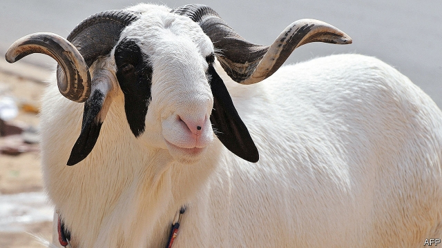

###### Golden fleeces

# Why people in Senegal pay a fortune for fancy sheep 

##### The majestic animals impress the neighbours 

 

> May 16th 2019 

“IF I HAD $100,000, I’d spend it all on sheep,” says Abib Seck, a sheep-dealer. Such enthusiasm is not unusual in Senegal. People there adore sheep. Not only are they delicious, they can also be status symbols. Every year during Tabaski, a religious festival, hundreds of thousands of them are sacrificed (and then gobbled up). Poorer families often take out crippling loans to buy one so they don’t lose social standing. 

The latest craze is for a particularly fancy breed. Ladoum sheep are huge and majestic—rams can weigh as much as three grown men. Startlingly, they are also without wool (which is not a problem in west Africa as it is too hot to wear jumpers). Some Ladoum look more like small horses than sheep. 

They are too valuable to be sacrificed to any god. Instead, dealers sell them to rich folk—businessmen, religious leaders and government ministers—who keep them as pets. They are so popular that there are beauty pageants for them on TV with prizes worth thousands of dollars. At an agricultural fair in Dakar, Senegal’s capital, well-heeled couples check the pedigree of sheep they see as an investment. Several dealers claim to supply the president of Senegal himself. 

Prices for Ladoum sheep have rocketed. New breeders are flocking to the trade. Mr Seck bought his first three sheep in 2016 for a total of $8,500 and bred them. Just one of their offspring, a huge ram called Cronus, is now worth around $70,000, he estimates. In a country where GDP per head is $1,000, some think such prices are shear madness. But Ladoum-lovers insist they are worth it. 

“They make me feel happy,” says Mr Seck. “The breed has a lot of charisma.” He now has over 40 in his home. He employs two men to look after them but still chooses to spend most of his time with them. He says that his wife doesn’t mind because the animals are so lucrative. He frequently sells Ladoum lambs for $2,500-5,000. He hopes to buy a separate house for his ovine chums. 

Breeding such treasures can be perilous. “[Sheep thieves are] our biggest problem,” says Mamadou Touré, another dealer. One night, he says, armed men rammed into his friend’s house and stole six ewes worth $85,000. Whether they will still be worth that much in a year’s time remains to be seen. Some economists think Ladoumania is doomed. 

