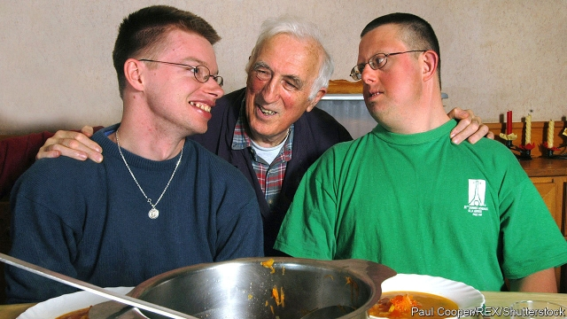

###### The beauty of humans

# Obituary: Jean Vanier died on May 7th 

##### The founder of the L’Arche communities for people with disabilities was 90 

 

> May 16th 2019 

THE VILLAGE of Trosly-Breuil, north of Paris, lay so close to the forest of Compiègne that it seemed about to be engulfed by it. The village mental institution, which Jean Vanier visited in the early 1960s, was gloomier still, a place of horror. With little work to do, the young men sat around for most of the day. They were not allowed to leave the building. Some were violent, and screaming; they were pacified with injections. He was struck by an overwhelming atmosphere of sadness. But amid that sadness shone the beauty of the human beings incarcerated there. 

He made several visits. His spiritual adviser, Father Thomas Philippe, was the chaplain and encouraged him to come. He also paid visits, in those years when he was trying to discern what Jesus was wanting of him, to other places where people dismissed as “stupid” or “idiots” were locked away. In one, built of cement blocks, the inmates spent their day walking round in circles. In another, he found a boy chained up in a garage. Their families and the world had abandoned them. They cried out to be looked on with kindness, called by their name, not despised, but loved. He already knew they would return that love, for he felt it whenever he was among them. And to love was to be with God. 

Feeling he must do something, in 1964 he bought a small stone house in Trosly-Breuil. It was falling to bits, with no electricity or plumbing, but it would serve the purpose. Then he invited two of the young men from the institution, Raphael Simi and Philippe Seux, to live with him there. They would share meals and chores and make a little foyer, like a family. They said yes at once. Philippe had a paralysed leg, a withered right hand and poor eyesight, and repeated himself constantly. Raphael, damaged by meningitis, knew only 20 words, fell often and had fits of anger. Yet in both boys he saw radiance and, most important, tenderness. From his invitation and their acceptance sprang a network of 150 house-based communities in 38 countries, from India to Ivory Coast, from Honduras to Palestine. Here those with mental impairment and those without it live and work together as friends. Each person does what they can manage, whether baking bread or mending tractors or binding books, and everyone has value. Communal meals are at the core of it; as Aristotle said, men cannot know each other until they have eaten salt together. 

He had no professional experience in this sort of care. He had been a professor of philosophy at the University of Toronto (hence Aristotle) and before that a midshipman in the British and Canadian navies, drawn to serve as a teenager during the war. When he set up the house in Trosly-Breuil, in his late 30s, he put aside all ambition for success in the world’s eyes. No more climbing up the ladder, hungry for applause; instead, the tiny joys of a bowl of soup carried without spilling to the table, or an apple crop shaken wildly down on the overgrown garden, or a song sung loudly out of tune. Though his lanky figure towered over “the boys”, as he always thought of his first recruits, he had left behind that life of controlling and commanding people. Now he listened, or spoke softly in a voice inflected by English public school as well as his Canadian parents. He let Raphael and Philippe choose the food and paint the rooms, discovering the gifts they had, laughed at the mess they all made together and, because they were in the same boat, named the house L’Arche, the Ark. It soon drew not only more young people, needing 12 more houses by 1977, but assistants from Europe, North America and South Asia. Support from the French government spread his idea all the faster, though he was careful to insist that no two houses were alike; he feared the dead hand of administration. His life became one of incessant travelling, in his simple blue anorak, to nurture his flowers as they grew. 

For him L’Arche was rooted in his following of Jesus. Whatever was done for the poor, the suffering and the imprisoned was done for him. For Jesus too was vulnerable, and a servant. He was moved especially by Jesus’s washing of his disciples’ feet, and once implicitly admonished a fractious Lambeth Conference by seeing that all 800 bishops present did the same for each other. Though he was not a priest, despite having thought about it, his life of navy- disciplined holiness often seemed as close as a layman could get. In the earliest L’Arche communities his own Catholic practice underpinned the day, and he would often retire to find the “anaesthetic” of quiet prayer. But his arms were wide open to Hindus, Muslims, Jews and those of no faith at all, as long as they acknowledged that at the heart of the universe, bringing everything together, was love; and as long as they could sit, as he did, beside a young man twisted and immobile from birth, repeating to him simply: “Sébastien, you are beautiful.” 

The same message appeared in his lectures and his books, more than 30 of them. Those who were most rejected and despised by society had the most to teach it. Those who seemed weakest exposed the weakness in others. Living with them was not plain sailing, and every L’Arche community kept doctors and psychiatrists on hand. But he found that displays of violence or rage led him to see the sources of violence in himself, instructing him in his own failings and allowing him to grow. And he was constantly inspired by the simplicity and joy of people the world thought crazy, by the amount of time he spent laughing with them (at music practices, or sports days, or the many celebratory meals), by the primacy of heart over head in their responses and the lessons they gave him in tenderness. He and his assistants might be helping them, but it was they who were doing the work of transformation. 

He thought of Pauline, an epileptic with a paralysed arm and leg, who had come to L’Arche-Trosly after 40 years of humiliation by her family and neighbours. For them, she had no value. For him, she was a friend who, despite her bouts of furious screaming, also loved to sing Parisian songs and to dance, even with one leg. Whenever she was not too angry, they would talk. Sometimes she would put her good hand on his head and say gently, “Poor old man!” He knew then that L’Arche was doing its work: in her, and in him. 

  

