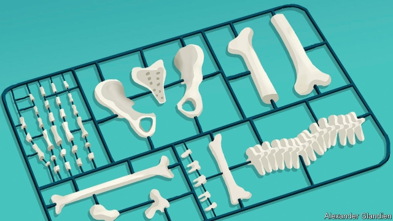

###### Inside the body shop

# 3D printers will make better implants 

##### They create a special surface that fuses with bone 

 

> May 16th 2019 

A ROBOTIC LAWNMOWER keeping the grass neat and tidy outside a modern industrial building in Carrigtwohill, near Cork in Ireland, is a good indication that something whizzy may be going on inside. And so it proves. The airy production hall contains row after row of 3D printers, each the size of a large fridge-freezer. The machines are humming away as they steadily make orthopaedic implants, such as replacement hip and knee joints. Even though several hundred employees’ cars are parked outside, the hall is almost deserted. Every so often a team appears, a bit like a Formula One pit crew, to unload a machine, service it and set it running again to make another batch of implants. 

It is not unusual in modern, highly automated plants to find the workforce distributed like this, with most of them in the surrounding offices engaged in engineering tasks, logistics, sales and so on, rather than on the factory floor. But this two-year-old factory, owned by Stryker, an American medical-technology company, differs from conventional manufacturing in another way as well. It is an example of how 3D printing, which a decade ago was seen by manufacturers as suitable only for making one-off prototypes, is quickly entering the world of mass production. For commercial reasons, Stryker keeps some of the details secret. But the factory, the largest 3D-printing centre of its type in the world, works around the clock and is said to be capable of producing “hundreds of thousands” of implants a year. 

Those made at Carrigtwohill have a feature that is impossible to create with conventional techniques such as casting and machining. Because 3D printing lays down an object layer by layer, complex shapes with intricate internal structures can be built. Stryker uses this facility to print a special porous surface onto the implants. That surface encourages bone to grow into the implant, which secures it more firmly in place. When combined with the precision of robotic surgical processes the firm has developed, this makes replacements more successful, says Robert Cohen, the company’s technology chief. 

Replacing worn and damaged body joints with implants is an old idea. The first hip-replacement operation was performed in 1891, in Germany, by Themistocles Glück, using a ball and socket carved from ivory. And Phillip Wiles, a surgeon based in London, carried out the first successful total-hip replacement in 1938, screwing a stainless-steel joint into the patient’s bone. 

Since then, things have moved on. Cobalt and chromium alloys, along with titanium, are now more commonly employed for implants than steel is. And operating procedures and devices have improved greatly, including the use of hard-wearing ceramic surfaces as bearings. Nevertheless, complications still arise. 

One of the commonest is dislocation—with, for instance, the hip ball coming out of the socket because soft tissue has not healed properly. A loosening of the implant over time is also a frequent problem, causing pain and a need for remedial surgery. That, though, should be helped by the implant’s porous surface encouraging bone and implant to meld, making such loosening far rarer than it was. 

The implants themselves are made by a type of 3D printing called direct-metal laser sintering. The printers are driven by software that takes thousands of digital slices through the design of the object to be manufactured. The process starts by spreading a bed of metal powder onto a special table. A laser then creates the first layer of the object, which can be as thin as a fiftieth of a millimetre, by melting particles of powder in the correct pattern. When this molten metal has solidified the table is lowered and another layer of powder spread. That second layer is then processed. And so on. Once the object is finished it is removed, cleaned and any final machining carried out. Unused powder is recycled back through the printer. 

Stryker is not alone in using 3D printing to make implants. Other companies, including DePuy Synthes, the orthopaedics business of Johnson & Johnson, a giant American health-care group, and LimaCorporate, an Italian firm, also print features intended to enhance bone growth on their implants. Generally, devices such as hip and knee implants can be made in such a wide range of sizes with 3D printing that customised shapes are not required. But some bespoke parts are printed, especially for reconstructive surgery in which patient-specific features are necessary. LimaCorporate, for example, is putting a 3D-printing facility directly into the Hospital for Special Surgery in New York, to produce complex, customised implants. 

Doctors were among the first to use 3D printing, employing body scans to produce anatomical models of organs, which can help them plan operations. That and other medical use has grown rapidly. According to a recent report from Wohlers Associates, a consultancy, the medical and dental use of 3D printing was worth more than $1bn in 2018, 11.5% of the entire market in 3D-printed goods and services. 

Much of this work now involves large numbers. Align Technology, an American firm, prints 17m plastic orthodontic aligners, an increasingly popular alternative to orthodontic braces, every year. Millions of metal copings, used to make dental crowns and bridges, are being churned out by 3D printers owned by companies such as Renishaw, a British engineering firm. 

Wohlers reckons it is only a matter of time before firms start printing ceramic material directly onto the copings, to make complete replacement teeth. Researchers are also coming up with new ways to print tiny scaffolds onto which human cells are grown. These structures can be used for drug testing or, potentially, to grow complete organs for transplant (see article). Making body bits with 3D printers is turning into a big business. 

