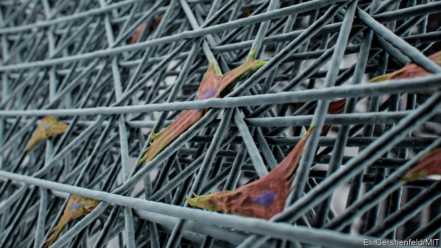

###### Cellular engineering

# 3D printing makes it easier to create tissue for medical research 

##### Drugs can be tested this way, and whole organs may one day be grown 

 

> May 16th 2019 

CULTIVATING CELLS in a Petri dish is a time-honoured way of experimenting on biological tissues. But it is not particularly reliable. The problem is that cells often need specific structural support to function correctly. To provide this, tissue engineers are turning to 3D printers to make tiny bespoke scaffolds onto which cells are “seeded”. This encourages those cells to grow and develop. As research into tissue engineering advances, so too do ways of printing the scaffolds. As two recent examples show, this could lead to better drug treatments for diseases such as cancer, and even to complete artificial organs suitable for transplant. 

Glioblastoma is an aggressive cancer that begins in the brain, and rapidly evolves resistance to drugs. The best chance of treatment is to cultivate, in the laboratory, samples of an individual’s tumour and then bombard these with different combinations of drugs until an effective mixture is found. 

Two South Korean researchers, Cho Dong-Woo of Pohang University of Science and Technology and Sun Ha-Paek of Seoul National University Hospital, have come up with a way to print 3D structures out of glioblastoma cells. These develop into mature cancers within two weeks and can, as the researchers reported recently in Nature Biomedical Engineering, be used to test novel drug cocktails—apparently with success, although existing regulations mean that such drug combinations cannot yet be given the ultimate test, in patients. 

In the second example, Filippos Tourlomousis of the Massachusetts Institute of Technology, working with a team at the Stevens Institute of Technology, in New Jersey, produced a scaffold from polymer fibres a mere hundredth of a millimetre wide—far smaller than most 3D printers can manage. The team did this by drawing the fibres out using an electric field applied between the print nozzle and the surface onto which the fibres were being printed. 

As Dr Tourlomousis and his colleagues report in Microsystems and Nanoengineering, cells stuck well to this scaffold and grew in a uniform way—essential if the technique is to result, ultimately, in a transplantable organ. In particular, the researchers found that certain stem cells (cells which can be coaxed into differentiating into more specialised cells that carry out specific functions) survived on the scaffold for much longer, without losing their properties, than would have been the case if they had been grown in a Petri dish. This discovery could help those trying to find ways of encouraging stem cells to generate tissue and organs for transplant. A bonus is that if the stem cells in question were taken from the patient to be treated, such transplants would be less likely to be rejected. 

