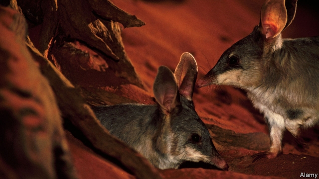

###### Hunger games

# How to train rare animals to avoid predators 

##### Those that do not learn, die 

 

> May 16th 2019 

MORE THAN a score of Australian mammals have been exterminated by feral cats. These predators, which arrived with European settlers, still threaten native wildlife—and are too abundant on the mainland to eliminate, as has been achieved on some small islands which were previously infested with them. But Alexandra Ross of the University of New South Wales thinks she has come up with a different way to deal with the problem. As she writes in a paper in the Journal of Applied Ecology, she is giving feline-awareness lessons to wild animals involved in re-introduction programmes, in order to try to make them cat-savvy. 

Many Australian mammals, though not actually extinct, are confined to fragments of cat-free habitat. That offers the possibility of taking colonists from these refuges to places where a species once existed but is no more. This will, however, put the enforced migrants back in the sights of the cats that caused the problem in the first place. Training the migrants while they are in captivity, using stuffed models and the sorts of sounds made by cats, has proved expensive and ineffective. Ms Ross therefore wondered whether putting them in large naturalistic enclosures with a scattering of predators might serve as a form of boot camp to prepare them for introduction into their new, cat-ridden homes. 

She tested this idea on greater bilbies, a type of bandicoot that superficially resembles a rabbit. She and her colleagues raised a couple of hundred bilbies in a huge enclosure that also contained five feral cats. As a control, she raised a nearly identical population in a similar enclosure without the cats. She left the animals to get on with life for two years, which, given that bilbies breed four times a year and live for around eight years, was a substantial period for them. After some predation and presumably some learning she abstracted 21 bilbies from each enclosure, fitted radio transmitters to them and released them into a third enclosure that had ten hungry cats in it. She then monitored what happened next. 

The upshot was that the training worked. Over the subsequent 40 days, ten of the untrained animals were eaten by cats, but only four of the trained ones. One particular behavioural difference she noticed was that bilbies brought up in a predator-free environment were much more likely to sleep alone than were those brought up around cats. And when cats are around, sleeping alone is dangerous. 

How well bilbies that have undergone this extreme training will survive in the wild remains to be seen. But Ms Ross has at least provided reason for hope. 

