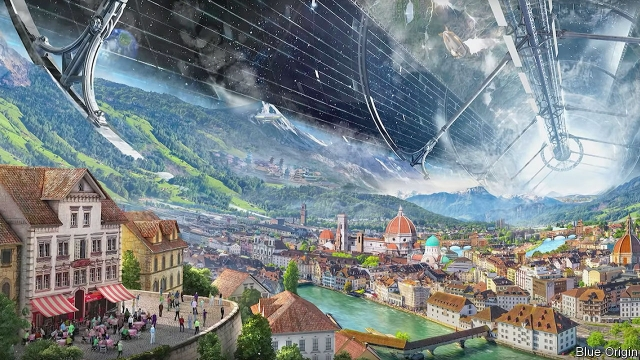

###### Back to the future

# Jeff Bezos’s ambition to colonise space is straight from the 1970s 

##### Big, spinning habitats would support millions 

 

> May 16th 2019 

IT WAS MORE interesting than another quarterly business update. On May 9th Jeff Bezos, the boss of Amazon, had his coming-out party as a space cadet. Mr Bezos, who is the world’s richest man, has long been interested in using his fortune to advance the cause of space flight. His private rocketry firm, Blue Origin, was founded in 2000. But he has been less of a publicity seeker than Elon Musk, the founder of SpaceX and the world’s best-known enthusiast for outer space. 

No longer. During an hour-long presentation, Mr Bezos introduced Blue Origin’s prototype lunar lander, a machine that could be ready, he said, to meet America’s ambitions to return to the Moon by 2024. More striking were his plans for the farther future. Mr Musk wants humans to colonise Mars as an insurance policy should anything happen to Earth. Mr Bezos has no interest in Mars, or indeed any other planet in the solar system, all of which (except Earth) are pretty inhospitable places. Instead, he thinks humans should build their new space-going homes from scratch. 

The idea is not new. Mr Bezos studied at Princeton, and one of his professors was Gerard O’Neill, a physicist. In 1976 O’Neill published “The High Frontier”, a bestselling book in which he sketched out the basic engineering principles of how such space habitats might work. It was exactly those sorts of habitat that Mr Bezos advocated as the way humans would live in the future. 

O’Neill’s book offered three shapes: a cylinder, a pair of cylinders or a torus. All are hollow, with the living surface built on the inside. All rotate, with the centrifugal force felt at the walls standing in for gravity. Sunlight provides both energy—through solar panels—and illumination, thanks to a system of mirrors and windows. And all are on a heroic scale. The biggest are tens of kilometres long and have enough living room for millions of people. 

For that reason, they would have to be built by a species that had already mastered space travel, using resources harvested from the asteroid belt (like Mr Musk, Mr Bezos hopes to drive down the cost of space flight as a first step). They would be strange places to live. The land would curve visibly up the sides of the structure. The superstructure of the habitat would arch across the “sky”. And rotation is not a perfect substitute for gravity, so moving objects would behave oddly, particularly if the habitat were small. But, said Mr Bezos, they also offer several advantages. Climates could be engineered (“Maui on its best day, all year long”). The best bits of Earth could be replicated elsewhere (one of his illustrations, shown below, depicted a space-going version of Florence). 

Their biggest advantage, though, is the sheer amount of living space they would create. Mr Bezos’s ultimate justification for pursuing such megaprojects is his worry about the mismatch between the exponential process of population growth and the finiteness of Earth’s resources. He gave the example of energy demand, which, he says, has historically grown by around 3% a year. He argues that if this were to continue, Earth would, in a couple of centuries, need to be covered completely by solar panels. With the resources of the solar system at its command, however, and thousands of habitats scattered through space, the human population could comfortably grow to a trillion or more. 

Perhaps. It is notable that Mr Bezos’s justifications come from the same era as his proposed solutions. It is a mathematical truism that exponential growth will eventually overwhelm any fixed, finite quantity. Such arguments were most famously applied to natural resources in “The Limits to Growth”, published by the Club of Rome in 1972. Not so much a bold new future, then, but a blast from the past. 

