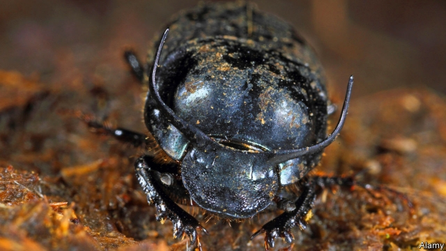

###### Food safety

# Organic farmers’ fields are faeces-free 

##### Because what lives in them is coprophagic 

 

> May 16th 2019 

SO-CALLED ORGANIC crops, grown without recourse to synthetic fertilisers and pesticides, are credited with miraculous properties by many of their fans. Unfortunately, there is little scientific evidence that they are more nutritious than those produced by conventional means. But their supporters argue that the methods used to raise them bring other benefits, too. And here they may be correct. That, at least, is the conclusion of a study by Matthew Jones of Washington State University, in America, which he has just published in the Journal of Applied Ecology. 

Contamination of fresh produce with bacteria-laden wild-animal faeces is a problem in many places. For this reason farmers often remove hedgerows, ponds and other habitats to discourage visits by such animals. That is necessarily (indeed, deliberately) detrimental to wildlife, and also requires the application of more pesticides because it reduces the number of insectivorous birds and mammals around. Dr Jones speculated that an alternative way of dealing with animal dung would be to encourage dung beetles to bury it and bacteria to break it down, and that this encouragement might be an automatic consequence of organic farming. 

To test this theory he and his team dug pitfall traps, baited with pig faeces to lure dung beetles, in 41 broccoli fields on the west coast of North America, a region that grows well over a third of that continent’s fresh produce. They also collected soil samples from the fields in question. Western North America has been the source of several outbreaks of food poisoning caused by toxin-producing strains of E. coli, a gut bacterium. Research suggests these are linked to contamination by wild-boar faeces (hence the choice of pig dung as the lure). Dr Jones focused on broccoli because it is frequently eaten raw, and is thus likely to carry live pathogens into the human gut. 

Of the fields in the study, 15 were farmed conventionally and 26 organically. Dr Jones and his colleagues found from their traps that organic farms did indeed foster large dung-beetle populations, which removed significantly more pig faeces over the course of a week than did beetles dwelling on conventional farms. They also found, by analysing the soil samples, that organic farms had more diverse populations of faeces-consuming microbes than did conventional farms. 

To establish whether high beetle numbers and good microbe diversity really did result in fewer disease-causing bacteria, the researchers followed up their field work with laboratory experiments. In one such they presented three species of dung beetles with pig faeces that had been inoculated with a cocktail of harmful strains of E. coli. One of these species, Aphodius pseudolividus, had no effect on those strains. But the other two, Onthophagus taurus and Onthophagus nuchicornis, reduced pathogenic E. coli numbers by 90% and 50% respectively. 

In a second experiment the researchers presented microbes from the various fields with the same faecal mix. This showed that the bacterial floras of organic farms were much more effective at suppressing dangerous strains of E. coli than those of conventional farms. The order of business, then, seems to be that beetles bury the dung and soil bacteria render it harmless. One up to organic farming. 

