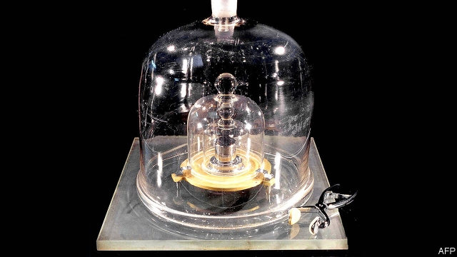

###### Metrology

# The world is about to get a new way to measure itself 

##### The Système International d’Unités is being overhauled 

 

> May 16th 2019 

ON MAY 20TH the world gets a new kilogram. It also gets a new ampere, kelvin and mole. And, more important, it gets a new way of defining all these units—which lie, along with the metre and the second, at the heart of the Système International d’Unités (SI) that human beings use to measure things. Even the pounds, miles, gallons and so on, clung on to by a few benighted Anglophones, are, malgré eux, defined in terms of the SI. 

Measuring anything means comparing it with an agreed standard. Until now, for instance, the standard kilogram (see picture) has been the mass of a lump of metal sitting, nestled under a series of bell jars, in a vault in a suburb of Paris. However, the best sort of standard by which to define a unit is a constant of nature, such as the speed of light in a vacuum. And the metre is indeed so defined—or, rather, the speed of light is defined as 299,792,458 metres per second, and the second itself is defined as the duration of 9,192,631,770 periods of the radiation corresponding to the transition between the two hyperfine levels of the ground state of the caesium-133 atom at absolute zero. The calculation is therefore a simple one. 

The other basic units, the ampere (electric current), candela (luminous intensity), kelvin (temperature) and mole (quantity of particles, such as atoms or molecules, regardless of their mass) are defined in terms of things that can be measured fairly easily in a laboratory. An ampere is proportional to the mechanical force generated between two wires (strictly speaking of infinite length, but let that pass) as a current flows through them. A kelvin is defined as 1/273.16 of the temperature of the point (known as the “triple point”) at which water, ice and vapour exist in equilibrium in a sealed glass vessel. And so on. 

But all that is now to change. From Monday onwards, several other fundamental constants will go, like the speed of light, from being things that are measured to things that are defined, and are then used as references for measurement. 

A kilogram, for instance, will be derived from Planck’s constant, which relates the energy carried by a photon to its frequency. An ampere will depend on the charge on an electron, a kelvin on Boltzmann’s constant (the average relative kinetic energy of particles in a gas, compared with the temperature of the gas) and the mole on Avogadro’s number—6.0221409x1023, originally measured as the number of atoms in a kilogram of a particular isotope of carbon. Only the metre, the second and the candela (already defined in terms of a particular frequency of light) remain unchanged. 

With luck, this will be the last change ever needed to the system. By definition, the fundamental constants of the universe do not alter with time or place. Neither, even in America and Britain, need the SI. 

