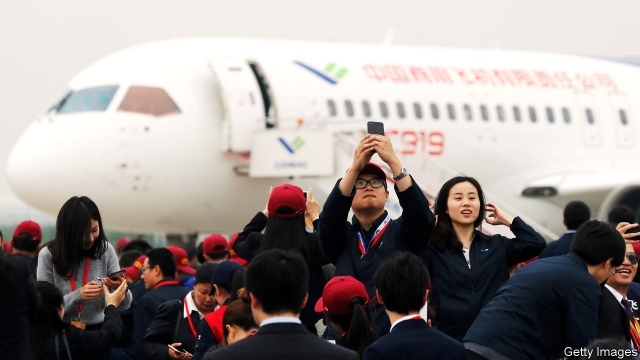
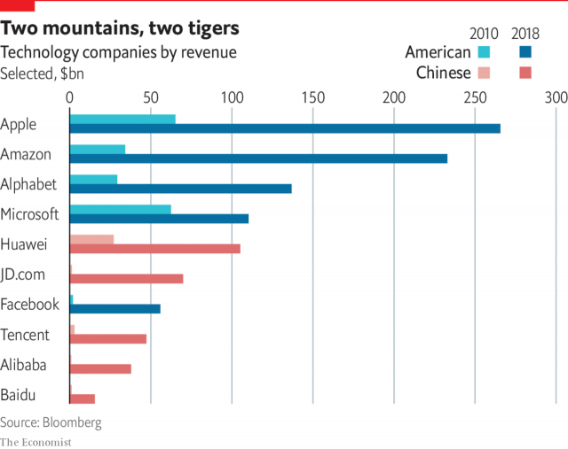

###### Competing in technology

# America still leads in technology, but China is catching up fast 

##### Commercial competition is turning into a zero-sum contest 

 

> May 16th 2019 

A RARE THING happened in an industrial park near Washington, DC, last November. Construction began on a $3bn extension to a semiconductor foundry owned by Micron Technologies, a maker of advanced memory chips, based in Idaho. “A few years ago, opening that sort of extension would have people saying, well, that is going to be moving to China soon, isn’t it?”, observes James Mulvenon, an expert on Chinese cyber-policy and espionage. 

Not now. Instead, that Micron foundry is a glimpse of the future. Trust in China has collapsed among American government and business bosses, and a consensus has grown that Chinese firms have closed the technological gap with Western rivals with indecent speed and by illicit means. 

Today’s tensions make the original cold war look simple. In 2018 China accounted for 57% of Micron’s net sales. In the 1960s and 1970s American tech companies did not rely on Soviet customers. But Micron is a symbol, several times over, of how commercial competition is turning into a zero-sum contest, in which one side wins at the other’s expense. In 2015 Micron rebuffed a $23bn takeover bid from a Chinese state-backed investment fund, saying that it thought such a deal would be blocked on national-security grounds by the Committee on Foreign Investment in the United States (CFIUS). In 2018 the Department of Justice indicted a state-owned Chinese firm, its Taiwanese partner and three individuals on charges of stealing trade secrets relating to Micron’s memory chips—technology worth tens of billions of dollars. That followed lawsuits and countersuits in which the accused Chinese firm asserted that it owned the relevant patents in China and was therefore Micron’s victim. A Chinese court sided with it, then Micron was hit with an antitrust probe. 

China hawks in Washington say the zero-sum game is about broken laws. “Put plainly, China seems determined to steal its way up the economic ladder at our expense,” declared Christopher Wray, the director of the FBI, on April 26th, adding that nearly all the agency’s 56 field offices are working on economic spy cases “that almost invariably lead back to China”. Between March and November 2018, the Department of Justice indicted a dozen individuals and entities it says were directed by the Chinese government to obtain commercial secrets from 15 companies, predominantly in aerospace and high technology. 

Others say the zero-sum game involves broken promises to American workers. They recall American political leaders assuring workers that high-value manufacturing would stay in America, even as globalisation carried cheap jobs to China. 

Using his chairmanship of the Senate committee on small business and entrepreneurship as a bully pulpit, Senator Marco Rubio of Florida in February issued a report condemning China’s plans to become a global powerhouse in ten high-tech fields, from artificial intelligence (AI) to aviation, as laid out in the “Made in China 2025” (MIC2025) plan issued by the State Council in 2015. Should America let China become the global leader in innovation and manufacturing, “this would be an unacceptable outcome for American workers,” Mr Rubio writes in his report. 

In a mark of these populist times, Mr Rubio is not afraid to argue that government has a direct role to play in defending blue-collar factory jobs. Manufacturing provides more stable employment than services, the Rubio report avers. It urges America to use industrial policies, including tax changes and export controls, to defend industries from robotics to tractor-making. 

Not all senators are as vocal as Mr Rubio, nor as keen on export controls. But deepening distrust of China is a bipartisan norm in Congress. The views of American businesses in China are a bit more nuanced, as shown by the 2019 business-climate survey of the American Chamber of Commerce there, issued in February. Nearly 70% of firms say they are profitable. Still, there are warning signs. In the AmCham survey, half of all American technology firms say they limit investments in China because of inadequate protection of intellectual property (IP), even after years of Chinese promises to get serious about it. 

China has become tougher on acts of piracy, from fake consumer goods to breaches of patents. But foreign executives still tell horror stories about pressure to share secrets with local partners and cyber-attacks on company servers back home. Depressingly, 13% of member firms in the AmCham survey said that their greatest IP risk was theft by their own employees. 

There are several ways in which economic competition can become zero-sum, and all can be seen in China today. Theft is just one. Another is the pursuit of import substitution, aiming to replace imports with domestic alternatives, by fair means or foul. America is in a funk about losing its edge, but it is still home to global champions from aerospace and semiconductors to software and self-driving vehicles. Its officials worry that MIC2025 commits China to being world-class in all those sectors. 

Since 2015 supporting plans and road maps published by government research agencies set out hundreds of market-share targets for Chinese firms, declaring, for instance, that 80% of electric or hybrid “new energy” vehicles sold in China must be domestically produced by 2025. Chinese officials, facing a worldwide backlash, now downplay those targets. Strictly-censored state media have stopped using the term MIC2025. But the policy itself has not been repealed. Speeches by party chiefs ring with calls for “self-reliance” and “indigenous innovation”. Other Chinese technology sectors are being encouraged to comply with a policy called “civil-military fusion”, a national strategy backed by top leaders and funding from opaque national-security budgets. 

That militarisation of some Chinese technology imposes costs as well as benefits, notes Mr Mulvenon. Those costs include the risks for Western firms of doing work that supports the brutal techno-dystopia that China has built in Xinjiang. “The good news is that the Chinese are going to discover that autarky is hard,” says Mr Mulvenon. Americans have watched China stealing and reverse-engineering one generation of technology, he says, then having to steal the next after failing to master the underlying science. “That model is incredibly inefficient.” 

China is willing to spend what it takes, showering would-be champions with billions of dollars in subsidies and prodding local firms to place orders. Among the beneficiaries is the Commercial Aircraft Corporation of China, whose C-919 commercial airliner is intended as a direct competitor to Boeing’s 737. State planners have set a goal of a 10% domestic market share for Chinese airliners by 2025. The C-919 has had teething troubles, making that timetable ambitious. But success for China could quickly feel zero-sum in America, whose top export category to China in 2017 was civilian aircraft, worth $16.3bn. The Rubio report laments that at least ten American firms supply vital parts to the C-919. 

 

China has created big brands in such fields as electric vehicles and batteries, in part by shutting foreign rivals out. Protectionist barriers have also allowed Chinese internet firms to grow. In 2009 the ten largest internet companies by revenue were American. Now several are Chinese (see chart). 

Still, it is a mistake to exaggerate China’s strengths in big-data analysis and AI, according to Dieter Ernst of the East-West Center, a think-tank in Hawaii. A near-total lack of privacy protection may help sweep up lots of data, but American firms are better at advanced algorithms that make AI less dependent on big data sets, Mr Ernst wrote. Big Chinese applications are still mostly powered by American-designed chips, which remain world-beating. 

America has other advantages. Joy Dantong Ma of MacroPolo, the in-house think-tank of the Paulson Institute, examined the origins of leading speakers at the most prestigious AI gathering. Most came from American universities and tech firms, she found. Crucially, though, more than half those American stars were foreign-born. Team Trump’s visa clampdown imperils that. 

Some forms of competition can be fair but still end with the gains going mostly to one side. Notably, some technological fields give a “first-mover advantage” that offers huge rewards to countries or businesses that take an early lead, allowing them to set standards that later entrants have little choice but to follow. In April the Defence Innovation Board, a Pentagon advisory committee of Silicon Valley luminaries, issued a report warning that China is on track to pull off this feat in the race to dominate 5G mobile telecommunications. This next generation of wireless technology promises to revolutionise existing industries and invent whole new ones with data speeds about 20 times those of 4G. 

A decade ago American firms took an early lead in 4G, setting standards for new handsets and applications that spread worldwide. That dominance helped Apple, Google and other American businesses generate billions of dollars in revenues. China learned its lesson, investing $180bn to deploy 5G networks over the next five years and assigning swathes of wireless spectrum to three state providers. In America the same part of the spectrum is largely off-limits commercially because it is used by the federal government. American firms are experimenting with a different part of the spectrum that has some advantages under laboratory conditions but is easily blocked by buildings and trees. For this reason, in spite of American pressure on allies, much of the world is likely to adopt China’s handsets, chips and standards, the Pentagon board concludes. Since America’s armed forces are expected to operate worldwide, they must prepare to send data through a “post-Western” world of wireless technology and through “zero-trust” networks, studded with components from such Chinese firms as Huawei. That will mean more focus on encryption and security. 

Some technology contests look more benign. As China and America wall off their respective digital markets from one another, each will look for growth in the rest of the world. A divided world wide web, or “splinternet”, is already a reality, as China’s internet grows behind a great firewall of censorship. American champions like Amazon are promoting payment services in India. China’s Alipay service is active in Brazil. China is exporting surveillance systems and censorship algorithms to police states from Ethiopia to Venezuela. With a change in direction, America could make a virtue of an internet that respects privacy. Western biomedical firms and gene-editing laboratories could make a virtue of stricter ethics. 

It is unhelpful that Mr Trump is a techno-curmudgeon. He has proposed budgets that slash scientific-research funds, though Congress reversed them. After two recent crashes of Boeing 737 Max airliners, he tweeted that “airplanes are becoming far too complex to fly”. Still, last year Mr Trump signed a bipartisan bill authorising $1.3bn for quantum-computer research. The aim is to keep ahead of Chinese work on computers that harness the laws of quantum physics to achieve processing speeds out of a science-fiction film. America leads this field, but Xi Jinping deems it a national priority, quizzing scientists who have returned from quantum laboratories in America and Europe. Should China succeed, it could develop almost unhackable satellite communications and quantum radar to detect the stealthiest planes and submarines. 

Such a success would turn a technology contest into an arms race. America would then have to decide whether this China can be deterred or whether one day it might use its new capabilities. 

China is on track to dominate 5G mobile tele- 

communications 

China is on track to dominate 5G mobile tele- 

communications 

