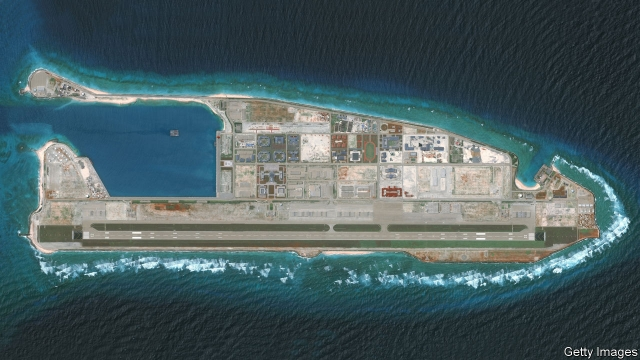
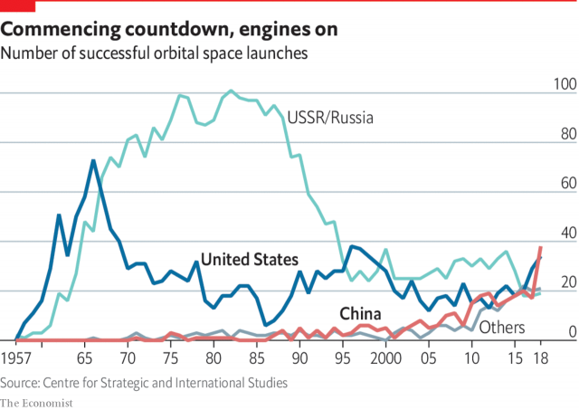

###### Military development

# America’s military relationship with China needs rules 

##### Armed forces are so different now that a framework for engagement has not yet caught up 

 

> May 16th 2019 

BEEP, BEEP, BEEP went the first satellite to orbit Earth, the primitive Sputnik 1, launched in 1957. No matter that it could do little else. That Soviet communists had won the first space race sparked an American crisis of confidence. This had useful effects. Abroad, America strengthened such alliances as NATO. At home, vast sums were poured into science. The Sputnik crisis felt like a loss of innocence—the enemy was overhead. But the actual Soviet threat had not changed much. The Soviet Union was, as before, a nuclear-armed foe, bent on spreading a rival ideology. 

Now America is having a crisis of confidence about China, and the cause is not one Sputnik moment but many smaller ones in a row. Talk to strategists in America and China—military officers, politicians, business bosses and scholars—and it is shocking how many say the chances of a limited conflict are underestimated. 

In part that is because China’s armed forces are catching up fast. America spent 17 years becoming expert at sending drones to find and kill individual terror suspects half a world away. Meanwhile China retired old Soviet weapons and acquired advanced fighter planes and warships. It invested in anti-ship missiles to increase the cost to America of intervention in its near seas, and in fleets of submarines (though its subs are still noisy compared with America’s). It fortified small islands and reefs in contested waters of the South China Sea with missiles, radar domes and runways (pictured). President Xi Jinping urged the navy to develop an ocean-going mindset, now that ties of commerce and security bind China—for millennia an inward-looking, agrarian power—to the sea. China has a lead in hypersonic glide weapons, travelling at a mile a second, against which aircraft carriers currently have no reliable defences. Ask about China’s weaknesses, and American officers will mention rigid chains of command which give little autonomy to junior officers. They wonder, too, whether different services could work together in complex missions such as invading Taiwan, the democratic island that China claims as its own. 

All-out war for Taiwan is not the most urgent flashpoint. The latest China Military Power Report, sent annually to Congress by the Pentagon, sees “no indication China is significantly expanding its landing-ship force necessary for an amphibious assault on Taiwan”. Instead, planners fret about efforts to push America out of China’s near seas and beyond the “first-island chain” that includes Japan and Taiwan. American ships and planes regularly exert legal rights to cross the South China Sea, triggering Chinese responses that could escalate unpredictably. 

This era of doubt even has its own emblematic Chinese satellite, the Shijian 17. Officially an experimental craft, testing new propulsion systems and imaging devices for spotting space debris, American scientists and military leaders have watched the SJ-17 perform remarkable manoeuvres since its launch in 2016, scooting between three different Chinese satellites high above the Earth and parking itself within a few hundred metres of one of them. China, like America, is becoming skilled in the dark arts of anti-satellite warfare. It first tested a satellite-destroying missile in 2007, strewing debris in space, and is thought to have tested anti-satellite lasers and jammers. Last year Mike Pence, the vice-president, included “highly sophisticated” Chinese satellite manoeuvres as one of the reasons to set up a “Space Force”, a new service branch drawing on a broad range of specialists. 

Strategists talk about the difference between capabilities and intentions. Alarm at China is eroding that distinction. When the US-China Economic and Security Review Commission, a congressional oversight panel, held a hearing on China’s space programmes last month, a Pentagon representative, William Roper (the assistant air force secretary for acquisition, technology and logistics), noted that the commission was really asking whether America is in a strategic competition with China in space. “I hope you conclude ‘yes’,” he told them. Noting America’s vast lead in space—it deploys more than half the world’s declared spy satellites—Mr Roper asserted that “countries like China have already demonstrated their intention to escalate hostilities into space.” 

 

President Donald Trump takes the idea of a Chinese space challenge seriously, says Michael Pillsbury, an outside adviser to the White House. “The Space Force is all about China.” He expresses dismay at China’s 38 orbital launches in 2018, surpassing America’s 34 (see chart). “That shouldn’t be happening.” 

The mood of alarm is bipartisan. A space-threat assessment published in April by the Centre for Strategic and International Studies, a think-tank in Washington, DC, opens with a warning from Jim Cooper of Tennessee, a Democrat who chairs the House subcommittee that oversees the space programme: “The risk of a space Pearl Harbour is growing every day…Without our satellites we would have a hard time regrouping and fighting back. We may not even know who had attacked us, only that we were deaf, dumb, blind and impotent.” 

Chinese experts suspect unseemly panic. After all, America tested its first anti-satellite weapon in 1959, and most of China’s space feats, from manned flight to the creation of a network of navigation satellites, were pulled off by America decades ago. 

A leading maritime strategist, Hu Bo of Peking University, complains that Americans have the bad habit of treating China’s intentions and capabilities as one and the same, perhaps because they consider Chinese power “inherently evil”. As soon as China has a missile with the range to hit the island of Guam, America charges that China is “threatening Guam”, he adds. By the same logic Beijing is in peril, as it lies within range of American bombers and missiles. “But China doesn’t go around claiming that the United States is threatening Beijing.” Mr Hu sees an America that had grown used to feeling invulnerable. 

A common complaint in Chinese national-security circles is that America’s mood has turned very suddenly, even though China’s core interests, from its territorial claims over Taiwan to preserving its one-party system, have not changed in decades. 

America has changed, a lot. The National Security Strategy (NSS) of 2006 declared that America “seeks to encourage China to make the right strategic choices for its people, while we hedge against other possibilities.” The NSS of 2017 calls engagement mostly a failure, and charges: “China seeks to displace the United States in the Indo-Pacific region, expand the reaches of its state-driven economic model and reorder the region in its favour.” 

Chinese security experts assume that the explanation is simple, and lies in China’s growing military and economic “hard power”, says Zhao Tong of the Carnegie–Tsinghua Centre for Global Policy, a Beijing-based think-tank. He sees a flaw in that argument, however. America’s mood change was swift, China’s rise gradual. Mr Zhao has a somewhat different explanation. It is not just that China is stronger, but that it has become more willing to show off that strength—an assertiveness connected to a renewed emphasis on ideology in Chinese domestic politics. That made the world realise that China is not about to embrace anything resembling Western values, Mr Zhao suggests. 

Other misunderstandings lurk. When smaller neighbours complain that China is threatening them, Chinese security folk are convinced that America must have put the tiddlers up to it. The way they tell it, when China acts tough it is in self-defence, showing that it cannot be pushed around. “I am very anxious, because China has not acquired the capacity to look at issues from the perspective of others,” says Mr Zhao. 

International-relations scholars call the most lethal forms of misunderstanding a “security dilemma”. It can arise when one state takes defensive actions which are mistaken for acts of aggression by another, making all sides less safe. America and China risk such dilemmas today, especially in novel fields of competition. 

If strategists spend time counting anti-ship missiles and studying China’s new marine-combat units, they also spend much time thinking about assets and weapons that cannot be seen and for which no rules of war exist, from cyber-weapons to compromised supply chains. Nowhere is this truer than in cyber-warfare, a field so shadowy that China and America do not even agree on basic definitions, such as what constitutes an unacceptable act. Some sound almost nostalgic for the grim but familiar doctrines of the East-West nuclear stand-off during the original cold war. 

Away from the din of daily headlines about trade wars and tariff fights, discreet efforts are under way to see if America and China can agree on some basic norms and principles to avoid disastrous clashes or miscalculations in the cyber-domain. These efforts explicitly take historic nuclear arms talks as a model, reviving such half-forgotten cold-war phrases as “confidence-building measures” and “no first use” pledges. 

American and Chinese think-tanks have held quiet meetings to talk about actions so disastrous that both countries might be willing to forswear them. The Carnegie Endowment, based in Washington, DC, has suggested a ban on attacks against command-and-control systems governing nuclear forces, and “extreme restraint” over undermining trust in flows of financial data vital to global stability. A group of government experts convened by the UN has proposed a norm against attacking critical infrastructure, like dams or power grids. Big technology companies and business leaders have begun debating lists of actions that could become as taboo as mustard gas or anthrax in the physical world, such as testing cyber-weapons “in the wild”, in computer networks connected to the outside world. 

Trust is proving a stumbling block to cold-war-style treaties to outlaw such tools. Unlike nuclear warheads, cyber-weapons cannot be counted, and their destruction can never be verified. To date, Chinese experts and officials have proved reluctant to talk about how China’s cyber-warriors operate. America disagrees with China about which forms of cyber-espionage, though annoying for rivals, are to be expected. America draws the line at government spying that steals trade secrets and hands them to favoured companies. China promised to stop such spying in a 2015 agreement between President Xi Jinping and Barack Obama, but American officials insist that the pledge has been broken, with China merely trying harder not to get caught by putting operations under its main spy service, the ministry of state security. 

Navigating this new world of known and unknown attacks may require both sides to make painful concessions. In October 2018 a retired colonel from the People’s Liberation Army, Lyu Jinghua, and a former Israeli atomic-energy official, Ariel Levite, published a proposal for a grand cyber-bargain in China Military Science, a PLA-sponsored academic journal. The paper suggests that America recognise China’s right to police and censor its own internet aggressively, dropping any insistence that the internet should be a place of free speech and inquiry worldwide. In return, it proposes that China’s cyber-police use their formidable powers to prevent and punish cyber-attacks launched from Chinese territory. 

Such proposals lack the drama of America’s response to the Sputnik shock, a space race that put man on the moon and spurred inventions vital to modern life. But the Sino-American confrontation must be managed. Arguably, it already amounts to an undeclared cyber-war. Both sides have overriding interests that can be listed and compared. Maybe one day those lists will become a treaty, making the world safer. Alas, that day has not come yet. 

