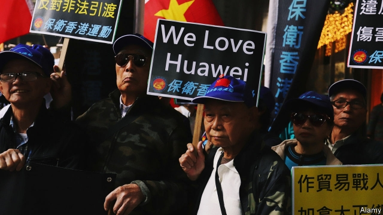

###### The view from Beijing

# In Beijing, views of America have become deeply cynical 

##### Many officials are frustrated with Donald Trump 

 

> May 16th 2019 

SPEND ENOUGH time with Chinese scholars and officials who study America, and comparisons will at some point be drawn between China’s relations with America and a bad marriage. It is a revealing analogy. China has interests in other continents, but America is an obsession. Marriage metaphors capture the lingering admiration mixed with envy and resentment that China’s elite harbours for its global rival. In the Trump era, however, a dangerous new emotion is increasingly surfacing: contempt. 

Powerful Chinese officials have few incentives to talk to outsiders. But some cadres and scholars known to brief government and party bosses do speak off the record. Leaders are selectively candid with foreign counterparts, and maintain ties to retired Western grandees. It can be said with confidence that China’s ruling classes claim to be deeply frustrated by the America that elected President Donald Trump. It is called a sore loser and a dangerous spoiler, not only unwilling to play a leading role in the world but livid if China becomes more active. 

According to this line of thought it is, for instance, maddening to hear America complain about China’s ambitions for the Belt and Road Initiative, President Xi Jinping’s globe-spanning infrastructure plan, when America is no longer prepared to play a leading part in setting global standards, and is too self-centred to invest in connecting the world. 

If this were a marital row, one line that sums up the mood in Beijing would be an angry challenge directed at America: “Why do you always think this is about you?” China did not set out to overtake America, it is argued. If it becomes the world’s largest economy, that is because it has a lot of people and wants to give them better lives. Yes, it has enjoyed a successful 40 years, but only thanks to its people’s ceaseless hard work. Still, many regions have been left behind and are crying out for development. 

That need to maintain economic growth is a reason for China to fear a trade war with Mr Trump. But it is also a reason for indignation at what is called an American policy of containment. Chinese sources describe a suffocating sense that—just as moderate prosperity comes within reach—a declining America now questions China’s right to achieve that wealth, whether by building strong armed forces or developing advanced technology. 

For it is not enough to be rich, they argue. Countries must also be strong, militarily and technologically. The humbling of imperial China by smaller European powers proves that. Often that is the cue for such Chinese sources to bring up the arrest in Canada of Meng Wanzhou, a senior executive with Huawei and daughter of the telecommunications giant’s founder. Depressingly, the argument that follows is a cynical one about the relative strengths of China, America and Canada. It is rarely about the details of the legal case against Ms Meng, arrested at the request of American prosecutors, who accuse her of sidestepping sanctions against Iran. Ms Meng’s arrest is seen as a signal that America might tolerate a richer China but does not want it to be strong. Pro-China protests have ensued in Canada and Hong Kong (pictured). 

Discussions of territorial disputes follow similar lines. The Chinese government’s public version of history asserts its sovereignty over reefs and islands in the South China Sea. But in private, when officials protest about America’s insistence on sending warships and planes through those disputed waters, the complaint is that America is showing disrespect, and would never tolerate such impertinence in its own backyard. After 40 years of growing richer, it is time for China to tackle such long-ignored issues, they say. 

Other official voices argue that China has not changed its behaviour; it has merely grown larger and more successful. If China is such an abuser of the international order, they ask, why have America and Europe never complained before? In part, Chinese puzzlement is disingenuous. China has repeatedly promised to open markets and grant more equal treatment to foreign companies. After the 20th year of broken promises, patience vanishes. In part, though, those Chinese sources have a point. 

Foreign businesses have spent years sending Chinese leaders mixed messages, notes a Beijing-based American. In meetings with central-government leaders, Western bosses would talk up their positive experiences, both out of caution and because they saw little point in raising problems caused by powerful provincial and local barons, knowing that the central government might simply ask those barons to investigate themselves. Having stayed mum in China, American businesses would grumble to their own government, which would take their complaints to the Chinese. But the Chinese would not believe them, thinking they had heard the truth from businesses on the ground. 

Mr Trump divides Chinese officials and scholars. An older generation, notably those who were among the first to study in America, is broken-hearted to find him popular with so many voters. Another generation of high-flying, middle-aged officials is more inclined to gloat. Their formative memories of America involve the disasters of the Iraq invasion of 2003 and the financial crisis of 2008. Mr Trump’s diagnosis of America’s ills is quite correct, they sniff. By that they mean he is right to say America should pull troops back from the Middle East and Asia and instead focus on nation-building at home. At the same time, they add, the low quality of his appointed officials points up the superiority of China’s meritocratic one-party system. 

The most candid voices admit that China got Mr Trump wrong, at first thinking him a pragmatic New York businessman in the mould of others they have known. China also underestimated the durability of his support. Mr Trump’s escalation of the trade fight shocked Chinese leaders, who assured visiting Western leaders in spring 2018 that his bluster was theatre, and that both sides had too much to lose for a real trade war to start. 

Following Mr Trump’s threats to rain “fire and fury” on North Korea in 2017, which genuinely alarmed China, the government in Beijing prefers his current policy. For now that combines indifference to North Korea’s human-rights abuses with a willingness to suspend American military exercises in South Korea as long as the north halts tests of bombs or missiles that threaten America. That is essentially the “freeze-for-freeze” policy that Chinese leaders urged on previous American administrations. Those administrations rejected it as a betrayal of Asian security alliances. 

Throughout 2018 foreign politicians and business leaders visiting Beijing were struck by an unexpected phenomenon which might be termed “Liberals for Trump”. This involved reformist Chinese scholars discreetly welcoming Mr Trump’s pugnacious ways. They saw outside pressure as the best way to force through needed changes, from the dismantling of state-run monopolies to the opening of markets. Those liberals are warier now—China feels under attack and Mr Trump seems less keen on structural reform. 

Chinese reformers never exactly admired Mr Trump. It is more that they hoped America’s president was a bigger bully than Mr Xi. Despite Mr Xi’s swing back to more authoritarian rule, he has plenty of critics in elite Beijing. Some call him a statist who does not understand economics. Others blame his assertive rhetoric about China’s rise for a backlash abroad, and say he has bungled the American trade war. The puzzle is to know whether such Beijing grumblers matter more or less than the American establishment grandees who deplore Mr Trump at dinner parties in Washington, DC. Others who are angry with Mr Xi are no friends of the West. Bonnie Glaser, a well-connected China specialist at the Centre for Strategic and International Studies, a Washington think-tank, recently reported that the upper ranks of the People’s Liberation Army are gripped by fear, amid a sense that an anti-corruption drive ordered by Mr Xi has gone too far. 

Mr Xi has told foreign visitors that he is exasperated by American inconstancy. According to a leaked diplomatic memo, Mr Xi complained to EU leaders at a summit last July that America had walked away from the World Trade Organisation just when China had at last managed to join it. He also pointed out that Mr Obama had persuaded him to join the Paris accord on climate change, only for Mr Trump to pull America out. 

Impatience between the two giants is nothing new. Still, it matters that China’s faith in America’s future is waning. Chinese officials used to want America’s respect, asking why the superpower could not accept that their political system is a good fit for China. Chinese officials still go out of their way to note that America is a much stronger and richer country whose enmity they do not seek. But America’s good opinion of China matters less to them. 

It would be especially bad if China’s ruling classes began to believe the charge that they have levelled for years: that America is bent on containing China. If a vengeful America wants to hurt China, there are few incentives for Chinese officials to propose imaginative concessions or urge reforms that might repair ties with America. In geopolitics as in marriage, contempt is an emotion that leads to bad outcomes. 

