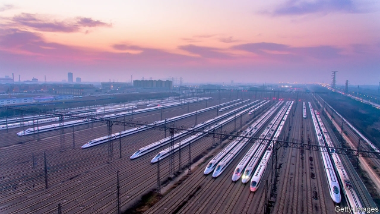

###### The view from Washington

# In Washington, talk of a China threat cuts across the political divide 

##### Amid accusations of theft and espionage, opinions have hardened 

 

> May 16th 2019 

LAST OCTOBER bosses from some big, innovative companies were invited to an annexe of the White House. Amid the high-ceilinged pomp of the Indian Treaty Room, the executives signed one-day non-disclosure agreements allowing them to see classified material. Then the Director of National Intelligence, Dan Coats, and two senators told them how China steals their secrets. 

The unpublicised event was the idea of Senator Mark Warner of Virginia, the senior Democrat on the Senate Intelligence Committee and himself a successful technology investor. He was joined by Senator Marco Rubio of Florida, a Republican on the committee. 

Recent arrests of alleged Chinese spies reveal only a small fraction of what is afoot, Mr Rubio says. China “is the most comprehensive threat to our country that it has ever faced”. The aim, he insists, is not to hold China down but to preserve peace. He sees an imbalance in relations between America and China that, if left unaddressed, “will inevitably lead to very dangerous conflict”. 

Speaking with rapid precision in his Senate office, Mr Rubio criticises an economic model that presses chief executives to maximise short-term profits. China has learned to use that system to turn firms into “advocates”, he charges. Too often politicians would vow to get tough on Chinese cheating. “Then these CEOs would be deputised by China to march down to the White House.” 

Venture capitalists have also been invited to Warner-Rubio China road shows. Mr Rubio grumbles that the business plan of some Silicon Valley tech firms is to get bought up, without necessarily caring if the investors are Chinese. 

Members of Congress have drafted proposals for a series of new export controls on products deemed important to national and economic security, notably from industries named as priorities in the “Made in China 2025” plan. That is a Chinese map for building world-beating companies in ten high-tech fields. Chinese investments face ever-tighter scrutiny by the Committee on Foreign Investment in the United States (CFIUS). The Foreign Investment Risk Review Modernisation Act recently extended the remit of CFIUS to new areas, such as property purchases near sensitive sites. A pilot scheme mandates reviews of foreign stakes in a wide array of “critical technologies”. Mr Rubio names telecommunications, quantum computing, artificial intelligence and any industry that collects large data sets as ones he wants closed to China. 

The staging of that October road show—a bipartisan endeavour involving Congress and the intelligence agencies, close to the White House but not inside it—is revealing. Views on China have hardened across official Washington. A tough new consensus unites what might be called America’s foreign-policy machine, including members of both parties in Congress, the State Department, Pentagon, Department of Justice, spy agencies and the president’s own National Security Council. The machine includes the vice-president, Mike Pence, who turned a speech last October into a charge sheet of Chinese misdeeds. Mr Trump stands apart. 

Pentagon chiefs and members of Congress are ever more publicly sounding the alarm about China’s intentions towards Taiwan, the democratic island of 24m people that America calls an ally but China claims as its own, saying it must be united with the motherland, by force if necessary. To China’s disquiet, Congress has passed laws signalling solidarity with Taiwan, urging the government to allow cabinet secretaries and American warships to visit the island. Some of President Donald Trump’s closest aides are long-time advocates for Taiwan. As president-elect in 2016 he was persuaded to talk by telephone with the island’s president, Tsai Ing-wen. Since then Mr Trump has blocked proposals for high-profile visits to show support for Taiwan as a democratic ally. He sees allies as a burden, and mighty China as America’s peer. 

Discerning a united view of China within Team Trump is hard. Trump aides use harsh language about the country. Referring to repression of Uighur Muslims in the north-western region of Xinjiang, the Secretary of State, Mike Pompeo, called China “one of the worst human-rights countries that we’ve seen since the 1930s”. That tone is a sign of their boss’s willingness to trample diplomatic niceties. But while Mr Trump’s views on China overlap with the Washington machine’s, they are not identical. Many officials are sincerely disgusted by Xinjiang, where perhaps a million Uighurs are being held in “re-education camps”. Asked how business ties between America and China may co-exist with get-tough policies, a senior administration official replies: “Concentration camps do spoil the mood, don’t they?” 

Yet cold-war-style discussions of human rights are of little interest to Mr Trump. Michael Pillsbury is a China specialist at the Hudson Institute, a think-tank, and an outside adviser to the White House. In his view, “the president is not a super-hawk on China”. Such issues as Taiwan or Xinjiang do not resonate with Mr Trump as much as trade does, he admits. Even on trade, Mr Pillsbury calls him more cautious than advisers such as Peter Navarro, who would like American firms to leave China. Mr Trump has often said he does not want to hurt China’s economy, notes Mr Pillsbury. “He sees China as a source of profit and investment.” 

The machine wants to change the fundamental principles guiding China’s rise. In contrast Mr Trump praises President Xi Jinping for putting China’s interests first. 

Yet Mr Trump can be riled by aides telling him that China is “stealing our secrets”. He also sees political risks in any trade deal that can be branded a climb-down. “The president understands very clearly that the Democrats are waiting for him to be soft on China,” says Mr Pillsbury. Senator Chris Coons, a Democrat, agrees that being a hawk on China in today’s Congress is “comparable to the 1950s when there was no downside, politically, to being anti-Soviet”. 

Tellingly Mr Trump’s China tariff escalation on May 10th was accompanied by defensive tweets asserting that China yearns for a “very weak” Democrat to win the 2020 election instead. A senior Trump administration official endeavours to reconcile the different camps. The aim is not economic decoupling, he says. But in sensitive industries, “the political and financial risk associated with doing business in China will continue to rise”. 

Modern-day Chinese mandarins obsess over differences within the Trump administration, not realising that the hardening of the Washington mood predates and will outlast Mr Trump. Evan Medeiros of Georgetown University, a former principal Asia adviser to President Barack Obama, notes that “the bureaucracy of a much more competitive relationship” is being put in place. 

Last November the Department of Justice established a China Threat Initiative, staffed by prosecutors and FBI investigators, to detect Chinese attempts to steal trade secrets and influence opinion, in particular on university campuses. At the Department of Homeland Security, a new National Risk Management Centre watches for high-risk firms working on critical infrastructure. A State Department office formerly focused on terrorism, the Global Engagement Centre, has a new mission countering propaganda from China, Russia and Iran. 

Pentagon anxieties about China coincide with a realisation that when troops rely on high-tech kit, cyber-attacks can kill. Mr Eikenberry, the former general, observes that in the 1970s or 1980s perhaps 70% of the technology that mattered to military commanders was proprietary to the government, and the rest off-the-shelf and commercial. “Now it is 70% off-the-shelf, much of it coming from Silicon Valley,” he says. Thus when American trade negotiators debate China policy, “the security people are in the room.” 

A study commissioned by the Pentagon, “Deliver Uncompromised”, warns that insecure supply chains place America’s armed forces at “grave risk” from hacking and high-tech sabotage, for instance by the insertion of malware or components designed to fail in combat. The study, by Mitre, a research outfit, notes that modern fighter jets may rely on 10m lines of software code, so it matters if tech firms use code of unknown provenance, as some do. 

Pentagon chiefs have created a new Office of Commercial and Economic Analysis whose mission includes scouring defence contracts for Chinese companies, down to third-tier suppliers. James Mulvenon, an expert on Chinese cyber-security, explains that “the Pentagon has decided that semiconductors is the hill that they are willing to die on. Semiconductors is the last industry in which the US is ahead, and it is the one on which everything else is built.” He already sees more high-value defence contracts going to semiconductor foundries in America. 

Randall Schriver is assistant secretary of defence for Indo-Pacific Security Affairs and a China specialist. Asked if the Pentagon will press businesses to leave China, he replies carefully. “Companies can do what companies do. We are much more aware of and keen to address vulnerabilities in our defence supply chain.” 

Official Washington has moved beyond asking whether China is a partner or a rival. The only debate concerns the magnitude of China’s ambitions. According to Mr Rubio, Mr Xi thinks that “China’s rightful place is as the world’s most powerful country.” 

Some political appointees in Mr Pompeo’s State Department sound eager to declare that an East-West clash of civilisations is under way. On April 29th the State Department’s director of policy planning, Kiron Skinner, told a forum hosted by New America, a Washington think-tank, that there was a need for a China strategy equivalent to George Kennan’s containment strategy for the Soviet Union. Not content with that bombshell, Ms Skinner ventured that China is a harder problem. “The Soviet Union and that competition, in a way it was a fight within the Western family,” she said, citing the Western roots of Karl Marx’s ideas. “It’s the first time that we will have a great-power competitor that is not Caucasian.” 

Leaving aside the ahistoricism of Ms Skinner’s comments—for China’s Communists drew deeply on Marx and Lenin—they are self-defeating. A clash of civilisations leaves no room for Chinese liberals, let alone for Taiwan, a democracy with deep roots in Chinese culture. As for the idea of containing one of the world’s two largest economies, that would be a nonsense even if American allies and other countries were willing to help, which they are not. 

There are more cautious voices. A recent essay for the Paulson Institute by Evan Feigenbaum, an Asia hand in the administration of President George W. Bush, argues that those accusing China of remaking the global order are both misstating and understating the challenge. China is selectively revisionist, wrote Mr Feigenbaum. Rather than seeking to replace today’s international system, it upholds many of the “forms” of multilateralism while undermining “norms” from within the UN and other bodies. 

In a break between votes, in a windowless office deep in the Capitol, Mr Coons urges Congress to try the hard work of dealing with China as it is and not as America wishes it to be. He does not think China is hostile to the idea of a rules-based order, but concedes that it has “behaved exceptionally badly on the world economic stage”. In today’s Washington, that is dovish talk. 

