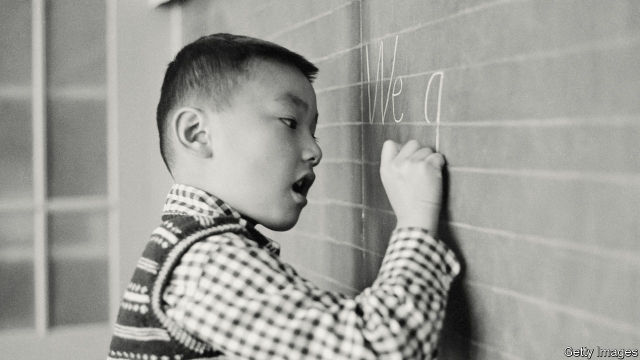

###### Slow boat

# Ordinary Americans and Chinese seem to be drifting apart 

##### Cultural and educational exchanges are under strain 

 

> May 16th 2019 

DURING A STATE visit to Beijing in November 2017 President Donald Trump invited his Chinese counterpart, Xi Jinping, to watch a video of his young granddaughter, Arabella, singing and reciting poetry in Mandarin. The daughter of Ivanka Trump and Jared Kushner learned her language skills from a nanny and at a private school. Many parents think that having studied Chinese looks good on a college application alongside ballet or violin lessons, says Scott McGinnis, a professor of Chinese at the Defence Language Institute, speaking in a personal capacity. 

A survey in 2017 by American Councils for International Education estimated that 227,000 school-age Americans regularly wrestle with Chinese tones and radicals. At roughly the same time 363,000 students from China were hosted by American colleges and schools. Those numbers make talk of a cold war seems outlandish. Beyond trade, people-to-people exchanges look like sturdy guardrails to keep relations on track. From Deng Xiaoping on, the past four Chinese leaders all sent a child to study in America (Mr Xi’s daughter was at Harvard). Soviet leaders did not enroll their young in Ivy League institutions. 

Alas, those guardrails are weaker than they may appear. In many places, Chinese student numbers are dropping. The University of Iowa, for example, had seen Chinese enrolments rise five-fold between 2007 and 2015, with the effects still visible in the streets of Iowa City, where bubble-tea outlets and noodle bars cater to thousands of Chinese students. 

But numbers peaked in 2015 and have since fallen by about 39%. Sydney Ji, a graduate student from Shanghai, says that it has become harder for Chinese students to secure or renew visas (rules are especially tight for students in some high-tech fields). One of her own friends is returning home after failing to secure the right to stay and work. The American embassy in Beijing has begun issuing leaflets to Chinese students who are granted American visas urging them to “learn with an open mind”, and enjoy the free thinking and debate of college life. 

Visa rules are likely to get stricter still. In April Christopher Wray, the director of the FBI, urged academic institutions to be more mindful of how others may exploit America’s “open, collaborative research environment”, accusing China of sending graduate students and researchers, among others, to steal innovations. The FBI chief also expressed concern about Confucius Institutes (CIs), Chinese-funded outposts based in American universities, trying to win hearts and minds with Mandarin lessons and cultural events. 

In 2018 Senator Marco Rubio, a Republican, urged universities in Florida to consider closing CIs on their campuses. Across America, at least ten have shut in the past year, leaving about 100. China’s influence on American campuses, via student associations with close links to diplomatic missions, is a frequent topic in congressional hearings. The State Department recently ceased funding a network of American Cultural Centres at Chinese universities in the face of official harassment—including an episode in which Terry Branstad, America’s ambassador, was denied access to one funded by his own embassy. 

Though demand for language teaching for school-age children remains strong, the number of college-age students choosing Chinese fell to 53,000 in 2016, a 13% drop since 2013. That is telling because older students need to think that they may want to live or work in a country, says Mr McGinnis. China is becoming less attractive, he concludes with some sadness. The number of Americans studying in China peaked in the 2011-12 school year at nearly 15,000 and was down to just under 12,000 in 2016-17. 

Behind all such statistics lie real people. When asked about Chinese students who may feel under suspicion, Mr Rubio pauses. “That is one I struggle with,” says the senator, himself the son of Cuban immigrants. America cannot ignore China’s use of students to acquire technology, he argues. But students exposed to American freedoms may call for change at home. “I don’t want to trigger xenophobia in which every Chinese student in America is presumed to be a spy until proven otherwise,” he says. In these populist times, others may feel less squeamish. 

