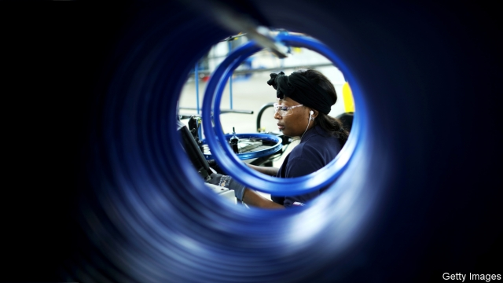
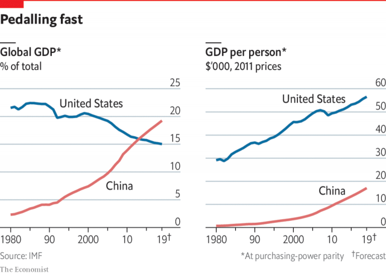

###### Trade

# The trouble with putting tariffs on Chinese goods 

##### They rarely work as intended 

 

> May 16th 2019 

DONALD TRUMP is not the first American president to promise a tougher line on China, but he is the first to make a trade war sound like a rent renegotiation. “I am a Tariff Man,” he tweeted last December, boasting that America is “taking in $billions” thanks to tariffs he has imposed (never mind that tariffs are a tax, mostly paid by American consumers). Mr Trump makes America’s markets sound like a valuable piece of real estate which foreigners should pay more to access. Or as he puts it: “When people or countries come in to raid the great wealth of our Nation, I want them to pay for the privilege of doing so.” 

As China grew, politicians typically accused it of not “playing by the same rules”. Mr Trump is different. He is not very fussed about rules. He says that he does not blame China for putting its interests first and for stealing American jobs. He blames his predecessors who allowed that theft to take place. 

When China’s business and policy elite ponders the trade war, it is not uncommon to hear Mr Trump described as a pragmatic businessman under the control of a cabal of crazed economic nationalists. In fact, trade is one of the few policy issues on which Mr Trump came into office with fixed beliefs, forged in the 1980s at a time of trade tensions with Japan and Germany. In contrast, his inner circle has spent a lot of time squabbling over trade policy, occasionally in full hearing of stunned Chinese negotiators. Officials in China are slightly obsessed with the president’s chief trade adviser, Peter Navarro, an abrasive academic who would like to decouple the Chinese and American economies. In truth, Mr Navarro’s influence is limited. His main strength is that he represents the world view of trade-union Democrats whose votes Mr Trump needs to be re-elected. 

The United States Trade Representative, Robert Lighthizer, was raised in a rustbelt railway town and sees fighting to protect manufacturing workers as the proper work of government. He cut his teeth negotiating with Japan for the Reagan administration. What unites this odd bunch is a shared narrative: that China schemed and cheated its way to stealing American jobs and that those jobs could be dragged home by using enough force, just as it happened with Japan two generations ago. 

Back then Japan and Germany placated America by agreeing to strengthen the yen and the D-mark against the dollar, making American goods a bit more competitive. Japan was bullied into voluntarily restricting exports of everything from textiles to cars. More constructively, Japanese firms opened car factories in America, bringing Japanese quality management with them. 

Alas for the odd bunch, the solutions imposed on Japan are inapplicable to China, and history will not repeat itself. For one thing China is not about to let its currency strengthen by 50% or more against the dollar. For another, Chinese carmakers or telecommunications giants like Huawei are not very welcome to invest in America, where they stand accused of stealing technology and threatening national security. 

Team Trump’s narrative also refuses to acknowledge the logic of global supply chains. The popular history of how American jobs migrated to China overplays the cunning of Chinese officials and underplays the role of multinational companies from Asia and beyond. In many low-end manufacturing industries, the forces of globalisation sent jobs to China when it offered low wages, cheap land and tax breaks. Foreign firms trained Chinese managers to run export-quality plants. 

Now, as Chinese wages are rising and Mr Trump’s tariffs are creating unmanageable political risks, manufacturing jobs are leaving after a 30-year sojourn, heading for South-East Asia and beyond. Getting history right matters because Mr Trump’s trade rhetoric is so steeped in nostalgia. Douglas Paal, who held top Asia posts in the Reagan and first Bush White Houses, sees a defect in every fight based on trade law: “The structure doesn’t allow for the voices of the industries of the future.” 

Sometimes a single industry’s fate sums up an era. In the 1970s American factories produced over 15m bicycles a year. Today over 95% of bikes sold in America are imported, overwhelmingly from China. They use decades-old technology, but the Trump administration wielded special “section 301” powers, meant to safeguard the most precious intellectual property, to slap a 10% tariff on Chinese bicycles last September, raised to 25% on May 10th. 

For anyone seeking evidence that trade wars are good for American workers, the bicycle aisle of the Walmart Supercentre in Moline, Illinois, looks promising. Alongside Chinese-made cycles from brands like Huffy or Kent, the racks hold stirringly patriotic machines: mountain bikes carrying the shield-shaped logo of the Bicycle Corporation of America (BCA) and tags in the colours of the American flag, bearing the slogan “Bringing Jobs Back to America!” and giving a factory address in South Carolina. 

 

That Walmart aisle is misleading. Arnold Kamler is chief executive of Kent International, a family firm based in New Jersey that sells about 3m bicycles a year to Walmart, Target and other shops. He remembers how, in the late 1980s, Chinese-made bikes sold in America at prices that made no sense and then kept falling by a further 5-10% each year. Kent closed its New Jersey plant in 1991. A few years later the remaining American bikemakers applied to have anti-dumping tariffs slapped on Chinese imports. Government trade regulators declined to help. “The United States was trying to endear itself to China back then,” Mr Kamler charges. It sounds like one of Mr Trump’s sagas of Chinese cheating and American passivity. Yet real life is less tidy, as a trip to the Yangzi delta shows. 

Most Kent bicycles are made in Kunshan, near Shanghai, by a contractor called Shanghai General Sports. It is run by Ge Lei, an amiable 43-year-old. The company patriarch is his father, Ge Yali, who ran a state-owned bicycle plant in the 1980s. In the elder Mr Ge’s telling, Kunshan owes its rise to Taiwanese and Japanese manufacturers who transformed production standards. If followers of Mr Trump were to find themselves in the Ge family boardroom in Kunshan, decorated with Kent children’s bikes already bearing Walmart labels, they might yearn for BCA machines from South Carolina to wipe them out. 

Except that BCA is a subsidiary of Kent. The firm was opened by Mr Kamler in 2014 after Walmart launched a buy-American drive. And rather than making bicycles from scratch, BCA assembles and paints imported frames and parts, many from Kunshan. A few years ago the Ge family bought 49% of Kent. In other words, those patriotic BCA bikes are half-Chinese. 

There is worse news for America Firsters. Because Mr Trump’s tariffs apply to finished bikes and components, they have raised Kent’s and BCA’s costs by $20m a year. Meanwhile, a separate series of Trump tariffs on steel and aluminium have so disrupted markets that plans to expand BCA are on hold, costing American jobs. 

In 2015 South Carolina’s then governor, Nikki Haley, hosted Chinese and Taiwanese parts-makers at the BCA plant, urging them to open branches in her state to create a bike-making cluster. Mr Kamler urged Chinese suppliers to see that low-technology manufacturing is profitable in America. “Candidly, it was not successful,” he sighs. BCA assembled 310,000 bikes last year, and Mr Kamler believes that low production volumes put Chinese investors off. Ge Lei sees a deeper problem. Even ignoring labour costs, he thinks that America has forgotten how to run labour-intensive factories. He is too tactful to call American workers lazy, saying only that they move “slower.” 

Instead Mr Ge is building a plant in Cambodia, seeking lower wage bills. Bicycles made there will escape Mr Trump’s anti-China levies as they ship to Moline and other Walmarts. Every one of his new Cambodian workers will learn something that Mr Trump refuses to accept: tariffs rarely work as intended. 

