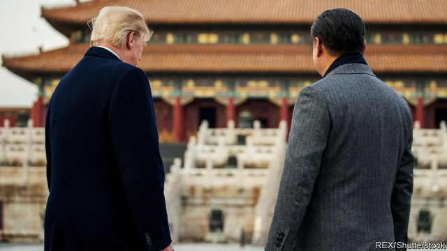
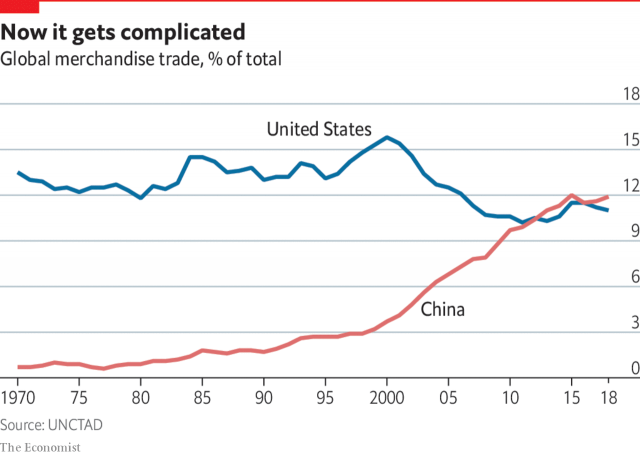

###### China and America

# Trade can no longer anchor America’s relationship with China 

##### The world should be worried about that, says David Rennie 

 

> May 16th 2019 

SINCE CHINA emerged from the wreckage of Maoism 40 years ago, the profit motive has become a pillar of stability in its relations with America. Presidential candidates might accuse China of stealing jobs. Spy scandals could simmer. Then corporate bosses and politicians in Beijing and Washington would decide that all sides were making too much money to let relations sour. This focus on mutual self-interest involved queasy compromises. Soon after troops massacred hundreds, possibly thousands, around Tiananmen Square in June 1989, President George H.W. Bush wrote discreetly to Deng Xiaoping to urge joint efforts to prevent “tragic recent events” from harming relations. The financial crash of 2008 revealed a dangerous co-dependency between America the importer of cheap goods and China the thrifty exporter. New terms tried to capture this symbiosis: “Chimerica”, or “the G2”. 

Suddenly, however, making money is not enough. In the past couple of years, debate about how to get engagement to work has given way to talk of strategic competition and security threats. Rather than catchy neologisms, scholars are reaching for historical analogies. Some talk of 1914, when clashing British and German ambitions swept aside deep bonds of commerce. China analysts obsess over the “Thucydides trap” that supposedly dooms upstart nations to fighting incumbent powers, as the Greek historian wrote of Sparta and Athens. 

China’s rise was always going to cause turbulence. The same country is America’s most daunting strategic rival, its biggest economic challenger and a giant trade partner. That is new. The Japan shock of the 1970s and 1980s triggered demands from politicians for protectionist barriers, as America’s trade deficit in goods with Japan rose 25-fold in a decade. But it was a lopsided political fight: Japan was a dependent military ally. As for the Soviet Union, it was an ideological but not a commercial rival: in 1987 bilateral trade was worth $2bn a year, or less than 0.25% of America’s total trade with the world. In 2018 two-way trade between America and China hit $2bn a day, or 13% of America’s world trade. 

Critics argue that elites should have seen this coming. Western leaders had hoped that joining the global economy would make China more like the West, as a growing middle class demanded free speech and more accountable government. They were wrong. The crash of 2008 and spasms of Western populism emboldened Communist Party leaders, notably President Xi Jinping, to reject those norms and assert the party’s supremacy. 

America’s shock is made worse by trade in technologies that blur the lines between commerce and national security. The Trump administration’s opposition to letting Huawei, a Chinese technology firm, build 5G telecommunications networks for America or its allies is a taste of that future. Such debates are, at root, about trust, a commodity that mattered less when China exported tennis shoes and televisions rather than microchips that can keep self-driving cars on the road and planes in the air. Yet clumsy forms of self-defence cause harm. Define sensitive technologies too broadly and, in the words of Henry Paulson, a former secretary of the treasury, an “economic iron curtain” may come to divide China and America, choking flows of goods, capital, people and technology, with grave implications for the rest of the world. 

 

China’s growing tech prowess is putting new strains on globalisation, beyond old arguments about stolen jobs. The fact that General Motors sells more cars in China than in America used to help both countries manage ideological differences. Today’s supply chains, carrying semiconductors from China to devices in America, actually raise the political stakes. 

Million-dollar American weapons rely on microchips sourced from firms around the globe. Critical infrastructure may contain components from a dozen nations, require software updates from a provider on one continent and send streams of real-time data to another. In April a Pentagon advisory board warned defence chiefs to plan for “zero-trust” commercial internet networks. A growing number of business transactions require a lifetime commitment to distant service-providers. In this world, trade relations cannot be quarantined from hard questions about whether countries are partners, rivals or foes. 

China has every right to want to grow stronger. Its success in helping hundreds of millions of people to raise themselves from poverty is admirable. It is the relentlessness of its methods that has turned business from a safe space to a field of contention. Western firms worry that before China truly opens up, they will be thrown out—as soon as Chinese firms have learned, bought or stolen enough Western knowhow to become self-reliant. 

Few Americans have better access to Chinese leaders than Mr Paulson, a longtime proponent of engagement. So it was noticed when in February he declared that, because China has been slow to open its economy since joining the World Trade Organisation in 2001, “the American business community has turned from advocate to sceptic and even opponent of past US policies toward China”. Bosses do not seek a tariff war, he said, but do want a “more confrontational approach”. Businesses are getting that from the Trump administration. 

In part, this is explained by the change in occupant of the Oval Office. President Barack Obama also denounced Chinese trade cheating and pressed China to stop stealing commercial secrets. Belatedly, his Pentagon chiefs grew alarmed as China turned disputed reefs in the South China Sea into military outposts. But ultimately Mr Obama put more weight on tackling global challenges, from climate change to pandemics to nuclear proliferation, for which he needed Chinese help. Get-tough policies were endlessly discussed, then often dropped. Mr Trump, by contrast, boasts that solving the world’s problems is not his job. 

In part, America has become more confrontational because multinational businesses that oppose barriers to trade have lost clout in a populist age. A new round of export controls for sensitive technologies and still-tougher investment-screening rules loom. That process will not end with a truce in Mr Trump’s trade war. 

The American president is as much a symptom as a cause of a change in the way that America thinks about its openness to the world. Voters elected a might-makes-right leader who scorns alliances, who is cynical about the rule of law and universal values and who believes that national interests always come first. Amid espionage fears, visa rules for Chinese students of science and technology have tightened. FBI agents have quizzed scholars visiting from Chinese state-backed think-tanks about government links, and cancelled the visas of some. Rather than China becoming more Western, America is becoming more Chinese. 

Meanwhile, officials in Beijing see a sore loser of a superpower, bent on keeping them down. They scoff at the idea that rich, spoiled America really feels threatened, seeing a ploy to extract better terms for American firms to make money. This misses how many people in Washington believe that the China threat is real and matters more than profits or free-market purity. Indeed, officials accuse firms of keeping quiet when Chinese spies steal intellectual property, to preserve face and access to Chinese markets. 

A senior American official says that China “emphatically” lied when it promised Mr Obama in 2015 that state-backed actors would stop spying on America for commercial gain. The official laments that, in the frenzied Washington news cycle, few noticed a Department of Justice indictment in December 2018 accusing China’s ministry of state security of ties to a long-standing campaign by the APT10 hacking group, stealing secrets from firms in aviation, space, pharmaceuticals, oil and gas, maritime and other technologies. “They basically got the crown jewels of hundreds and hundreds of the world’s biggest companies,” he says. 

The pendulum risks swinging too far. Some sniggered in March when the Committee on Foreign Investment in the United States (CFIUS), a government agency that screens foreign deals for security concerns, asked a Chinese internet firm to sell Grindr, a gay dating app with 3.3m daily users. Actually CFIUS may have a point. A gay app could be a blackmailer’s trove, and Chinese police routinely grab data from social media at home. It is harder to take seriously Senate attempts to ban Washington, DC, from using federal money to buy metro trains made in America by a Chinese state-owned company lest on-board security cameras are used for spying. 

Although China lacks the formal alliances that made the Soviet Union a global threat, its rise dominates Pentagon debates about the future of war. Since the 1980s America has pursued a “forward presence” doctrine, meaning that its forces were confident about operating close to enemy defences. China’s growing strength confronts Pentagon planners with their hardest decision in years: to find new ways to make combat in the Western Pacific viable, or pull back and force adversaries to fight far from home. 

Karl Eikenberry was a China expert in the army who became a lieutenant-general, then ambassador to Afghanistan. Now at Stanford University, he describes commanders grappling with the end of overwhelming American superiority: “There is an intense debate within the American armed forces about how to counter the PLA’s accelerating efforts to control the South China Sea.” 

This report will look at clashing views in Washington and Beijing about how to manage the technological, military, economic and political aspects of a great-power contest so new that the two sides do not even agree on what successful relations might look like. Rules must be found. Mr Eikenberry’s summary of the military challenge applies to the whole: “A new doctrine is required.” 

