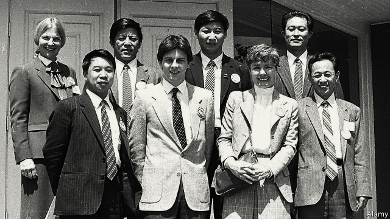

###### Down on the farm

# Why Iowa is Xi Jinping’s favourite corner of America 

##### But even here, attitudes towards China are changing 

 

> May 16th 2019 

WHEN RICK KIMBERLEY showed Xi Jinping around his farm in Iowa in 2012, he explained how modern seeds, big machines and computers had doubled crop yields since he began farming in 1972. His Chinese guest, who was then vice-president and months away from assuming the leadership of the Communist Party, pronounced the farm a model to study. When he speaks, China acts. 

A replica of Mr Kimberley’s property is being built in Hebei province, northeast of Beijing, as a demonstration farm. He is now honorary dean of the Kimberley Agricultural Business School in Shaanxi province. Thousands of Chinese visitors have trekked to his farm in Iowa, many eager to be photographed on the John Deere tractor on which their leader sat. Mr Kimberley would have traded it in by now, but Chinese firms have asked about shipping it to the motherland. 

Mr Xi’s first visit to Iowa was in 1985, as leader of a five-man agricultural delegation. His business cards said he was the director of an animal-feed association. His hosts took him to farms and feed mills. He ate roast hog and went on a cruise on the Mississippi River. Iowa’s then governor, Terry Branstad, received the Chinese guests. This Iowan kindness was a lucky investment. Unbeknown to his hosts, young Mr Xi (pictured) was party secretary of a county in Hebei and son of a member of China’s politburo, Xi Zhongxun, who had visited Iowa in 1980. 

Today, Mr Branstad is America’s ambassador to China, and delights in talking up his long friendship with Mr Xi. China’s president seems attached to those memories, too. During his second visit in 2012 he spent an hour with Iowans who had hosted him in 1985. “For me, you are America,” Mr Xi enthused. 

China has duly showered Iowa with demonstrations of amity. For the past four years orchestras on American concert tours have given free concerts in Muscatine, the town of 24,000 where, in 1985, Mr Xi stayed with a local family, the Dvorchaks. Grateful Muscatine high-school students have enjoyed free study tours of China, funded by Wanxiang, a Chinese maker of car parts. 

Gary Dvorchak was at college when China’s future ruler borrowed his teenage bedroom, complete with Star Wars figures on the shelves. His reward came in 2015 when his family was invited to Beijing to dine with President Xi, his wife and his daughter. Today Mr Dvorchak is a business consultant in Beijing. In the face of continued unequal treatment for foreign firms, the impatience of American businesses is at “boiling point”, he laments. Often asked to meet delegations of Iowan farmers and entrepreneurs, he tries to warn them about cultural differences. Chinese business partners learn to trust slowly. Americans are in a hurry, and trust strangers until given cause not to—but once disappointed will walk away. 

Mr Dvorchak’s former home in Muscatine is now the Sino-US Friendship House, a museum displaying photographs of Mr Xi in Iowa. Its developer, Cheng Lijun, owns several properties in Iowa and is bringing up his children there. He thinks that ordinary Americans still welcome Chinese investment. But Chinese businesses feel “a lot of invisible pressure” from America’s government, which sees a spy scandal in every bid for a business that uses technology, he sighs. 

In 2017 America sold China soyabeans worth $12.4bn, many from Iowa. Then Mr Trump launched his trade war and China slapped tariffs on American soyabeans. Tim Maxwell grows them near Muscatine. He backs the president even if his sales are hit: “We’re going to feel a bit of a sting for a couple of years, because he is not going to let anyone push him around, and I’m all for that.” 

Sarah Lande (pictured) helped to organise Mr Xi’s visit in 1985, giving him a lift in her red convertible (she regrets declining his request to drive it). She hosted him again in 2012. But this pioneer of engagement senses a new wariness among her neighbours. “People are influenced by what they read in the papers, that China is spying on us,” she says. If a young Chinese official were to visit today, she is not sure his delegation would get the same sort of welcome: “What we show them might be a bit broad-brush now.” 

