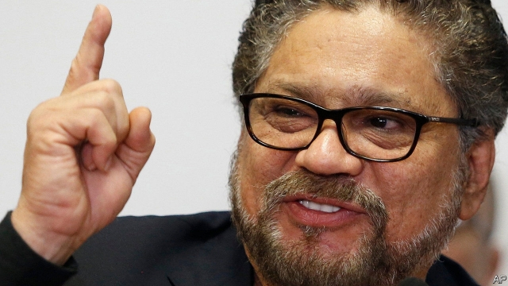

###### Sorry Uncle Sam

# Colombia’s peace tribunal defies an American extradition request 

##### An alleged drug dealer is also a key part of the peace process 

 

> May 16th 2019 

JESúS SANTRICH was supposed to become a member of Colombia’s congress in July 2018. As a former FARC commander, he was chosen to take up one of the ten congressional seats promised to the guerrilla group by the peace deal that ended the country’s 50-year armed conflict. But Mr Santrich, whose real name is Seuxis Hernández Solarte, could not be sworn in because he was arrested in April last year as part of an American-led undercover operation. A New York court indictment accuses him of conspiring to ship 10,000kg of cocaine to the United States. The Department of Justice has asked for his extradition. 

Mr Santrich has put Colombia in a difficult position. The country signed an extradition treaty with the United States in 1979. But Mr Santrich is protected by the peace deal, which says FARC members can be extradited only if they committed a crime after December 1st 2016. President Ivan Duque, who was elected on a campaign pledge to modify the peace deal, wishes to extradite Mr Santrich. But his hands are tied. On May 15th the extradition was blocked by Colombia’s peace tribunal, known as the JEP, which investigates and judges members of the FARC and the armed forces for war crimes and crimes against humanity. 

The decision has pitched the JEP against the attorney-general, Néstor Humberto Martínez, who resigned in protest. He said the ruling was a “coup d’état against justice” and called for a mobilisation to “re-establish legality in Colombia”. The JEP accused the attorney-general’s office of allowing the United States to conduct an illegal undercover operation in Colombia. It also asked the attorney-general’s office to hand over Mr Santrich’s case file. 

Supporters of the peace deal praised the JEP’s decision. Mr Santrich, they claim, was framed in an American-led attempt to sabotage the peace deal. But the decision might damage Colombia’s relationship with the United States. President Donald Trump is already losing patience with Mr Duque, who he says is doing nothing to curb the flow of drugs. 

A month ago the State Department revoked the American visa of John Jairo Cárdenas, a Colombian congressman. Mr Cárdenas had revealed details of a meeting with the American ambassador, Kevin Whitaker, in which Mr Whitaker supposedly warned of reprisals if congress did not curtail the JEP’s power to shield former FARC fighters. The visa revocation has prompted many Colombians to accuse the United States of political blackmail. It also seems to have emboldened peace supporters in congress and in the courts against Mr Duque’s efforts to modify the peace deal. It looks as though for now, at least, Mr Duque must focus on mending fences with the United States. Mr Santrich will take his seat in congress at last. 

