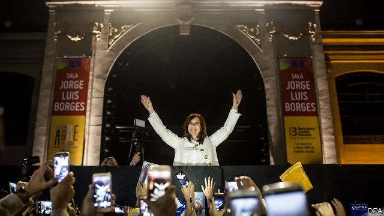
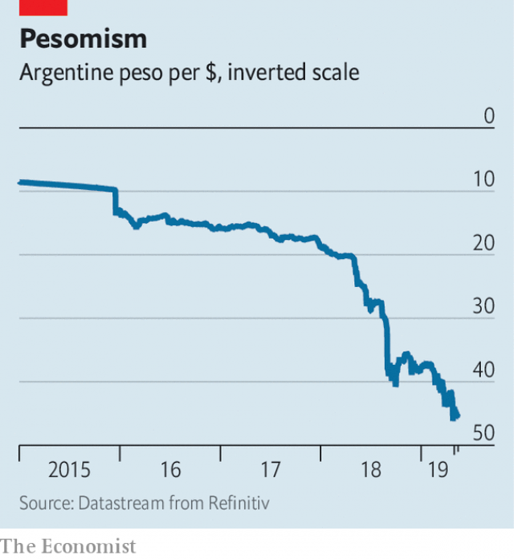

###### All through my wild days

# Cristina Fernández de Kirchner threatens to upend Argentina again 

##### Argentina’s election in October looks like a toss up 

 

> May 18th 2019 

FOR DECADES the city of Quilmes, a 40-minute drive south of Buenos Aires, has had the distinction of being the name of Argentina’s national beer. A German immigrant, one Otto Bemberg, started his brewery there, on the edge of the River Plate, in the 1880s; today Quilmes (now part of the AB InBev empire) is sold from Iguazú falls to Tierra del Fuego. But there is more than beer brewing in the city. 

From the fall of Argentina’s dictatorship in 1983 to 2015, the Peronists, a populist movement, ruled Quilmes and its 650,000 inhabitants for all but eight years. Then President Mauricio Macri’s Cambiemos movement ousted the mayor and city government, which had been loyal to his Peronist predecessor, Cristina Fernández de Kirchner, in a landslide. 

Little more than a year ago, Mr Macri seemed assured of another victory in this year’s elections, due in October. Then investor confidence in his economic policy of gradual reform collapsed along with the peso, prompting him to secure a record $57bn bail-out from the IMF. With inflation at 56% and unemployment having grown by half, the chances of Mr Macri winning again now seem slimmer. On May 9th Ms Fernández launched a new book (which became an instant bestseller), seemingly signalling that she will enter the race. Quilmes is a battleground for their starkly different philosophies. Can Mr Macri’s promise of technocratic reform still beat Ms Fernández’s populist nationalism? 

A national poll last month by the Isonomía group, which has worked for Mr Macri, showed him losing badly to Ms Fernández. That triggered turmoil in the markets; the peso lost almost 9% against the dollar in a week. On April 29th Mr Macri won permission from the IMF to allow the central bank to prop up the falling peso. 

 

An election today would be too close to call, according to a fresh Isonomía poll. In Quilmes, a small-sample survey from Gustavo Córdoba Associates, a pollster, suggests Mr Macri’s mayor is just ahead of a candidate from Ms Fernández’s militant youth wing, La Cámpora. That is led by her son Máximo, a congressman who campaigned in Quilmes on May 11th, calling Mr Macri’s leadership “a debt disaster”. 

At the Casa Rosada, the presidential palace in Buenos Aires, Mr Macri’s chief of staff, Marcos Peña, argues that the election is a choice between reform or a reversion to Argentina’s dysfunctional past. If Ms Fernández were re-elected, it would be a return to the “broken country” she left behind, he says. “That would be a tragedy.” 

Mr Peña acknowledges that market instability represents the biggest threat to the president’s survival now. With a firm “no”, he dismisses any possibility that Mr Macri will step aside for a candidate better placed to defeat Ms Fernández, a persistent suggestion from some within the Cambiemos movement in recent weeks. “He’s a fighter, and he’s going to fight for this, just as she will, because she’s a fighter too.” 

According to Mr Peña, if Mr Macri wins, it “can be a message to other countries which have had populist governments that you can rebuild, recover, and go forward.” He reckons the country is about evenly split: some 35% are for Ms Fernández, another 35% are for his boss and the rest are undecided. “We’re confident that there’s a majority of Argentines who don’t want to go back to an authoritarian, populist past, and that they won’t go back to Cristina.” 

They may turn to one of several possible Peronist moderates. But it helps both Mr Macri and Ms Fernández to try to polarise the race between them. In the working-class suburb of Agronomía, the Cristina team is coming together under the slogan “order out of chaos”. Unsurprisingly there is no mention of the currency controls, import controls, protectionism and unsustainable subsidies that characterised Ms Fernández’s second term. That she will be put on trial for corruption—on May 21st—doesn’t merit a mention either (she denies wrongdoing)." 

Instead Axel Kicillof, who served as finance minister in the former president’s second term, attacks the results of the Macri economic programme. He says that “the Macri years have been a train-wreck for our country and for our people. They spent the first half of their mandate blaming us for all the problems. Now they use the second half trying to scare everyone if we win. They are bankrupt of ideas.” 

Mr Kicillof says that the Peronists are not the economic arsonists Mr Macri claims. He stresses that under a re-elected Ms Fernández, Argentina would not default on its international debts. But, he says, “what we need is this government and the IMF to renegotiate their unsustainable deal.” To this he adds breezily: “ask not what you can do for your creditors, but what your creditors can do for you.” 

In Quilmes Daniel Kaploian, who runs a small family firm making curtains, expresses a mix of sadness and weariness. “I voted for Macri,” he says, but he is reluctant to do so again. His wife will vote “positively” for Ms Fernández because she is dismayed by seeing hunger on the streets of Quilmes. “But I can’t vote for Cristina,” he concludes. “It’s a rotten choice, and this country deserves better.” 

Update (May 16th 2019): The original version of this article said Cristina Fernández de Kirchner's trial was delayed. The trial was subsequently rescheduled for May 21st. The story has been updated.  

