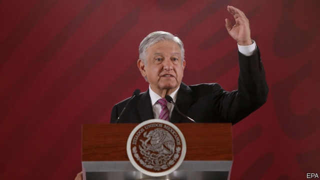

###### Class, dismissed

# In Mexico, AMLO seeks to expel merit from schools 

##### Good news for teachers’ unions. Awful news for pupils 

 

> May 16th 2019 

HOW QUICKLY winds change. The school reforms signed in 2013 by Enrique Peña Nieto, then Mexico’s president, were to be the only popular legacy of an unpopular man. No longer. On May 8th the senate scrapped them. In mere months a reform deemed vital to reduce poverty lost many of its most ardent defenders. Even senators from Mr Peña’s cowed Institutional Revolutionary Party assented to the death of a law they recently favoured. So did the national teachers’ union, the STNE, despite having backed the reforms six years ago. 

That is a testament to the power of Andrés Manuel López Obrador, Mr Peña’s populist successor, who has long opposed the reforms. It is also bad news for the millions of pupils who might have benefited, had the reforms been allowed to continue. The “new” education measures passed in their place represent a return to old ways. 

Mr Peña’s project was an attempt to curb overmighty teachers’ unions. It revoked their power to hire teachers, giving it to an independent body that picked applicants through examinations. Teachers had been accustomed to jobs for life, and the right to sell their posts or bequeath them to their children upon retirement. Suddenly, they were subject to performance evaluations, and those who went on strike risked losing their jobs. And the federal government assumed responsibility for managing a payroll that blew as much as 16bn pesos ($1.2bn then) a year on salaries for teachers who were retired, dead or non-existent. 

The reforms had little time to work. Just 171,000 teachers—less than 10% of the total—were hired on merit. A further 36,000 head teachers and supervisors were promoted on ability rather than loyalty to union bosses. But even this may leave a mark. A study published this year by the Development Bank of Latin America found that teachers hired on merit not only had better high-school grades than union-picked ones, they also helped their pupils learn faster. That inspires hope that Mexico may have improved its lowly ranking in the next round of PISA tests, an international measure of student proficiency in maths, reading and science, the results of which are due in December. 

Mr López Obrador has long complained that the old reforms infringed on teachers’ “dignity”, and that national evaluations were “punitive” and unfair to poorer states. In fact, veteran teachers who failed evaluations three times in a row were not laid off. Instead they were transferred to administrative roles. Such a fate befell less than 1% of those assessed. But the haphazard implementation may have hastened the reforms’ demise. The Peña administration overspent its marketing budget but underspent its teacher-training budget. To appease strikers, the government gave deputy head-teacher positions to union commissioners, undermining the meritocracy it was trying to build, says Marco Fernández of Tecnológico de Monterrey. 

The new reform as written allows for a “selection process” that will be specified in secondary legislation. Mr López Obrador has intimated that the CNTE, a dissident teachers’ union dominant in four poor southern states, will play a role in drafting the details. Experts expect the reforms to dispense with the notion of merit-based hiring altogether. 

Mr López Obrador’s supporters argue that the new reforms will cause fewer teachers to strike. “We need to pacify the education system,” says Rubén Rocha, a senator for the president’s Morena party who chairs the chamber’s education commission. But unions will still have an incentive to walk out to extract bigger budgets and salaries, as they have done every year since the early 1990s. The CNTE’s members began another strike on May 15th, when Mexico observes Teachers’ Day, as part of a warning to the government. 

The president promised Mexican voters drastic change, and often dismisses his detractors as people clinging on to privilege. It is ironic that one of his most consequential achievements to date is to return old privileges to Mexico’s mollycoddled teachers’ unions. 

