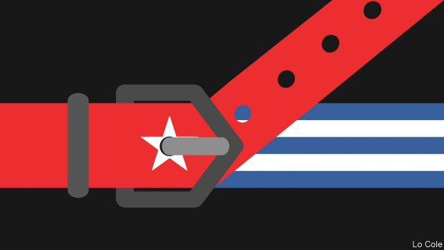

###### Bello

# Sanctions on Cuba will only slow regime change 

##### The island’s communist dictatorship can blame America for shortages 

 

> May 16th 2019 

FOR THE past few months Cubans have faced shortages of some foodstuffs, as well as sporadic power cuts and fuel shortages that have affected never-abundant public transport. “We have to prepare for the worst,” Raúl Castro, Cuba’s communist leader, told his people last month. On May 10th the government announced that it would ration several staples, including rice, beans, chicken and eggs, as well as soap and toothpaste. 

These are the first results of Donald Trump’s tightening of the American economic embargo against Cuba, as part of his effort to overthrow the dictatorship of Nicolás Maduro in Venezuela. Mr Trump’s administration is trying to halt the shipment of oil from Venezuela to Cuba. Last month it imposed fresh restrictions on tourism and remittances to the island from the United States and opened the way for thousands of lawsuits by Americans against foreign companies operating in Cuba. After ousting of Mr Maduro, Cuba’s government “will be next”, promised John Bolton, Mr Trump’s national security adviser. 

The Cuban regime has survived six decades of American sanctions, and there is little reason to believe it will buckle now. But Mr Trump’s offensive does come at a complicated moment for Cuba. It coincides with a gradual handover of power from Mr Castro, who is 87, to a collective leadership including Miguel Díaz-Canel, who took over as president last year and who was born after the revolution in 1959 that installed communism. It also comes when the economy is stagnant. 

Older Cubans look back to the years when the island was a heavily subsidised Soviet satellite as ones of relative abundance. The collapse of the Soviet Union in 1991 was followed by what Fidel Castro, Raúl’s older brother, called the “Special Period” of austerity. That ended when Hugo Chávez of Venezuela gave Cuba subsidised oil. When the oil price fell in 2014 and mismanagement cut Venezuela’s oil output, Mr Maduro scaled back the aid; it is now at less than half its peak. 

The blow was softened, explains Pavel Vidal, a Cuban economist at Javeriana University in Cali, in Colombia, partly by a rise in American tourism following Barack Obama’s thaw towards Cuba and by a modest increase in foreign investment as a result of Raúl Castro’s mildly liberalising economic reforms. Mr Trump’s measures target these two shock absorbers. Mr Vidal expects the economy to shrink by up to 3% this year and imports to fall by 10-15% (after a 20% drop since 2015). 

Harder times “do not mean returning to the most acute phase of the Special Period”, Mr Castro insisted last month. That was marked by systematic shortages and regular power cuts, the memory of which is traumatic. Since then Cuba has diversified its economy somewhat. It now produces a third of the oil it consumes. It has also hoarded foreign reserves. 

The immediate impact of the Trump offensive has been to send the Cuban regime into a defensive crouch. Progress in market-opening reforms has all but halted. While not doing anything to jeopardise the system’s iron political control, Mr Díaz-Canel had brought a more relaxed style, going around with his wife and talking to ordinary Cubans. Now the veteran Stalinists in the politburo are more visible again. On May 11th police broke up an unauthorised march by gay-rights activists in Havana. 

That march was a sign that society, too, has changed as a result of Raúl’s reforms and Mr Obama’s thaw, much scorned though it is by Mr Bolton. A third of the workforce now labours in small private businesses or co-operatives. Around 20% of Cubans, mainly younger ones, are globalised and connected to social media, reckons Rafael Rojas, a Cuban historian at CIDE, a university in Mexico City. With the other 80%, the regime “will be fairly successful in blaming a deterioration of economic conditions on the United States”, he says. “I don’t see a popular uprising or social unrest because of shortages.” 

For the Cuban regime, Venezuela has been a means to divert American pressure away from the homeland. A bolder leadership might cut its losses, and accept a democratic transition there in return for guarantees that it will still get some oil. But there is no sign that diplomatic overtures by Canada and the Lima Group of Latin American countries will draw that response from Havana. A different administration in Washington might seek to negotiate with Cuba about Venezuela. As it is, under Mr Trump’s assault the Cuban regime is likely to become even more rigid in its resistance. 

  

