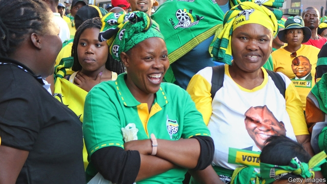

###### China v America

# Politics this week 

 

> May 18th 2019 

The ruling African National Congress won South Africa’s general election with 58% of the vote. The party had never before received less than 60% at a national poll. Many voters were put off by the corruption that flourished under Jacob Zuma, president from 2009 to 2018. The ANC might have done worse but for Cyril Ramaphosa, who replaced Mr Zuma and vowed to clean up his mess. The Democratic Alliance got 21% of the vote. See article. 

Violence flared in Sudan as the ruling military council and protest groups tried to reach a political-transition deal. At least six people were killed. It has been more than a month since the army toppled Omar al-Bashir amid large demonstrations against his presidency. Generals and civilians have yet to agree on how power will be shared. 

A militia allied with the Nigerian government freed almost 900 children it had used in the war against the jihadists of Boko Haram, according to the United Nations Children’s Fund. Of the 3,500 or so children in total who were recruited by armed groups to fight Boko Haram, more than 1,700 have now been set free. 

At least 28 troops in Niger were killed in an ambush near the border with Mali, a region that is a hotbed of jihadist activity. 

Tensions rose in the Middle East, as officials in the Gulf said four oil tankers, including two from Saudi Arabia, had been sabotaged off the coast of the United Arab Emirates. Unnamed American sources were quoted as blaming Iran or its proxies, but they presented no evidence. America pulled all “non-emergency employees” from Iraq amid concerns about alleged threats from Iran. See article. 

Yemen’s Houthi rebels attacked two oil-pumping stations in Saudi Arabia with armed drones. Saudi Arabia supports the Yemeni government in its war against the Houthis, who are aligned with Iran. The UN held talks in Jordan aimed at consolidating a truce between the parties. See article. 

Alabama’s governor signed a law banning abortion in all cases except when the mother’s life is in danger, the most stringent in a number of “heartbeat” bills that have been approved by Republican states. Pro-lifers hope the bills will eventually make their way to the Supreme Court, where they think they have a chance of overturning Roe v Wade. See article. 

A federal judge ordered 32 of Florida’s 67 counties to provide election material and ballot papers for Spanish-speakers in time for the presidential primaries next year. Florida has started the process of supplying bilingual forms, but the judge wants that to speed up; he warned officials that complying with the order was “not optional”. 

  

Hundreds of thousands of students and teachers took to the streets of Brazil’s state capitals to demonstrate against a 30% cut in the federal funding allocated to universities. Brazil’s president, Jair Bolsonaro, who was in Dallas meeting Republican leaders, called the protesters “useful idiots”. 

Meanwhile, Mr Bolsonaro said he would nominate Sérgio Moro, his justice minister, to Brazil’s supreme court in 2020. Mr Moro faced allegations of bias when he joined Mr Bolsonaro’s government after sentencing Luiz Inácio Lula da Silva, Mr Bolsonaro’s one-time political rival, for corruption. 

Guatemala’s constitutional court ruled that Zury Ríos, the daughter of a former dictator, could not stand in June’s presidential election, in which she is a leading candidate. The court found that relatives of coup leaders are barred from the presidency. Efraín Ríos Montt took power for 18 months in the early 1980s in a coup. He died last year during a retrial of his quashed conviction for genocide. 

In Britain Theresa May was facing a humiliating defeat at the European Parliament elections. Ahead of the vote on May 23rd the new Brexit Party has sapped so much support from her Conservative Party that the Greens briefly polled higher, pushing the Tories into fifth place. The prime minister remains defiant, announcing that she will attempt for a fourth time to get her Brexit deal passed by the House of Commons in early June. See article. 

Sweden reopened a rape case against Julian Assange, who is currently in prison in Britain for evading bail. If the investigation ends with a request for extradition, Britain will have to decide whether to send him to Sweden or to America, which also wants to try him, for allegedly helping to hack classified documents. 

The European Commission warned Romania to change new rules that will give the government more power over the judiciary and will shorten the statute of limitations for corruption charges. If it does not, it could face disciplinary action similar to that dished out to Poland. Awkwardly, Romania currently holds the rotating presidency of the EU. 

Candidates backed by Rodrigo Duterte, the president of the Philippines, won nine of the 12 seats up for grabs in the Senate in mid-term elections, as well as a strong majority in the House of Representatives. The results should give fresh impetus to Mr Duterte’s plans to overhaul corporate taxes and amend the constitution to institute a federal form of government. 

Sri Lanka imposed a curfew after mobs began attacking mosques and Muslim-owned businesses. The attacks are in retaliation for the bombing of several churches and hotels at Easter by Muslim extremists. 

Separatist gunmen in Balochistan province in Pakistan attacked a hotel frequented by Chinese visitors in the city of Gwadar. Four employees and one soldier were killed in the attack, but no guests. The separatists vowed more strikes on Chinese targets. 

North Korea demanded the immediate return of a ship America had seized on suspicion of violating UN sanctions. America said the ship was being used to export coal illicitly. The North denounced the seizure as “gangster-like”. Relations between the two countries have deteriorated recently as disarmament negotiations have stalled. 

China’s president, Xi Jinping, said it would be “foolish” to regard one’s own civilisation as superior and “disastrous” to attempt to remould another. His remarks appeared to be directed at America. Two weeks earlier a State Department official, referring to China, said America was involved in “a fight with a really different civilisation” and for the first time was facing a “great power competitor that is not Caucasian”. See article. 

