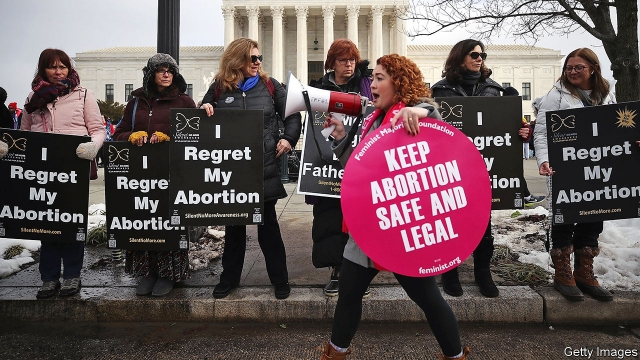

###### Alabama shakes

# Alabama’s lawmakers want to challenge Roe v Wade 

##### That seems unlikely to happen until 2021 at the earliest 

 

> May 16th 2019 

NEVER HAS the war sparked by Roe v Wade, the 1973 Supreme Court ruling that declared abortion a constitutional right, been as intense as it is now. Lawmakers in conservative states are passing “heartbeat” bills banning abortion from the moment a heartbeat is detectable, around the sixth week of pregnancy—flagrantly violating Roe. To defend abortion rights, some liberal states are extending them, making it easier to have abortions in the third trimester. That has encouraged President Donald Trump to mount a fresh assault on late abortions, which he routinely characterises as babies being “ripped” from their mothers’ wombs. 

The most uncompromising attack on Roe has been launched in Alabama. On May 14th the state’s Senate passed a bill that would, in effect, ban abortion outright. Signed into law by the governor the following day, it constitutes the harshest abortion legislation passed in America in half a century. “The heartbeat bills don’t really tackle what Roe is about,” says Eric Johnston, president of the Alabama Pro-life Coalition, alluding to Roe’s protection of abortion until a fetus is viable, at around 24 weeks. “It seemed like the right time to challenge it properly.” 

The bill, which the softly spoken Mr Johnston wrote, does not mess around. Comparing abortion to the most murderous atrocities of the 20th century—“German death camps, Chinese purges, Stalin’s gulags, Cambodian killing fields, and the Rwandan genocide”—it makes performing one a felony, punishable by up to 99 years in prison. Because the bill defines a fetus as “a human being…regardless of viability” its sponsors resisted attempts, by Republican as well as Democratic senators, to allow exceptions in cases of rape or incest. 

The law will be struck down in the courts, just as heartbeat bills have been elsewhere, most recently in Kentucky and Iowa. Similar laws passed earlier this year in Mississippi and in Georgia will meet the same fate, as will several more making their way through state legislatures if they become law. That is the purpose of extreme abortion laws—to prompt legal cases in the hope that one might come before the new conservative majority at the Supreme Court, which will use it to overturn Roe. 

Until recently anti-abortionists were engaged in a stealthier battle. Rather than challenging Roe directly they chiselled away, introducing state-level regulations so burdensome that clinics were forced to close. As social conservatives retreated in the culture war over gay marriage, they advanced over abortion. Between 2011 and 2017, more than 400 abortion restrictions were introduced across America—more than a third of the total since 1973, according to the Guttmacher Institute. Eight states have only one abortion clinic left. 

Mr Trump’s appointment of two conservative Supreme Court justices has emboldened some pro-lifers to adopt a more aggressive strategy. Their hopes of directly overturning Roe were boosted on May 13th when the justices voted 5-4 along ideological lines to overturn a 40-year-old precedent in a case unrelated to abortion. The move, wrote Stephen Breyer, one of the liberal justices, “can only cause one to wonder which cases the Court will overrule next.” Lest anyone wondered what sort of case he had in mind, he cited Planned Parenthood v Casey, a ruling from 1992 that upheld Roe. 

Some pro-life activists are cautious about the prospects of overturning Roe. Clarke Forsythe, senior lawyer for Americans United for Life, which has drawn up successful state-level abortion regulations, says his organisation watches carefully every time the court overturns a precedent: “it happens more often than many imagine”. But he also points out that the court, and in particular Chief Justice John Roberts, seem in no hurry to overturn Roe. He does not expect the justices to take on a direct challenge for “two or three years”. 

That is probably right. Casting himself as a pro-life warrior is useful for Mr Trump, who needs to keep the support of conservative evangelicals in 2020. But actually overturning Roe before the next presidential election would be an electoral disaster for Republicans, since a large majority of Americans believe abortions should be legal up to the third trimester. 

Undermining early abortion rights can be risky for state lawmakers, too. Georgia, which last week became the fourth state this year to pass a heartbeat bill, has long been deeply conservative. But it is becoming more diverse and urban, as the inroads made by Democrats in November’s mid-terms attest. A recent poll found that more voters in the state opposed the heartbeat bill than supported it. 

