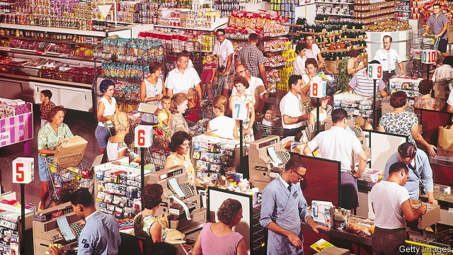
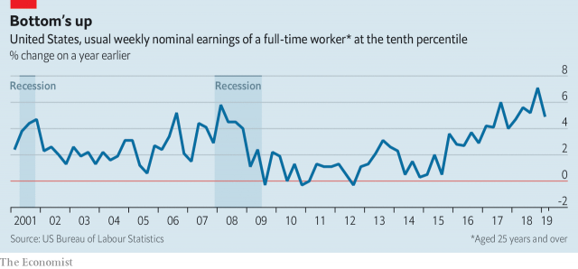

###### Working

# American life is improving for the lowest paid 

##### Come back capitalism, all is forgiven 

 

> May 16th 2019 

BRAD HOOPER quit his previous job at a grocery in Madison because his boss was “a little crazy”. The manager threatened to sack him and other cashiers for refusing orders to work longer than their agreed hours. Not long ago, Mr Hooper’s decision to walk out might have looked foolhardy. A long-haired navy veteran, he suffers from recurrent ill-health, including insomnia. He has no education beyond high school. Early this decade he was jobless for a year and recalls how back then, there were “a thousand people applying for every McDonald’s job”. 

This time he struck lucky, finding much better work. Today he sells tobacco and cigarettes in a chain store for 32 hours a week. That leaves plenty of time for his passion, reading science fiction. And after years of low earnings he collects $13.90 an hour, almost double the state’s minimum rate and better than the grocer’s pay. His new employer has already bumped up his wages twice in 18 months. “It’s pretty good,” he says with a grin. What’s really rare, he adds, is his annual week of paid holiday. The firm also offers help with health insurance. 

His improving fortunes reflect recent gains for many of America’s lowest-paid. Handwritten “help wanted” signs adorn windows of many cafés and shops in Madison. A few steps on from the cigarette shop is the city’s job centre, where a manager with little else to do points to a screen that tallies 98,678 unfilled vacancies across Wisconsin. In five years, he says, he has never seen such demand for labour. He says some employers now recruit from a vocational training centre for the disabled. Others tour prisons, signing up inmates to work immediately on their release. 

Unemployment in Wisconsin is below 3%, which is a record. Across America it was last this low, at 3.6%, half a century ago. A tight labour market has been pushing up median pay for some time. Fewer unauthorised immigrants arriving in America may contribute to the squeeze, though this is disputed. Official figures show average hourly earnings rising by 3.2% on an annual basis. “Right now, part time, it seems like everyone is hiring. Every American who wants a job right now can get a job,” says another shop worker in Merrillville, in northern Indiana. 

In any economic upturn the last group of workers to prosper are typically the poorest earners, such as low-skilled shopstaff, food preparers, care-givers and temps. Their pay was walloped in the Great Recession a decade ago, and the recovery since has been unusually slow. Pay has leapt recently—with the lowest-paid enjoying faster gains than the better-off. 

 

The benefits are not equally spread. In Wisconsin, as in much of the country, more jobs are being created in urban areas and in services. Laura Dresser, a labour economist, points to a “very big racial inequality among workers”. Wages have been rising fastest for African-Americans, but poorer blacks, especially those with felony convictions, are also likelier to have fallen out of the formal labour market, so are not counted in unemployment figures. 

The wage recovery is not only about markets. Policy matters too. Some states, typically Republican-run, have been reluctant to lift minimum wages above the federal level of $7.25 an hour. In Merrillville, a worker in a petshop carries a Husky puppy to be inspected by a group of teenage girls. Staff are paid “a dollar or two above the minimum wage”, says his manager. Despite his 13 years’ employment, and over 40 hours’ toil each week, his pay and benefits amount to little. He calls occasional bonuses a “carrot at the end of the road”. 

He could munch on bigger carrots in other states. Lawmakers in some states are more willing to lift minimum wages. Where they do, the incomes of the lowest-paid rise particularly fast. Thirteen states and the District of Columbia raised the minimum wage last year. (Some cities, like Chicago and New York, occasionally raise it too). Elise Gould of the Economic Policy Institute told Congress in March that, in states which put up minimum wages at least once in the five years to 2018, incomes for the poorest rose by an average of 13%. In the remaining states, by contrast, the poorest got a rise of 8.6% over the same period. 

In neither case, however, do the increases amount to much better long-term prospects for the worst-off. By last year, the poorest 10% were still earning only a miserly 4.1% more per hour than they did (in real wages) 40 years ago. Median hourly pay for America’s workers was up a little more, by 14%. 

One study in Wisconsin suggests that caretakers, for example, took home over $12 an hour by last year, so were only just getting back to their (real) average earnings achieved in 2010. Expansion at the bottom of the labour market “is finally pulling some wages up. But it’s certainly been much slower in this boom than any other,” argues Tim Smeeding, a poverty expert at the University of Wisconsin, in Madison. He describes “capital winning over labour” for several decades, and expects the trend to continue, given weak unions, more automation and other trends. 

The poorest get some hard-to-measure benefits in addition to higher hourly pay. Mr Hooper is not alone in daring to walk away from an exploitative boss. More of the low-paid get a bit more say on how and when they toil. Many crave a reduction in the income volatility that afflicts them, since sudden swings in earnings are associated with poor mental health, high stress and worry over losing access to financial assistance or food stamps. 

One study of 7,000 households, by Pew, found in 2015 that 92% of them would opt for lower average incomes, if earnings were predictable. Follow-up research late last year suggested the same trends are still present. Low- and middle-income households remain anxious about volatile earnings. Most have almost no savings. Many would struggle with a financial shock of just a few hundred dollars. 

Lots of jobs that are being created are in or near flourishing cities like Madison, where low-paid workers are squeezed by high housing costs. Pew has estimated that 38% of all tenant households spend at least 30% of their income on rent. Living in more affordable places, such as Janesville, an hour south of Madison, may be an option for the lower-paid. But that means commuting to the city, or taking local jobs with less pay and fewer benefits. Few workers earning less than $12 an hour get health insurance from their employer, whereas most do so above that threshold. 

Katherine Cramer, who studies the long-standing causes of simmering anger among poorer, rural Americans, says “resentment is worse than before”, despite the recent better wages. Rural folk complain that “it’s been like this for decades”, she says. A year or two catching up has not yet been enough to change their minds. 

