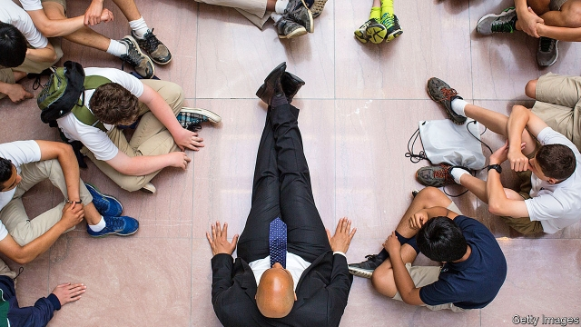
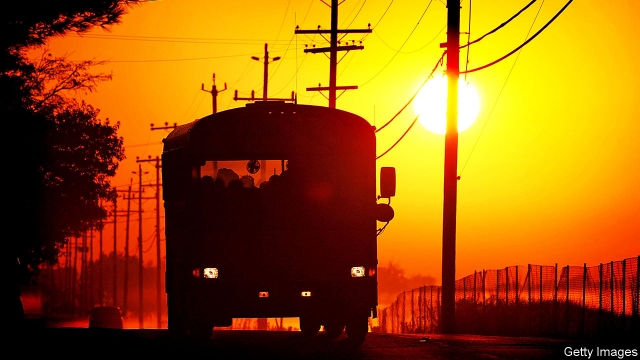

###### Class struggle

# Cory Booker helped turn round Newark’s schools 

##### Taking credit for that in the Democratic primary is tricky 

 

> May 16th 2019 

ON SEPTEMBER 24TH 2010 “The Oprah Winfrey Show” hosted the unlikely trio of Cory Booker, who was then the Democratic mayor of Newark, Chris Christie, who was then the Republican governor of New Jersey, and a skittish-looking Mark Zuckerberg. They were there to announce a $100m donation from the Facebook founder to help Newark’s beleaguered schools. Mr Booker promised it would be a “bold new paradigm for educational excellence in the country”, and helped raise another $100m in matching donations. 

Now that Mr Booker is a New Jersey senator running for president in a crowded Democratic primary, he seldom brings up the Zuckerberg donation. That is not because the schools have failed to improve. They have done so significantly, though not to the degree envisioned by Mr Booker, who exclaimed that “you could flip a whole city!” Instead, it is because the ingredients of Newark’s education turnaround—the closing of bad schools, renegotiating teacher contracts to include merit pay, and expanding high-performing charter networks—are anathema to the Democratic primary voting base. 

Outside Newark, the public perception of the school reforms remains widely negative. Much of that is due to Dale Russakoff, a journalist, who wrote an influential and stinging portrayal of the efforts in her book, “The Prize”. Cami Anderson, the hard-charging superintendent appointed to oversee the plan, was widely criticised, and then resigned after Mr Booker decamped from Newark to Washington in 2013. Ras Baraka, a former high-school principal who is the current mayor, won election after making the contest a referendum over Ms Anderson’s popularity. 

A review of the recent evidence suggests this pessimism is misplaced. For district schools, the high-school graduation rate has climbed to 76%, up from 61% in 2011. A study done by researchers at Harvard found an initial drop-off in test scores, and then, after the reforms set in, a big improvement in English tests, though not in maths. Two-thirds of the growth was attributable to changes in the composition of schools—the closing down of a third of the city’s public schools and expansion of high-performing charters. Today, 31% of black pupils attend schools that exceed the state average, compared with 10% in 2011. All this, even though Newark remains profoundly poor. Nearly 40% of the children live with families making less than the federal poverty line (currently $21,300 for a family of three). The vast majority, 79%, of schoolchildren are poor enough to qualify for free or reduced-price school lunches. 

If Mr Booker believes deeply in anything, it is school choice. In 1998, when he was still a little-known city councillor, he founded Excellent Education for Everyone, which advocates charter schools and voucher programmes. He sat on the board of Alliance for School Choice, a national organisation, alongside Betsy DeVos, who would become education secretary under President Donald Trump. 

School choice has always scrambled the usual left-right divide in American politics. Mr Booker’s belief in it differs strongly from Ms DeVos’s and as a senator he voted against her confirmation. Whereas those on the right see parental choice as a good in itself—and as a way to expand religious education—progressives favour charter schools as a path to opportunity for poor black and Hispanic children whom urban school systems have failed for decades. “What do middle-class people do? They don’t wait for the district to fix itself. If [school choice] is good enough for middle-class people, then poor people should be able to as well,” says Shavar Jeffries, a civil-rights lawyer who runs Democrats for Education Reform, a pro-charter group. 

Ms Anderson, the former superintendent, who now runs a school-discipline initiative, feels vindicated. “The results speak for themselves,” she says. “The fact that the establishment has been quiet is because it’s working.” The rhetoric from Mr Baraka, the mayor who pushed her out, has changed from outright hostility to comfortable neutrality. Ms Anderson describes an ingrained culture of cronyism before she arrived: requests to hire as a teacher the girlfriend of someone politically connected, even though she could not write a cover letter; or not to sack another grandee’s nephew for punching someone in a school cafeteria. Ms Anderson fired most of the district’s principals, whom she found unsatisfactory, and hired her own handpicked ones. 

Disruption was also especially threatening because the school district was one of the largest employers in the city. The budget was nearly $1bn a year—meaning that even the impressive-seeming $200m donation, which was spent over five years, represented only a 4% annual increase in funding. Some of the jobs supported by the big budget seemed superfluous. In her book Ms Russakoff describes a Gogol-like setting in which the clerks had clerks. More than half of the district’s funding—a not-paltry $20,000 per pupil—was gobbled up in central-bureaucracy costs before it reached classrooms. 

A third of pupils in Newark now attend charter schools. According to an assessment done by CREDO, a research outfit at Stanford University, in 2015 Newark’s charters were the second highest-performing in the country. They delivered gains in maths and reading almost equivalent to a full additional year of instruction, the researchers estimated. The latest state assessments for reading and maths for pupils in the third to eighth grades (roughly between the ages of 8 and 14) still show stark differences—60% of pupils in Newark’s charter schools were proficient in English, compared with just 35% in the traditional public schools. For maths, the numbers were 48% compared with 26%. In both cases, the charters beat the state average—a remarkable achievement given the impoverishment of Newark and the high quality of the state’s other schools. 

As a result, demand for charters from parents is high. Before a common enrolment system was in place, the waiting list for KIPP schools, a high-performing charter network, had 10,000 children on it, says Ryan Hill, the co-founder. One of the top-ranked high schools in the state of New Jersey is North Star Academy Charter, which is 98% non-white and 85% poor. Its most recent valedictorian is heading to Princeton. 

Not all charters are so good. On average, their outcomes are similar to those of traditional public schools. They do better in cities, and worse elsewhere. The problem is that teachers’ unions are at their strongest in precisely the places where charters are best, making the politics of school reform treacherous for Democrats. Elizabeth Warren, the Massachusetts senator also running for the Democratic nomination, favoured school choice before she was a public figure, on similar progressive-minded grounds (she worried that the zero-sum race to buy property near good schools was endangering middle-class finances). But she opposed a referendum to increase the number of charters in Boston, despite the fact that these are the highest-performing in the country. 

 

Mr Booker is trying to navigate these treacherous waters. His proposed education manifesto for 2020 is to increase funding for educating special-needs children and to pay teachers more. These proposals are fine. Yet Mr Booker is the only candidate with a serious educational achievement under his belt—and the essential ingredients of that turnaround are not what he is promising now. His campaign replies that there is no one-size-fits-all solution for education reform. 

Mr Booker is already taking flak for his record in Newark. “Cory Booker Hates Public Schools” blusters a headline from Jacobin, a widely read democratic-socialist magazine. He has some defenders too, though. “It is a shame to deride the good work that was done in Newark as a defect of his candidacy or his worldview,” says Derrell Bradford, a long-time advocate of education reform who worked with Mr Booker early in his career. “Newark now is better than when I took my job in 2002. If you’re a poor kid, a black kid, your opportunity to succeed is much higher than before. Is it what it should be, or ought to be? Still no—but there’s been tremendous progress.” 

