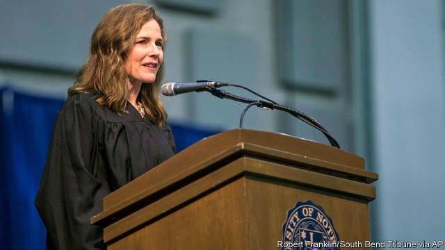

###### Justice-in-waiting

# If Donald Trump gets another Supreme Court pick... 

##### Amy Coney Barrett, a staunch anti-abortion judge, appears to be next in line 

 

> May 16th 2019 

CONSERVATIVES MAY not love everything about Donald Trump, but the 45th president’s record of installing federal judges has delighted them. In barely two years in the White House, with guidance from the Federalist Society, a conservative legal organisation, Mr Trump has seated 104 judges on the district and circuit courts and won confirmation battles for two Supreme Court justices. The high-court picks—Neil Gorsuch replacing a like-minded Antonin Scalia and Brett Kavanaugh taking the seat of the more moderate Anthony Kennedy—have bolstered a 5-4 conservative majority. With one more appointment, Mr Trump could capture a third of the highest court and tilt it conservative for generations. 

Will he get the chance? Clarence Thomas, who at 70 is the longest-serving and most thoroughly conservative justice, recently swatted away rumours of retirement. Two of the four liberal justices, Stephen Breyer and Ruth Bader Ginsburg, are octogenarians. In January a third bout with cancer led Ms Ginsburg to miss work for the first time in a quarter of a century. When she returned to the bench her posture and voice were perkier. But some liberals rue Ms Ginsburg’s decision not to retire a few years ago, when Barack Obama could have chosen her successor. If she leaves the bench under Mr Trump’s tenure, she could be replaced by a rising star of the conservative judicial movement. 

Amy Coney Barrett was born in 1972, just as a young Ms Ginsburg started teaching law at Columbia and was launching the Women’s Rights Project at the American Civil Liberties Union. Now in her second year as a judge on the Seventh Circuit Court of Appeals in Chicago, Ms Barrett was a short-lister last June when Mr Kennedy announced his retirement. A mother of seven and a devout Roman Catholic with ties to People of Praise, a charismatic Christian community, Ms Barrett is the product of a Catholic girls’ school in New Orleans. She is a Phi Beta Kappa graduate of Rhodes College, a Presbyterian liberal-arts institution in Tennessee, and received top honours as a law student at Notre Dame. She clerked for two prominent conservative jurists, including Mr Scalia, and, after a brief stint practising law in Washington, DC, returned to Notre Dame to teach in 2002. 

Ms Barrett’s academic writing sparked concerns among Democrats when Mr Trump nominated her to the Seventh Circuit in 2017. “I would never impose my own personal convictions upon the law,” Ms Barrett insisted when quizzed about “Catholic Judges in Capital Cases”, a 1998 law-review article she wrote with John Garvey, now president of Catholic University of America. Senator Dianne Feinstein told Ms Barrett she was concerned that it seemed “the dogma lives loudly within you”. She fretted that—in light of Mr Trump’s goal of appointing judges who would “automatically” overturn Roe v Wade—she would threaten abortion rights. Ms Barrett had a ready answer. She would have “no opportunity to be a ‘no’ vote on Roe”. As a circuit-court judge, she said, “I would faithfully apply all Supreme Court precedent.” 

The same constraint does not bind Supreme Court justices. And in several law-review articles, Ms Barrett has argued for a more flexible conception of stare decisis, the principle that justices should ordinarily respect the court’s previous decisions. There may be a “very strong presumption” that precedents should stand, she wrote in 2003, but when “a prior decision clearly misinterprets the statutory or constitutional provision it purports to interpret”, judges “should overrule the precedent.” 

Couple that declaration with Ms Barrett’s favourable—even fawning—view of Mr Scalia’s jurisprudence, and there is little reason to believe she would vote to uphold Roe and Planned Parenthood v Casey, a 1992 decision re-affirming abortion rights. In an article in 2017 in the Notre Dame Law Review, Ms Barrett detailed the instances when Mr Scalia “repeatedly urged the overruling of Roe v Wade” and closed with an embrace of the late originalist. “Nothing is flawless”, she wrote, “but I, for one, find it impossible to say that Justice Scalia did his job badly.” 

In speeches, Ms Barrett shares her belief that life begins at conception. As a circuit-court judge, though, she has yet to brush up against reproductive rights—or many hot-button controversies. She has mainly seen eye-to-eye with her colleagues: of the 46 opinions she has written on three-judge panels, only three have been dissents. All but three of her 43 majority opinions have been unanimous. But on the few occasions where she has departed from her fellow judges—or inspired a colleague to dissent—Ms Barrett has shown flashes of strident conservatism. In May 2018 she took a narrower view of a criminal’s constitutional right to a lawyer than two of her colleagues (the Seventh Circuit’s only judges appointed by Democratic presidents). In February she took another hard line against a criminal defendant, dissenting from a ruling for a convict who complained that the state had withheld evidence favourable to his case. 

In March Ms Barrett filed a forceful 37-page dissent from a judgment against a Wisconsin felon whose crime, under state and federal law, barred him from owning a gun. According to Supreme Court precedent, the right to bear arms may be denied to “dangerous people”, she wrote, but not to all felons. Since there is no evidence that “disarming all non-violent felons” does much good—and the criminal in question showed no “proclivity for violence”—it is a violation of the Second Amendment to strip all felons of their firearms. 

Ms Barrett’s expansive view of gun rights—juxtaposed with a narrower interpretation of immigrants’ rights—puts her to the right of the two Reagan appointees who formed the majority in the case. But her dissent is couched in dispassionate, straightforward terms, with none of the barbs that often spiked Mr Scalia’s opinions—and are now popping up in other Trump appointees’ rulings. In the view of Ross Guberman, an expert on legal writing, Ms Barrett’s prose is “relentlessly clear and logical”, free of “political diatribes” and betrays little “that would pin her as an ideologue”. There may be method to her caution. “You’d almost think”, Mr Guberman says, “she has her eye on a higher court.” 

