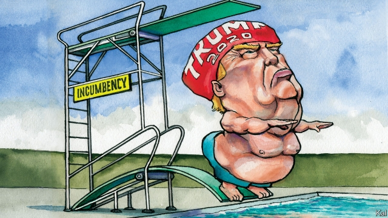

###### Lexington

# Incumbency ain’t what it used to be 

##### The president is using his office to impress his supporters, and annoy everyone else 

 

> May 16th 2019 

DONALD TRUMP’S campaign rallies have had a makeover. Though most of their signature features are still evident— the MAGA hats on sale, the testaments to Mr Trump’s generosity by warm-up speakers, his dramatic arrival by helicopter, Elton John and the Stones blaring out to make everyone feel young again—the production has been brought up to presidential standards. The merchandise stands at the Trump rally Lexington attended last week in Panama City Beach, in Florida’s Panhandle, were NFL quality; everyone in the large crowd seemed to have visited one. The praise singers, who once consisted of a bunch of oddballs and Jeff Sessions, were Florida’s congressional delegation. “Thank God for President Trump!” hollered Senator Rick Scott. “He cares about Florida like nobody else!” The helicopter is now Marine 1. To the seventies music Mr Trump’s stage managers added a magnificent firework display. When Trump comes to town, it’s the 4th of July! 

In a Panhandle county that gave him 71% of the vote in 2016, he could count on a warm welcome. Even so, the emotions the president induced in the lily-white crowd, wearing Trump-branded T-shirts and shorts on a balmy evening, were impressive. “I love him, I love, I love him,” said Darrell, an air-force veteran. “I love him because he cares the most about the people. Democrats don’t care. They want to take money away instead of giving it to our people.” He must have liked what he was about to hear. Mr Trump began his speech by boasting of the “billions” in disaster relief his administration “has given” to Florida, after its recent hurricanes. And he promised there would be more to come, despite (he falsely claimed) Democratic efforts to stop him. 

By way of a gratuitous comparison, he then slammed Puerto Rico, which has suffered even worse storm damage, unleashing a vast exodus of islanders to Florida, for being greedy and corrupt. Candidate Trump dog-whistled on race by making wild claims about immigration; as president, he can merely cite his spending priorities. Ninety minutes into Mr Trump’s speech, in which he talked up the latest jobs numbers, lambasted his enemies and joined in the hilarity that a heckler caused by suggesting he “shoot” Latino immigrants, the crowd was still cheering him. 

There has been much speculation about the electoral boost Mr Trump could get next year from being the sitting president. This is understandable. He won in 2016 by a whisker, few of his supporters have since deserted him, and the benefits of incumbency, in terms of name recognition, the mystique of the office and the many opportunities it presents to blend governing and campaigning, have long been recognised. Throughout presidential history, by one calculation, incumbency has been worth around three percentage points on average. No president has failed to win re-election since George H.W. Bush in 1992, and before him Jimmy Carter in 1980, both of whom were saddled with an economic downturn. Moreover, as his performance in Florida suggested, Mr Trump will milk his office for every advantage he can. 

He will claim to have done things for his audiences that he has not (the disbursement of relief spending to Florida has in fact been slow), and promise incredible things. He will mix politics and governing shamelessly. The pretext for his Panhandle visit was his desire to inspect a storm-damaged air-force base that the Pentagon thought about closing but which he has vowed to rebuild at vast cost. Yet though he stands to benefit from such ploys, the incumbency effect in 2020 will probably be weaker than in the past. 

That is because what Mr Trump’s supporters love about him—including the bullying public persona he has used his office to inflate—almost everyone else loathes. He has therefore gained even fewer supporters than he has lost. His approval ratings are as stable as they are low. And the Democrats, as their bumper turnout in the mid-terms indicated, are as motivated to remove him as his supporters are to keep him in place. Mr Trump is therefore unlikely to get a three-point boost from his incumbency, or anything close to that, because it is unclear whether such a large group of swing voters even exists. The election is likely to be decided by whichever side does a better job of mobilising its supporters—just as Barack Obama’s re-election was in 2012—with the presidency among the tools that Mr Trump will have at his disposal. 

This is risky for a Republican because the Democrats have more supporters, which is why they tend to win the popular vote. Yet the electoral college mitigates that advantage (which is how Mr Trump won in 2016). It should also be noted that, even if Mr Trump’s hyper-partisanship makes him an extreme case, his two immediate predecessors both ran less inclusive campaigns the second time round. This underlines the fact that the depletion of swing voters, and consequent reduction in the incumbency advantage, is a long-running trend. Even in the alternative universe in which Mr Trump could restrain himself and count on incumbency and the strong economy to see him home, there might not be enough persuadable centrists left for the strategy to pay off. 

Despite his low ratings, Mr Trump’s more divisive style could turn out to be a better bet at this juncture. In particular, it might be his best hope of tying in the voters who have gone most wobbly on him: a group of working-class whites—the so-called Obama-Trump voters—in Midwestern states such as Michigan and Pennsylvania which he won by tiny margins and needs to win again. Given that these voters have not felt much of a boom in their wages and had no great qualms about Mr Trump’s boorishness in 2016, it is not obvious that they would be likelier to stick with him if he were to tone it down and lead with the economy. Ripping into his opponents, after all, is what Mr Trump is best at—and he is anxious to get on with that. “I’ll take any,” enthused the president in Florida, after denigrating the main Democratic primary contenders. “Let’s just pick somebody please, and let’s start this thing.” 

