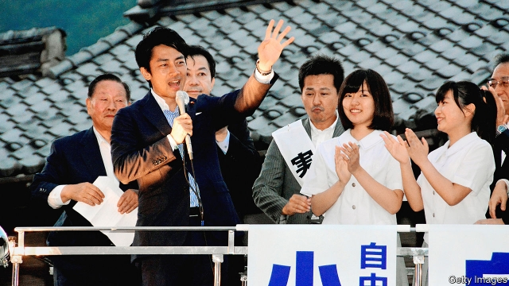

###### Cometh the hour, cometh the man’s son

# A political dynast is favoured to be Japan’s next prime minister 

##### Shinjiro Koizumi is handsome, well-spoken and ambitious 

 

> May 23rd 2019 

GLANCE AT THE members of the Diet and this much is clear: Japanese politics is a business for old men. The average age of a member of parliament is around 55, and prime ministers tend to be even older than that. So it is striking that people are talking about a 38-year-old, Shinjiro Koizumi (still a man, of course), as a potential successor to Shinzo Abe, the incumbent prime minister, who must step down by 2021 according to the rules of the ruling Liberal Democratic Party (LDP). 

Mr Koizumi is the son of a prominent former LDP prime minister, and, like many MPs, won the seat his father vacated when he retired from politics. In the decade since he was elected, however, he has made a name for himself in his own right. He has charisma and is a good orator. It doesn’t hurt that Mr Koizumi is fodder for glossy magazines thanks to his film-star looks (his brother is an actor). 

Mr Koizumi has been trying to show he has substance, not just star appeal, even though he has never had a job in the cabinet. His most important role in the government to date has been monitoring the reconstruction effort after the Tohoku earthquake in 2011—a task he is said to have done well. He is also an enthusiastic advocate of reforming health care and pensions, a step he says might help Japan get over its gloom about its ageing and shrinking population. He speaks of transferring resources from the old to the young, by making people work longer, for example, and by making child-rearing easier. 

He earned a master’s degree at Columbia University and speaks fluent English—a rarity in the Diet. He is hardly an iconoclast, rejecting immigration as a balm for the country’s demographic ailments, as most politicians do. He is woolly on other social issues. But he says he wants to push diversity. “If I hadn’t gone to the US, I wouldn’t really understand what diversity is,” he says. “It is hard to feel in Japan.” 

Many Japanese take it for granted that Mr Koizumi will eventually become leader of the LDP and prime minister (the two jobs tend to go together); the question is when. The LDP’s leadership race involves votes among both its MPs and its broader membership. Polling suggests he is the most popular choice among the public; the media refer to him as Japan’s Macron. It helps that there are few strong alternatives. 

Mr Koizumi has to tread a delicate line by being enough of an insider to gain support within the party, but enough of a critic to earn the respect of the public at large. He praises Mr Abe’s reforms, but did not vote for him in LDP leadership elections in 2012 and 2018. 

Mr Koizumi is coy about whether he will stand in 2021: “Let’s see.” But he points out that on the one hand, young people are becoming estranged from politics, and on the other that the LDP attracts more young voters than any other party. “Japan is getting ready to see more young leaders in politics,” he says, with a dash of self-interest. 

