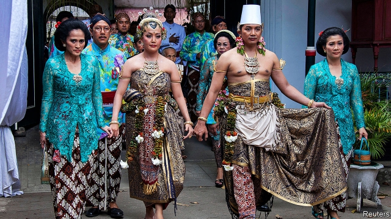

###### Polite and powerful

# How the mores of Indonesia’s biggest ethnic group shape its politics 

##### Javanese custom eschews conflict in favour of woolly consensus 

 

> May 23rd 2019 

NO ONE BEATS about the bush quite like the Javanese, an ethnic group from Indonesia’s most populous island. Chronicling their mores in 1960 Clifford Geertz, an American anthropologist, noted that proposals for arranged marriages often start with the groom’s father visiting the bride’s family and saying something as vague as: “The frost in the morning means rain in the evening.” More metaphors ensue as the conversation slowly meanders towards the point. The future in-laws then counter with false protests, saying that their daughter is unworthy. This ritual is repeated a few times. When the bride and groom finally meet, direct eye contact is avoided and no one talks of weddings. 

Indonesia is a vast archipelago with hundreds of ethnicities spread across 13,000 or so islands. But Javanese dominate, with 95m people, or 40% of the population. There is much that is distinctive about Javanese culture, from shadow-puppet plays to tempeh, a fermented soyabean cake. The Javanese language is the 12th-most-spoken tongue in the world. Traditional Javanese religion blends Hinduism, Buddhism and Islam. To this day, the sultan of Yogyakarta, a Javanese royal, throws nail and hair clippings into the sea and a volcano each year to appease the gods. 

Most noticeably, Javanese have a distinct etiquette. “We are a polite people who do not like conflicts,” explains Prabandari, a Javanese woman from Yogyakarta, which is considered a centre of Javanese culture. Her friend, a Javanese businessman, says he finds arguments so distasteful that he cannot bring himself to haggle. Asih, a Javanese teacher, complains that she is expected to “camouflage” her true thoughts. Geertz recounts the tale of a husband who wanted a divorce but thought it unseemly to say so. Instead he inflamed an old quarrel between his wife and a villager and, without saying anything directly, failed to side with his wife. She soon left him, in what he saw as a triumph of politesse. 

Javanese are softly spoken, too. Ellia Wamese, a student from Maluku, an eastern province, recalls giving a presentation to a group of Javanese. Although he spoke at what he considered a normal volume, they thought he was irate and shouting. 

Java plays a disproportionate role in the economy and politics. It is home to Jakarta, the capital, and generates 58% of GDP. Party bigwigs tend to be Javanese. Their dislike of conflict has helped create a parliamentary system run by consensus, rather than majority rule. Cross-party committees shape laws and the budget. This means law-making can be tediously slow and often ends in a woolly compromise. 

Political parties have only the vaguest of ideologies, and tend to fall in line behind the president of the day. The coalition supporting Joko Widodo, the current president, who is known as Jokowi, will probably command 60% of seats in the new parliament. His predecessor managed 75%. And before his re-election in April Jokowi contemplated striking an alliance with Prabowo Subianto, who had run against him in 2014 and ended up running against him this year. That would have done away with the need to hold an election at all. 

This week, after the official results of the election were released, Mr Prabowo’s supporters mounted protests in which at least six people died. This disorder, too, is very Javanese: what better way to show a leader is illegitimate than to prove he cannot preserve peace and harmony? 

