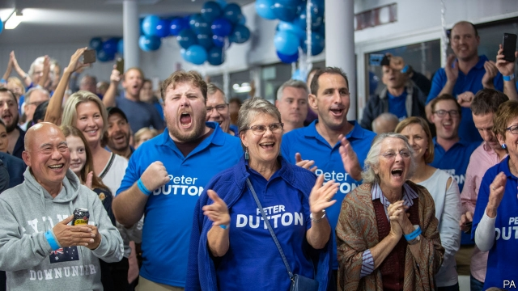
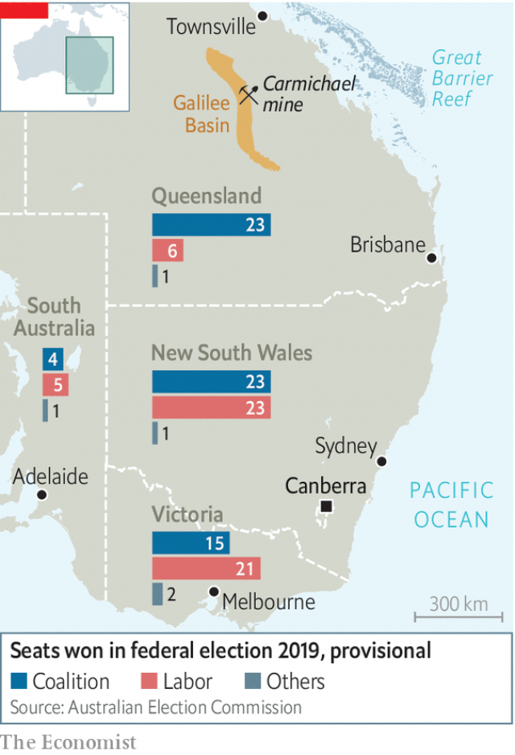

###### Upset down under

# How the ruling coalition won an unexpected victory in Australia 

##### The Liberals put off greens; Labor put off miners and pensioners 

 

> May 23rd 2019 

EVEN BY THE admission of the prime minister, Scott Morrison, it was a “miracle”. His centre-right Liberal Party was expected to lose a federal election on May 18th. Instead, it has been returned to power with more MPs than it had before. Counts are still trickling in, but the Liberals and their rural partners, the National Party, look set to take 78 seats in the lower house of parliament. That gives their coalition government, now entering its third term, a majority of three. 

The result blindsided Australians, because pundits, bookmakers and even a supposedly clairvoyant crocodile had all predicted victory for the main opposition party, Labor, which had led the coalition in the polls since soon after the previous federal election, in 2016. The Liberals have been consumed by infighting, with centrist and conservative wings perpetually at one another’s throats, leading to the toppling of two sitting Liberal prime ministers by their own MPs. Many Australians had seemed inclined to punish the government both for its incessant feuding and for its failure to curb greenhouse-gas emissions, which have been rising under its tenure. The coalition had been given a drubbing at a recent state election in Victoria and at several by-elections. 

The Liberals did indeed do badly in affluent inner-city areas full of green voters. In Sydney Tony Abbott, a former prime minister who once called climate change “crap”, was ousted from his formerly safe seat by an independent who had promised to cut emissions. In Victoria there were big swings away from the Liberals in leafy suburbs—but the seats in question are so solidly conservative that their MPs survived all the same. 

In the end, the election was won in Queensland, a state full of marginal constituencies. Global warming is exacerbating its frequent floods and droughts, and has devastated big parts of the Great Barrier Reef, which stretches along its coast. But the state’s economy is dependent on exploiting natural resources, notably coal, and many of its voters are wary of environmental regulation. 

 

Labor had wanted to set binding caps on emissions. This would have involved generating more electricity from renewable sources, rather than coal, which still fires most of Australia’s power plants. But the party’s toing and froing on another issue—whether to permit the development of the vast new Carmichael coalmine by an Indian conglomerate, Adani—probably did more to hurt its standing with voters. 

Adani’s mine is in the Galilee Basin, a part of outback Queensland which is home to some of the world’s biggest untapped coal reserves. Whether these should ever be dug up is a point of bitter national contention. The Liberals support the mine, as well as others in the basin. Labor, in an attempt to appeal both to would-be mineworkers and green metropolitan types, has waffled about its intentions, alienating everyone. 

The party thought it might pick up a handful of marginal seats in Queensland. Instead it lost two, leaving it holding on to just five of the state’s 30 constituencies. Voters turned out in force for nativist fringe parties, which have a bigger presence in Queensland than elsewhere, transforming coalition seats around the Galilee Basin that had previously been held by wafer-thin majorities into conservative strongholds. Nativists won some working-class votes from Labor and, under Australia’s preferential voting system, funnelled them to the Liberals. Angry environmentalists have begun calling for “Quexit”, to secure more progressive government for the rest of Australia. 

It did not help that Labor’s leader, Bill Shorten, is unpopular. (He stood down immediately after the election as head of the party, but will stay in parliament.) Mr Morrison is hardly beloved either. But he adopted a studied everyman persona, which seems to have gone down better than Mr Shorten’s equally studied efforts to look statesmanlike. 

The Liberals were too divided to agree on a substantial platform. Mr Morrison’s only notable pledge was to lower income taxes. He focused instead on accusing Labor—quite implausibly—of imperilling the economy with its plans to cut emissions and close tax loopholes that benefit the wealthy. Those reforms frightened pensioners and owners of investment properties, in particular. Many of them turned on Mr Shorten. 

This may be the last time an opposition party tries “a big-ticket campaign”, says Anne Tiernan of Griffith University. But now the campaign is over, Mr Morrison has a chance to be more ambitious than his bland campaign suggested. The defeat of Mr Abbott, the leader of the Liberals’ right wing, gives the prime minister an opportunity to pull the government back to the centre, argues John Hewson, another former Liberal leader. Whether he will take it is anyone’s guess. Having saved the party from disaster, without making many clear pledges, he has far more room for manoeuvre than his recent predecessors. 

