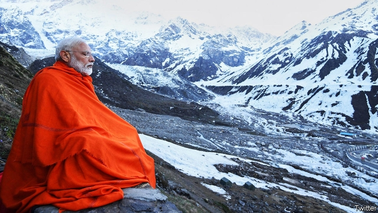
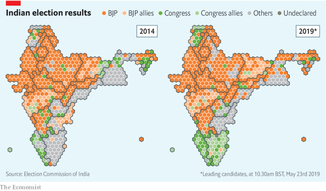

###### India’s election results

# Narendra Modi scores a remarkable election victory 

##### The BJP’s win is down to the prime minister, not the party 

 

> May 23rd 2019 

AFTER A HARD-FOUGHT re-election campaign, an American president might thwack some balls down a fairway, or go shoot turkey with the boys. Narendra Modi is different. As India’s gruelling election marathon reached its seventh and final round of voting, leaving a break before the final tally on May 23rd, its prime minister headed instead to a hermit’s cave at the foot of a Himalayan glacier. Or rather, Mr Modi led a posse of cameramen to the scenic Kedarnath Temple, where they dutifully snapped him in a range of poses, from deep meditation cloaked in a saffron shawl, to striding purposefully against a backdrop of snow-capped peaks, sporting a grey woollen cassock and felt cap, a silken tiger print cast over his shoulder. 

The image, half Olympian god and half kung-fu wizard, suits a man who appears to have pulled off a miracle. For such, in the permanent subtropical storm of Indian politics, is the rarity of two consecutive full parliamentary majorities. As The Economist went to press, the Bharatiya Janata Party (BJP) looked set to boost its share of votes from 31% in 2014 to 40%, and to increase its number of seats in the Lok Sabha, or lower house of parliament. With plenty of smaller regional parties as allies, Mr Modi will enjoy another walloping majority. 

There are many reasons why the BJP has again outplayed its rivals. At the top, however, is Mr Modi’s charisma. The relentless ubiquity of his face, in print, on screens and in streets, may be something that money and power can buy—and the BJP has plenty of both. What takes talent is to create a role as an ancient-yet-modern captain of an imaginary Team India, and then to play it out with unbounded conviction. In adopting an almost mythical persona, Mr Modi appears to rise heroically above his foes. He becomes a vessel for dreams, not only of national glory but also individual dignity. He involves his followers in a story that promises a happy ending. 

But with his wagging finger and gravelly snarl, Mr Modi is also a vessel for anger. In speeches over recent weeks, one count showed he spent 53% of his time attacking opponents, a further 18% talking of national security, and only the remainder touting vikas, or development—the central theme of his 2014 campaign. In the town of Gondia in the state of Maharashtra in early April, he blasted critics for questioning his decision to strike at Pakistan, following an attack in February claimed by Pakistan-based militants. “People who sit in air-conditioned offices in New Delhi claim the nation has forgotten Balakot [the site of the attack]. Have we forgotten Balakot?” In Mysore, he declared that all terrorism in India was linked to Pakistan, but the rival Congress party kept talking about “Hindu” terror. Back in Maharashtra, he asked first-time voters to dedicate their ballots to Indian martyrs. “What can be more sacred than giving your vote to the nation?” he cried. “Exercise your choice, and decide who can serve the motherland.” Then, at a rally in Uttar Pradesh, he asked the crowd if it felt good when India hit Pakistan, or tested a new satellite-killing missile. 

 

Without Mr Modi, reckons Sanjay Kumar, director of CSDS/Lokniti, a Delhi think-tank, the BJP would probably have lost. Despite some successful social programmes, the Hindu nationalists’ five years in power have largely failed to live up to promises, and in fact caused widespread distress, particularly to minority groups. Polling data show that in the populous Hindi-speaking heartland, where the BJP recently lost three state assemblies to the rival Congress party, a high proportion of voters this time voted for the prime minister rather than his party. 

Yet Mr Modi’s strutting, sneering nationalism remains only part of the story. His opponents aided their own defeat. As in 2014 they largely failed to form cross-party alliances, allowing the BJP to win numerous three-way races with a mere plurality of votes. Congress, the only national rival amid a sea of regional parties, vainly tried to chip away at Mr Modi’s image, and to present itself as equally Hindu, but failed to provide a compelling new narrative. Its leader, Rahul Gandhi, had in fact narrowed his popularity gap with Mr Modi from a dismaying 35 percentage points in May 2017 to just ten points a year later. But when the terror attack in February, followed by Mr Modi’s retaliatory strike, triggered a reflexive nationalist surge, the gap yawned again to 19%. 

 

The perfectly timed clash with Pakistan was hardly the BJP’s only extra advantage. Indeed Shivam Vij, an astute media commentator, suggests that given his hand of jokers it is surprising that Mr Modi did not win 100%. Not only did the BJP wield immensely more money than rivals, it has a far better-greased party machine, backed up by the street power of hundreds of Hindu-nationalist voluntary groups. Madhya Pradesh, a state just captured by Congress five months earlier, nevertheless returned a huge BJP majority to parliament, largely because it mobilised enough voters to register a ten-point surge in turnout. 

Some of Mr Modi’s crucial support might not be described as voluntary. Conveniently, government statisticians tried to bury reports of a surge in unemployment before the vote. Just as helpfully, the Indian air force refrained from spoiling Mr Modi’s martial bombast, delaying the revelation that during February’s brief dust-up with Pakistan it had shot down one of its own helicopters. At a time of rising world oil prices, meanwhile, state-owned fuel distributors kept the cost of petrol for Indian consumers artificially low (not surprisingly, they are beginning to rise). Not least, the Election Commission of India, a powerful body with seven decades of accolades for fair and efficient management of the world’s most logistically daunting democratic exercise, has in recent months issued a long series of decisions that advantaged Mr Modi. But perhaps it is not surprising that the gods get all the luck. 

