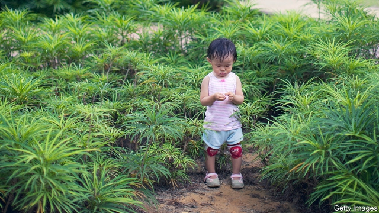
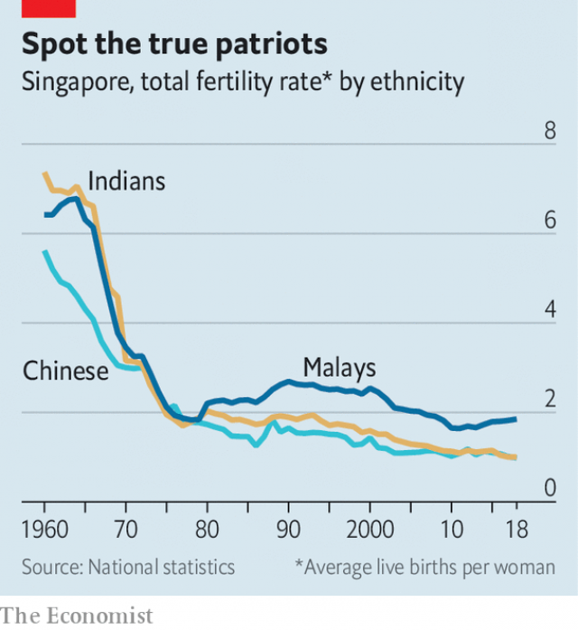

###### Baby strike

# Singapore’s government struggles to promote procreation 

##### The city-state has one of the lowest fertility rates in the world 

 

> May 23rd 2019 

“REAL LOVE works”, a sign outside the entrance to Singapore’s marriage registry assures visitors. Inside, however, shelves of pamphlets imply that love needs a little help. One leaflet details generous housing benefits for newlyweds. Another recommends a list of subsidised marriage counsellors. A third gives advice on addressing marital differences (“Think win-win”) and family planning (“Make time for sexual intimacy”). 

The registry gets fewer visitors than it did in the past. A third of Singaporeans aged 30-34 are not married, up from a fifth in 1980. That trend is matched by a decline in the number of babies. The fertility rate, a measure of how many children the average woman will have over her lifetime, fell to just 1.14 last year, among the lowest in the world. The city-state’s population of 4m would be falling were it not for a continual influx of immigrants. 

It wasn’t always this way. After Singapore won independence in 1965, many feared that overpopulation would hamper economic growth. The government launched family-planning campaigns and encouraged sterilisation and abortion. Meanwhile, more women were going to university and joining the workforce. Over the ensuing decade, the fertility rate plummeted from 4.5 to 2.1, the level at which the population is stable. 

This created other problems. Lee Kuan Yew, Singapore’s prime minister from 1959 to 1990, lamented the fact that improved schooling for women had created a “lopsided” pattern of procreation, where the better-educated had fewer children. The government tried to correct the balance by, among other things, giving tax breaks to graduates with big families and cash to less-educated women who got sterilised. Because ethnic-Chinese Singaporeans, who make up three-quarters of the population, are highly educated, the measures smacked of eugenics and were unpopular. They were gradually rolled back. 

Today the state takes more of a back seat. The Social Development Network, a government body set up in 1984 to play matchmaker for graduates, now provides grants and oversight to Singapore’s 13 approved dating services. One is working with public universities and AI Singapore, a government tech unit, to develop a matchmaking algorithm and relationship-advice chatbot. Prodding about breeding has been farmed out to NGOs. The posters of one such outfit, I Love Children, which is mostly government-funded, depict ovaries as ticking clocks alongside messages like “Fertility is a gift with an expiry date”. 

The clearest pro-family policy is in housing. It works through the Housing & Development Board (HDB), which administers the government-subsidised flats in which four-fifths of Singaporeans live. Large grants help married couples buy flats. Those with children get extra handouts. It is virtually impossible for singles to get HDB housing until they are 35. 

 

Despite such enticements, birth and marriage rates continue to fall, abetted by countervailing government policies. Surveys find that Singaporean workers clock the longest hours in the world. This is helped by a “lack of constraints on employers”, says Michael Barr of Flinders University in Australia. Labour laws are weak. There is no minimum wage and strikes are rare. Statutory paid maternity leave is 16 weeks, more than in the United States but less than in most of Europe. A recent survey found that most married couples would like to have more children, but work and the cost of raising a child get in the way. Two-fifths of singles said they do not date because they want to focus on their careers. 

Another problem is the government’s narrow view of what constitutes a family, says Jean Yeung Wei-Jun of the National University of Singapore: two heterosexual parents with a male breadwinner. Many regulations support this definition. Most divorce proceedings can only begin three years after marriage. Those who split move to the back of the queue for HDB flats and get fewer grants. Children born out of wedlock get fewer financial benefits, and their fathers get no paid parental leave. The government argues that these policies reflect social norms in Singapore, citing a survey which finds that 83% of young singletons intend to get married. 

Nonetheless, the government’s most recent push for procreation suggests a shift in those norms. In 2014 it lengthened parental leave and increased support for unmarried parents. It has also made it easier for divorcees to buy HDB flats and it plans to double spending on child care between 2017 and 2023. 

This may not have had the desired effect, however. Overall fertility rates have continued to decline, with one exception: ethnic Malays. They are the poorest of Singapore’s three main ethnic groups, and so may be more susceptible to financial incentives. The Malay fertility rate has risen steadily since 2013 and now stands at 1.9, almost twice the Singaporean-Chinese rate of 0.98. They are the future, it seems. 

