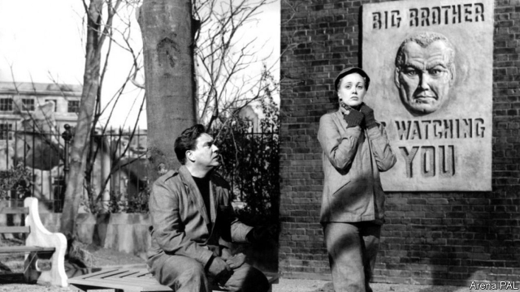

###### The clock strikes 13

# Big Brother’s long afterlife 

##### “1984” might have become irrelevant when the Soviet Union fell. But it didn’t 

 

> May 23rd 2019 

The Ministry of Truth: The Biography of George Orwell’s “1984” By Dorian Lynskey. Doubleday; 368 pages; $28.95. Picador; £16.99 

HOW GEORGE ORWELL would have relished these times. Alternative facts, troll farms, meme warfare—he would be spoiled for material. “The Ministry of Truth”, Dorian Lynskey’s biography of “1984”, joins the dots between the age of fake news and Orwell’s work. 

Mr Lynskey begins with the genesis of “1984” and its reception in 1949, and then explains how it reverberated through the cold war. The Spanish civil war and Orwell’s career in the BBC may seem familiar, but the novel’s literary background is arresting. Utopian and dystopian stories had become increasingly popular since H.G. Wells published his series of late-Victorian hits such as “The War of the Worlds”. Orwell was heavily influenced by Wells; Mr Lynskey gives a poignant account of the ageing man of letters dining with the rising star in Orwell’s tiny flat in London in 1941. The result was a bust-up, the aggrieved Wells skulking off into the darkness. 

As Mr Lynskey says, Orwell wrote “1984” not as a prophecy but as a warning, to galvanise action so that the future he described never came to pass. He succeeded; the book became a weapon in the Western fightback against totalitarianism in the 1940s and beyond. Yet, as Mr Lynskey relates, by the 1970s it had become so proverbial as to be colonised by gormless television shows and indifferent pop-music albums. Its wholesale appropriation by pop culture blunted its political force. 

When the Soviet Union fell, Orwell’s oeuvre might have become a historical curiosity. After all, mid-century writing that was meant to expose the despotism of both the communist left and fascist right should have become irrelevant; history was deemed to have ended. That is not how it turned out, for history or Orwell. 

Disappointingly, the section on his modern resonance is the weakest part of Mr Lynskey’s book. He devotes only a brief passage to the Orwellian echoes in Donald Trump’s presidency: the lies that warp reality, the obsolescence of facts, the divergent information universes of Fox News and CNN. The obvious implication—that the totalitarian methods chronicled by Orwell 70 years ago are now being recycled by supposed democrats—should concern everyone. But it awaits a more rigorous analysis than the one offered here. 

