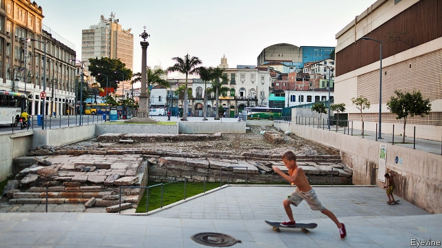
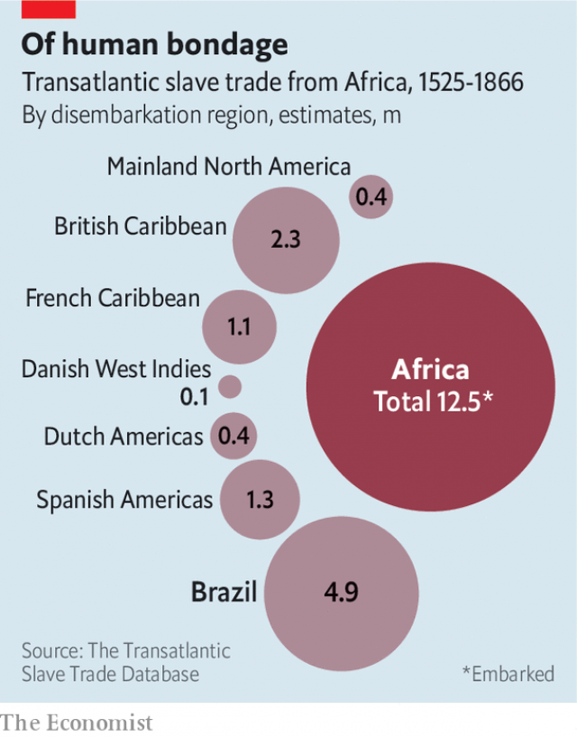

###### Giving up the ghosts

# For some in Brazil, commemorating slavery is vital 

##### Others are wary of a painful past 

 

> May 23rd 2019 

IN 2005 Giovanni Harvey began to buy property in the port district of Rio de Janeiro. The area was dilapidated and controlled by drug-traffickers; he would wear a tucked-in shirt (to show he was unarmed) and sandals (suggesting he had no reason to run). But Rio aspired to host the World Cup and the Olympics, and the area was due to be gentrified. To Mr Harvey, a successful black businessman who founded Brazil’s first incubator for Afro-Brazilian entrepreneurs and served as national secretary for racial equality, the purchase was “purely an investment”. He knew nothing about the port’s role in slavery. 

Two events in February 2011 changed that. On a business trip to Senegal he visited the Maison des Esclaves, where enslaved Africans were loaded onto ships for the Americas. “Until then, I’d had a romantic image of slavery,” he says. In the 1970s his school had glossed over such dehumanising aspects as family separation. In Africa, he wept. Just days after returning to Brazil, he turned on the television and saw an archaeologist discussing the “discovery” of the Cais do Valongo, a wharf in Rio where around 1m slaves had disembarked (pictured). It was two blocks from his house. 

Since then, Mr Harvey and a small group of Rio-based academics, entrepreneurs and activists have fought to disseminate this history. It is an uphill battle. The wharf was recognised as a UNESCO World Heritage site in 2017, but risks losing that status because of political bickering, economic woe and the government’s perennial negligence over historical preservation, especially when the history in question is painful. A plan to construct a museum next to the wharf has won international support, but attracted neither funding nor powerful domestic politicians to tout it. 

These days the wharf is ridden with graffiti and trash. Other relevant sites are in even sorrier states—but then, so is much of Rio. For some, commemorating slavery is a vital part of addressing contemporary injustices. For others, it is a distraction. 

 

Between 1525 and 1866 more than 12m slaves were shipped across the Atlantic to European colonies in the Americas. Around half a million died on the way to Brazil; of the 4.9m who disembarked there, around half did so in Rio, according to Emory University’s Transatlantic Slave Trade Database (see chart). At the height of the slave trade in the early 1800s, when gold, coffee and sugar cane were booming, 400-500 enslaved Africans landed at the Valongo wharf every week, says Monica Lima of the Federal University of Rio de Janeiro. Its unearthing in 2011 was not really a discovery, she notes. Documentary evidence had always existed, but over the years the wharf was covered up—by a new pier to receive the Portuguese empress in 1843; by a commercial plaza in the early 1900s; by a powerful myth, confected in the 1930s, that Brazil is a “racial democracy”. 

 

“There’s this notion that Brazil isn’t as racist because it has lots of interracial marriages and everyone loves samba,” says Ms Lima. Though Brazil was late to outlaw slavery, in 1888, it did not adopt the segregation and miscegenation laws that ensued in America. More fluid relations helped perpetuate a feeling that slavery need not be dwelled upon. Mr Harvey sees himself as a victim of this “social amnesia”. 

In the 1970s Brazil’s civil-rights movement started to question the idea of racial equality. It gradually brought about change. During the presidency of Luiz Inácio “Lula” da Silva (2003-10), a law instructed schools to teach Afro-Brazilian history. Steps were taken to boost black education and alleviate poverty; descendants of escaped slaves living on informal settlements called quilombos gained land rights. São Paulo opened the Museu Afro Brasil, a complement to an existing institution in the north-eastern city of Salvador (though neither focuses on slavery). 

In Rio, Eduardo Paes, a white mayor known for his love of samba, promised that a multi-billion-dollar project to renovate the port would benefit the black neighbourhoods around it. Rebranded with an old nickname, Little Africa, the area has witnessed a cultural flowering in recent years, including the Museu de Arte do Rio, which hosted Brazil’s first major exhibit about samba, and the rebirth of a weekly gathering at Pedra do Sal, a rock where early sambistas jammed. Julio Barroso, a cultural impresario, says it is these sorts of initiatives that the government should support. “We can’t get stuck in the past,” he says, “we have to look toward the future.” 

Others insist that the awful history of slavery must be remembered alongside uplifting narratives. “It’s more than just a reference point, it’s the defining factor in the construction of Brazilian identity,” thinks Ms Lima. Ignorance, they say, only makes this task more urgent. When vestiges of the Valongo wharf began to emerge in 2011, Mayor Paes gleefully announced that Rio had found its “Roman ruins”. Newly enlightened, Mr Harvey protested. “This is our Maison des Esclaves,” he said. More fumbling followed, including a short-lived suggestion that the mayor’s office inaugurate the wharf with a musical re-enactment of a slave voyage, featuring black actors. 

Because of such insensitivity, many black people in Rio are apprehensive about the museum proposal. The original plan was to use a warehouse near the wharf owned by the federal government and constructed in 1871 (without slave labour) by André Rebouças, a black engineer. The Smithsonian Institution and other overseas bodies were supportive, but the scheme came to nothing, as did a proposal in 2017 from Rio’s new mayor, Marcelo Crivella, for a “Museum of Slavery and Liberty”. Its unfortunate Portuguese acronym—MEL, meaning honey—sparked an outcry. 

The project was renamed and given the broader purpose of chronicling the African diaspora. Then, in February, Nilcemar Nogueira, the municipal official responsible, was demoted. She insists the plans are progressing; the 80m reais ($19.5m) required will come from private donations, she says. Meanwhile, rubbish collection at the wharf depends on a grant from America’s State Department. “If the mayor’s office can’t even take out the trash, how is it going to run a museum?” asks Luiz Eduardo Negrogun of the State Council for Black Rights. 

One danger is that debate over how to handle such a sensitive subject, which could be therapeutic, will instead be a pretext for uninterested governments to abandon the project altogether. Brazil’s far-right president, Jair Bolsonaro, once characterised quilombo residents as fat and lazy. Mr Crivella (an evangelical Christian) is the first Rio mayor in decades to refuse to attend carnival celebrations. Choosing whether and how to highlight slavery is “a political decision”, says Milton Guran, an anthropologist who co-ordinated the Valongo wharf’s recognition by UNESCO. 

Ali Moussa Iye, director of UNESCO’s Slave Route Project, which has just issued guidelines on managing slavery-related sites, notes that the task is often complicated by the paucity of physical exhibits: “apart from shackles here and there, it is an intangible heritage.” In Rio, though, even such artefacts as have survived have been neglected. Consider the “New Blacks Cemeteries”, pitiful church-side plots where newly arrived slaves who died from disease or exhaustion were dumped like rubbish. In 1996 a white woman came across some such remains while building a house. Merced Guimarães now runs a tiny museum called the “Institute of New Blacks”, where visitors can peer through a glass panel in the floor and see the skeletons of slaves. 

But there has been no effort to fund large-scale excavations or memorials. “Archaeology in Brazil doesn’t produce knowledge, it just accumulates material,” says João Carlos Nara, an architect and historian who studies the Santa Rita church in Rio, where thousands of slaves were buried in the mid-18th century. He thought the construction of a tram line on the site could be an opportunity to learn what lay beneath. But the city was keen to finish the job. 

After some debate, the firm in charge proposed raising the tracks to avoid the bones, and to give several stations apposite names such as “Little Africa” and “New Blacks”. Black leaders reluctantly agreed—to forestall a repetition of what happened to the material recovered from the Valongo wharf in 2011. Mr Negrogun summarises that bleak precedent: “The remains of our ancestors are sitting in plastic bags in air-conditioned shipping containers waiting for whenever there’s enough money to study them.” Last year, construction on the tram line moved forward. Whatever bones had emerged were quickly covered up. 

