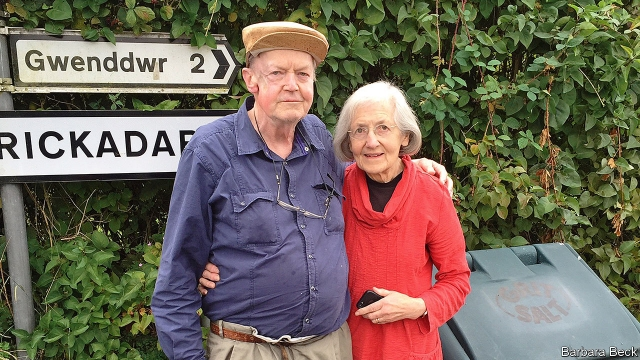

###### The boy from Africa

# Remembering Tony Thomas, a great Economist journalist 

##### He kept a spike in his office for poor copy—and once killed a mouse with it 

 

> May 23rd 2019 

“FRESH AIR and fresh light” was how Tony Thomas appeared to his bureau chief when he breezed into the Brussels office of The Economist in 1974. Improbable, even. He had come out of Africa, via the Yorkshire Post and the Washington office of the Times, to cover Britain’s efforts to join the Common Market. Unlike the desk-bound pundits in St James’s Street, here was a journalist of the old school. He was not afraid to get his hands dirty; to ask in his brisk, emphatic way, “What’s the story?” and to challenge conventional wisdom whenever he met it. Throughout his quarter-century at The Economist, as well as over fine wine and venison stew in the Welsh hills he retired to, he kept the habit. 

His Southern Rhodesian background made that difference. He was always, in accent, dress, head and heart, the boy from Africa. Bulawayo, his home town, was a place for hard grafters, unlike soft-handed Harare. So straight out of government school at 16 he had joined the Bulawayo Chronicle, then made his way to England to work there. But the move didn’t change him. When his doctor remarked latterly that he should be good for a couple of years, he told friends he would be able to plant at least one more crop of “mealies”, or maize. 

Once at The Economist he thrived, writing for almost every section of the paper. After Brussels he became US business correspondent, covering the whole country out of New York. America became his lasting joy and fascination. He did two stints there, and never tired of reviewing books on its history. With Edmund Fawcett, a colleague whose sister, Sarah (pictured right on previous page), he married, he wrote “The American Condition”, assessing land and people with his usual unflinching eye—but also the humanity of Rembrandt or Norman Rockwell, favourite artists. 

In London, as Business Affairs editor for six years, he kept a spike in his office to receive poor copy. (Ever the country boy, he also killed a stray mouse with it.) He wrote an enthusiastic survey on golf, ran Books & arts, and with the then-editor, Rupert Pennant-Rea, a soft Harare man, introduced a sports page. Its failure disappointed him. But then, at Books & arts, he was already doing “the best job on the paper”. 

Meanwhile he used his clear eye, first, to turn writers’ dross into good vigorous prose, and second to spot young talent when it turned up. Several of today’s senior editors were hired by him. He took pride in that, and them. 

His move to a whitewashed cottage in Crickadarn in 1998 seemed sudden, prompted by a cancer prognosis that he delightedly outlived by many years. But Wales was the land his great-grandparents had left for southern Africa; and there he turned his voracious appetite for life to becoming an honorary Welshman. He was a vice-president of the Erwood agricultural show, grew vegetables of prize-winning size, was teaching himself Welsh and found in Mattie (short for Matabele), a spirited Welsh springer, the perfect dog. But, like any journalist worth their salt, he loaded the sofa at weekends with every decent London paper he could get. For though he might have left the world of news, it, like The Economist, never left him. 

