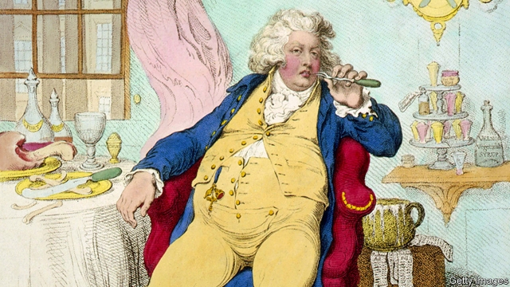

###### Prince charmless

# Sex, drugs and the birth of modernity 

##### An entertaining history shows that the Regency period deserves to be better known 

 

> May 23rd 2019 

The Regency Years: During Which Jane Austen Writes, Napoleon Fights, Byron Makes Love, and Britain Becomes Modern. By Robert Morrison.W.W. Norton; 416 pages; $29.95 

IF A SINGLE man in possession of a large fortune must be in want of a wife, that is nothing to how a regent in possession of a large debt tends to feel. By 1795 Britain’s dissolute Prince Regent (pictured) had, through his passions for horses, mistresses and diamond-buttoned breeches, acquired debts of £630,000 (roughly £74m or $94m today); the unwelcome attentions of Parliament; and an even less welcome engagement to a wealthy cousin. 

The dialogue at the meeting of the betrothed would not be easily confused with Jane Austen’s. Upon seeing his bride, Caroline of Brunswick, the regent declared: “I am not well. Pray, get me a glass of brandy.” Caroline, meanwhile, announced: “I think he’s very fat and he’s nothing like as handsome as his portrait.” Of Mr Darcy-style smouldering there was little—not counting the fact that, on their wedding night, the regent got so drunk that he collapsed into the fireplace in the bridal chamber. 

It is a scene that deserves to be well-known but, like so much in the Regency period, it is not. “I awoke one morning and found myself famous,” Lord Byron, a Regency poet, once said. The period itself has suffered from the opposite problem. Sandwiched between the more solemn and substantial Georgian and Victorian eras, it has always felt like a transition, so flighty it is unable even to muster a proper monarch as its namesake. Today it is widely ignored, except perhaps through the lens of Austen’s writing or Napoleon’s fighting. 

What a shame, says Robert Morrison in his superb new book “The Regency Years”—the first on the period in 30 years. It is a hoary old criticism of Austen that she left the Napoleonic wars out of her work. That is the least of it, Mr Morrison writes. Her England also has “no Luddite riots, no steam locomotives, no displaced families of factory workers, and no contaminated rivers.” Austen skips discreetly over England’s thriving porn industry, its appalling opioid crisis and its burgeoning gay-rights movement. But they were there. 

As Mr Morrison’s subtitle contends, it was in this period—not its celebrated Victorian successor—that Britain started to become modern. Certainly there is much that feels contemporary. Take that opioid epidemic. At this time laudanum (a mixture of brandy and opium) was “an unremarkable part of daily life”, not only prescribed by doctors but flogged by bakers, grocers and publicans. Charles Lamb endured his cold with it; Austen’s mother alleviated her travel sickness with it; Samuel Taylor Coleridge composed “Kubla Khan” on it. Babies were dosed on Mother Bailey’s (doubtless effective) “Quieting Syrup”. 

It was also a period of sexual experimentation, liberation—and infection. The population of London’s prostitutes rose to an estimated 50,000; rates of disease soared accordingly. Regency rakes such as Byron were not only “mad, bad and dangerous to know”, they were even more dangerous to sleep with. Syphilis attacked without regard for rank or privilege. If you think the Elgin Marbles, snatched from Athens at this time, look dilapidated, that is nothing to the state of Lord Elgin himself. Shortly after selling the marbles to the British Museum, and with his nose viciously consumed by the disease, he retired from public life. 

This era also saw the birth of that most modern spectacle, the political sex scandal. In November 1815 the “most infamous Regency flagellant” (this being an age that offered competition for such a title), an MP named Sir Eyre Coote, entered Christ’s Hospital mathematical school, sent away the younger boys and paid the older ones for a bout of mutual flogging. The school nurse arrived to find him buttoning his breeches; England’s satirical press had come of age in time to make the very most of such a moment. Coote endured a cartoon by George Cruikshank, a vaunted caricaturist, and national humiliation. 

The Regency period lasted for less than a decade but, as Mr Morrison argues, “its many legacies are still all around us.” It was also, as this book amply proves, marvellously entertaining. It deserves to find itself a little more famous than it has been. 

