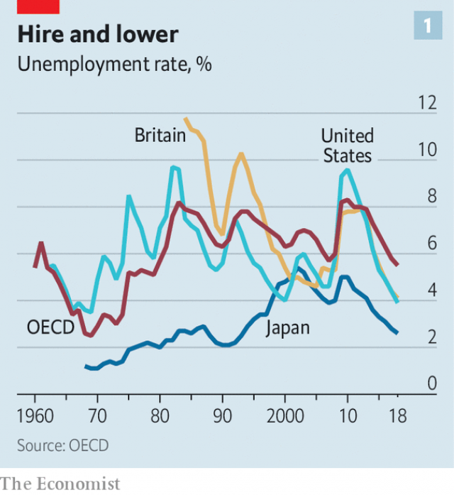
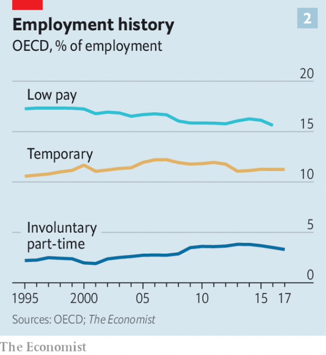
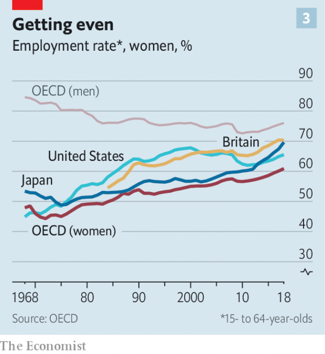

###### Working it

# Across the rich world, an extraordinary jobs boom is under way 

##### Many popular perceptions about the modern labour market are wrong 

 

> May 23rd 2019 

THE SECOND volume of “My Struggle”, Karl Ove Knausgaard’s enormous, maddening, brilliant autobiographical novels, contains some depressing life advice. “If I have learned one thing,” he sighs, “it is the following: don’t believe you are anybody. Don’t bloody believe you are somebody…Do not believe that you’re anything special. Do not believe that you’re worth anything, because you aren’t.” We like to tell ourselves that we deserve our successes, Mr Knausgaard’s book suggests, yet they are largely the product of forces over which we have no control. When he wrote those words he probably was not thinking about the boasts of politicians in the OECD, a club mainly of rich countries, about their jobs markets. But he might as well have been. 

“Unemployment numbers best in 51 years. Wow!” tweeted Donald Trump, America’s president, last month. Theresa May, the British prime minister, bragged in February that “employment is at a near-record high and unemployment at a near-record low.” The month before, Scott Morrison, Australia’s prime minister, crowed that “more than 730 jobs were created every day last year under our government.” Around the same time his Japanese counterpart, Shinzo Abe, let it be known that “the employment rate for young people is at a level surpassing all previous records.” Hence the swagger of politicians, who believe that they are special. But they are not. Jobs abound because of forces that largely have nothing to do with them. 

 

And abound they do. Across the OECD a jobs bonanza is under way. In the past five years the group has added 43m jobs. The unemployment rate—the number of people looking for work as a share of the total labour force—is at its lowest in decades (see chart 1). Not every member can celebrate. Unemployment in Italy, Spain and Greece remains higher than before the financial crisis of 2008-09. America’s rate of labour-force participation is still well off its all-time high. But most can. In 2018, the employment rate among people of working age was the highest ever in Britain, Canada, Germany, Australia and 22 other OECD countries. 

 

The boom is broad based. Unemployment among unskilled workers and the young is tumbling, as is long-term joblessness. The share of people working part-time because they cannot find jobs with longer hours remains higher than it was just before the financial crisis of 2008-09 but has fallen sharply since 2013 (see chart 2). America’s Bureau of Labour Statistics produces perhaps the widest official measure of unemployment, which includes involuntary part-timers as well as those who have dropped out of the labour force but nonetheless want to work. It is currently well below its long-run average. 

No one can argue about the scale of the jobs boom. But it has become a shibboleth at either end of the political spectrum that the quality of jobs on offer has nosedived. Driving Uber taxis or delivering meals are not really jobs at all, the argument goes. It is true that what Mr Trump regards as “jobs”—traditional, male-dominated occupations, such as those in manufacturing—have withered. Between 1995 and 2015 such middle-skilled jobs fell as a share of OECD employment by ten percentage points. Next month sees the publication of a book by David Blanchflower of Dartmouth College, and previously a member of the Bank of England’s monetary-policy committee, called “Not Working: Where Have All the Good Jobs Gone?”. Perhaps the growing difficulty of finding stable, well-paid employment in academia and journalism explains why the popular discourse about modern labour markets is so gloomy. 

The despondency might be justified were not popular perceptions about the world of work so obviously wrong. Consider the notion that work is ever more precarious. In fact, official estimates of America’s gig economy, whereby short-term freelance work is accessed through online market places, put it only at about 1% of total employment. Temporary employment may be a little higher than it was in the 1990s, yet the rate has been falling for a decade. In France the share of new hires given long-term permanent contracts recently reached an all-time high of 50%. 

The belief that people increasingly flit from job to job is also not borne out by fact. Over the past two decades the share of OECD workers who have been in their job for less than a year has hovered around 20%, with no clear trend up or down. The demise of jobs for the middlingly skilled has not proved a disaster either. Although it has meant that low-skilled jobs have risen as a share of OECD employment they have done so to a far lesser extent than high-skilled ones, which have boomed. 

Until recently a missing piece of the puzzle was wage growth. Economics textbooks say that times of low unemployment go hand in hand with juicy pay rises as employers compete harder for staff. Yet for much of the post-crisis period the “Phillips curve” appeared broken, with falling unemployment in 2014-16 failing to translate into higher wages. 

The relationship has started to rekindle. As unemployment has continued to fall wages are at last accelerating. A broader measure of whether work pays, where the total of all compensation is expressed as a share of national income, is rising in many rich countries, including America and Britain. Pay is still increasing more slowly than might have been expected given the tightness of the labour market. For that, blame weak productivity growth. And it is wrong to conclude that workers are ever more exploited. The incidence of “low pay”—workers who earn less than two-thirds of the median—has been falling for two decades. 

Red-hot labour markets do not solve every problem. Malaga’s restaurants are buzzing and its streets are clean. You would hardly know that the Spanish city’s average unemployment rate over the past five years has been close to 30%. The one sign that there may be lots of people with not much to do is the number of gaming arcades. The rough sleepers and empty lots of San Francisco scream of a city with an unemployment problem; in fact the rate is 2.6%. 

Others make deeper criticisms of the rosy jobs numbers. Shouldn’t societies aspire to work less, rather than more? People who do not need to engage in wage-labour can indulge in other, more fulfilling activities. David Graeber, an anthropologist, goes further. In “Bullshit Jobs”, a book published last year which has become akin to a holy tract for millennial socialists, he claims that a big chunk of modern employment is pointless and soul-sucking. “Huge swathes of people, in Europe and North America in particular, spend their entire working lives performing tasks they secretly believe do not really need to be performed,” he argues. 

It is hard to dismiss the feeling that drudgery is the price Japan has paid for an average unemployment rate over the past half-century of just 3%, the lowest in the OECD. At the baggage-collection area of Haneda airport, a woman spends her day straightening suitcases after they are placed on the conveyor belt. At an empty bar in Tokyo’s fashion district a world-beating gin martini (the addition of a single drop of orange bitters is a revelation) is mixed by three people, who then stand around as it is drunk. Mr Graeber would surely argue that this is less a sign of social progress and more that capitalism has conspired to turn people into drones. 

But societies benefit from strong labour markets. More workers means more people paying income tax and fewer receiving benefits. Studies suggest that the unemployment rate is positively correlated with rates of property crime and even with violent crime. Having a job gives people a sense of purpose which is also good for all sorts of social outcomes, including mental and physical health. And being in work makes another, better job easier to get. Capitalism has not been able to tell many good-news stories of late. This is one of them. 

The reason for the strength of the OECD’s labour market is a puzzle, however. In recent years many governments have loaded employers with extra costs, even as it is becoming ever easier to replace people with robots. A study in 2013 by Carl Benedikt Frey and Michael Osborne of Oxford University concluded that 47% of jobs in America were at risk of being automated. Rules have proliferated on equal pay, anti-discrimination, health and safety, and maternity and paternity leave. Across 24 OECD countries for which there are long-run data, the value of the minimum wage has risen from 44% of full-time median earnings in 2000 to 50% today. 

Why are labour markets so buoyant? This is in part a cyclical phenomenon. Economic growth tends to push unemployment down. The recovery from the financial crisis is a decade old. In part because of appropriately lax monetary policy, America is about to achieve its longest-ever period of economic expansion. Meanwhile, lingering uncertainty related to the financial crisis and the rise of populism may mean that firms are keener on hiring staff than on devoting large amounts of capital to investment, which is harder to undo. The post-crisis period has also been characterised by rapid growth in the service sector, which is more labour-intensive than industry. For all these reasons it is no surprise that unemployment is relatively low. 

But not this low. In October 2013 the IMF made economic forecasts for advanced economies for the following five years. On the assumption that annual GDP growth would average 2.4%, they concluded that by 2018 the rate of unemployment would be 6.9%. It turned out that the IMF was too optimistic on growth and too pessimistic on unemployment, which by 2018 had fallen to around 5%. That suggests it is not only a cyclical phenomenon. Long-term structural changes to demography, technology and policy play an equally significant role. 

Take demography. The OECD is ageing. Young people on average are more likely to be registered as unemployed than their elders, in part because they are less skilled but also because older folk who lose a job may retire and thus drop out of the labour force. Several studies draw a link between more young people and higher unemployment. In the 1980s, a time of relatively high joblessness, 25% of the rich world’s working-age population was aged 15 to 24. That has since fallen to around 17.5%. 

Demographic change, in other words, means that today’s unemployment rate is not directly comparable with those of the past. By one estimate, had America’s demographic structure in 2000 remained the same today, the current rate of unemployment would be around 0.5 percentage points higher. Oxford Economics, a consultancy, finds results for the euro zone that are similar. 

Yet tumbling unemployment is about much more than statistical trickery. The second big factor, technological change, is genuinely strengthening labour markets. Better tech improves the “matching” of employers with potential employees. Not long ago those hiring put an advert in a local newspaper or spread the word by mouth. Now employers can shoot from the hip, posting vacancies on a slew of jobs websites. In the ten years to 2016 the cost of filling a vacancy fell by 80% in real terms. And candidates are more likely to spot a job that suits them. A study in 2011 by Peter Kuhn and Hani Mansour found that using the internet to look for a job reduced the time spent unemployed by about a quarter. OECD countries with high worklessness are often those where online job searching is less common. Only 40% of unemployed Italians do it, compared with over 95% of South Koreans. 

The gig economy, even if it is relatively small-scale, also raises employment by creating work that would not otherwise exist. In the past fixing a tap would have been a DIY job; now with the tap of a screen it is possible to pay someone else to do it. 

A series of small, incremental changes to policy over many decades is the third factor behind a jobs boom for which the current crop of politicians are so keen to take credit. Governments have offered carrots and sticks. Carrots include making it easier for women to combine work and family. In many countries rights for part-time workers have been strengthened and parental leave made more generous, with the state often bearing the cost. Mr Abe’s economic-reform package includes providing more day-care centres for children. 

 

Such policies can have a large impact on labour-force participation, particularly for women, suggests research by Francine Blau and Lawrence Kahn, published in 2013. Female employment rates have been edging up across the OECD for decades. While in America female employment has since fallen, across the OECD as a whole the pace of growth has quickened (see chart 3). 

Another carrot is education. The share of OECD workers with some form of higher education has risen from 22% in 2000 to nearly 40% today. These workers are more likely to be in employment than poorly qualified folk. Higher education usually instils a superior work ethic and such workers have more transferable skills. 

Governments have wielded the stick, too. Many have reduced the power of trade unions and collective-bargaining agreements. That may have made wages more responsive to market conditions. A larger share of workers appears to be experiencing nominal wage reductions than was the case a few decades ago. Receiving a pay cut is unpleasant and embarrassing. But if bosses can trim pay during bad times, they are less likely to fire workers. Wages in Japan move down almost as easily as they do up. An unusually large share of workers’ take-home pay is made up of bonuses, which can be withheld fairly easily during times of economic trouble. In Japan’s hospitality sector in 2009, workers’ end-of-year bonuses were cut by over 40%. 

In countries that have failed to update old-fashioned labour practices, the cost of doing so has been high. In Italy nearly 350 national industrial agreements cover the vast majority of firms and formal employees. They take little account of regional differences in the cost of living and productivity. That prices many workers in the poor south out of the labour market. Spain’s collective-bargaining agreements are often rigid in the face of changing conditions. In 2008-09, when a building bust pushed the economy into recession, nominal wages in construction rose by 5%. Bosses had little choice but to shed staff. 

Governments have also made it difficult to live off handouts. In 2001 a single childless person earning the average wage, who then became unemployed for a year, would have received benefits worth 48% of previous earnings. By 2018 that had fallen to 41%. Would-be recipients of benefits face ever-tougher eligibility tests. Over the past two decades the number of Britons receiving jobless benefits, as a share of those out of work, has fallen from 80% to 50%. That may, in turn, have made wages more flexible. Workers will take wage cuts if necessary in order to avoid unemployment. 

 

Reforms such as these are harsh and their implementation has often been botched. Yet they can have a big effect on jobs. In one paper Marcus Hagedorn, Iourii Manovskii and Kurt Mitman look at what happened in America in 2013, where the time for which some people could claim unemployment benefit fell from 73 weeks to 25. They estimate that the benefit cut led to the creation of some 2m jobs in 2014 about two-thirds of total employment growth that year. 

The strength of the labour market calls into question gloomy predictions about the future of work—that increasingly sophisticated computers will consign growing numbers of workers to a life of enforced idleness. Messrs Frey and Osborne could still be proved correct at some point in the future. Accelerating wage growth will certainly persuade more companies to automate jobs. 

Yet the lesson of the past half-millennium is that technological change complements jobs rather than destroys them. Sky-high employment rates today suggest that nothing has changed. And there is plenty of evidence pointing in the direction of more improvements. The current period of economic expansion seems to have further to go. If there is a lesson from the 1960s, when unemployment in some OECD countries fell as low as 1%, it is that there remains more scope to reduce underemployment and inactivity. Mr Knausgaard finds room for some practical advice amid the detailed accounts of his struggles: “So keep your head down and work.” If everyone follows it, the rich world’s jobs market could have more surprises in store. 

