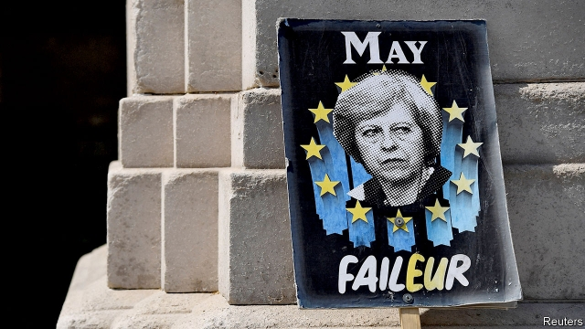

###### The bitter end of May

# Another British prime minister is destroyed by the Europe question 

##### Theresa May has reached the end of her failed premiership 

 

> May 23rd 2019 

THERESA MAY’S premiership has entered its surreal phase. On May 22nd the prime minister dutifully read out the ten points of her revised EU withdrawal bill to the House of Commons. The front bench next to her was half-empty, because several members of her cabinet were holed-up somewhere else discussing what to do next. The benches behind her emptied as she spoke. This was not just a prime minister without authority but a prime minister without an audience. 

The rest of the day was consumed with frantic rumours about her imminent resignation. The good news for Mrs May was that the 1922 Committee of backbench Tory MPs put off a decision to change the party’s rules in order to allow an immediate leadership challenge. The bad news, delivered an hour or so later, was that Andrea Leadsom, the leader of the House and the person responsible for bringing the withdrawal bill before the Commons, resigned, becoming the 36th minister to leave the government. Mrs May avoided further confrontations with disgruntled colleagues only by retreating to Downing Street and turning away ministers who asked to see her. “The sofa is up against the door, she’s not leaving,” remarked Iain Duncan-Smith, a former Tory leader. 

It is hard to see how Mrs May can hang on for long, even if she adds the kitchen sink to the sofa. The Conservatives are expecting a drubbing in this week’s European election, whose results will be announced on May 27th. Polls put the party in the single figures. Tory MPs from all sides of the party—liberals such as Tom Tugendhat as well as Brexiteers like Steve Baker—are calling for her to go. President Donald Trump may arrive for his state visit on June 3rd to a country without a prime minister. 

Mrs May has been under pressure to quit for months. What brought matters to a head this week was her revised withdrawal bill. In her plodding style, she tried to win over various interest groups by offering something for everyone: strengthened workers’ rights to please the Labour left, an option for MPs to vote for a second referendum to entice Remainers. She ended up alienating them all. The Tory party’s Brexit wing erupted at the mention of a second referendum; Brexiteer ministers claim that Mrs May “exceeded what was agreed in cabinet”. As we went to press, Downing Street was still promising to bring forward the withdrawal bill on June 7th. If it does, it will go down to an even bigger defeat than last time. Even former converts such as Boris Johnson and Dominic Raab have said that they will vote against. 

How did the Conservative Party—an outfit that prides itself on its age, wisdom and ruthless appetite for power—get into such a mess? The British establishment has always been ambivalent about the European project, partly because it was on the winning side in the second world war and partly because it has historically seen Britain as a global power, not a continental one. That ambivalence curdled into hatred in some sections of the Tory party as the EU acquired more of the trappings of a state. 

The Brexit referendum of 2016 created a poisonous clash between direct and representative democracy. The Tories’ Brexit wing, convinced that it had the “will of the people” on its side, kept demanding an ever-purer version of Brexit. Those who lean towards Remain refused to vote for a hard Brexit that they thought would impoverish their constituents. As Mrs May’s hold on power has weakened, so has her ability to enforce a compromise. 

There is also a subtler reason. British politics still has not recovered from the financial crisis of 2008-09, and the blow that it dealt to the country’s globalised, light-regulation model of capitalism. The crisis not only led to a prolonged period of wage stagnation. It also stoked popular demand to “take back control” from the forces that had dominated the economy over the previous decades. The rise of the Labour left, under Jeremy Corbyn, was driven by a demand to discipline global companies that trample on local communities (Mr Corbyn spent much of prime minister’s question time this week lambasting Mrs May for the closure of British Steel). The rise of the nationalist right, most recently in the form of the Brexit Party, is propelled by a desire to insulate Britain from global uncertainty, particularly when it comes to immigration. 

The Conservatives are profoundly divided over what to do about this crisis. Broadly speaking, the right of the party wants to complete the Thatcher revolution by deregulating markets still further and slashing taxes. For them, leaving the EU is a prerequisite to turning Britain into an offshore Singapore. The left of the party, meanwhile, wants to return to the One Nation tradition that believes in a more active role for the state and in reining back the excesses of capitalism. 

Mrs May has proved to be just the wrong person to help the party out of this crisis. She has some of the right instincts—realising two years ago, for instance, that the government needed to increase its majority to avoid being held prisoner by clashing Tory factions, and that it had to deal with the unhappiness that led to Brexit. But she lacked the ability to make these things happen. She is an introvert who dislikes the rough-and-tumble of politics and who tries to run everything through a tiny group of advisers. When she was in her pomp she tried to exclude Parliament from having any say over the Brexit deal. 

The race to succeed her is already approaching a full gallop. It is a measure of how big a mess the party is in that some 20 MPs have signalled that they are running, offering a bewildering range of policies. The favourite is Mr Johnson (see Bagehot). 

It is still unclear what will happen when Mrs May does indeed resign—whether she will stay on while a successor is chosen, when the contest will conclude, and whether her successor will feel obliged to call a general election. But one thing is clear. For all Mrs May’s many failings as a politician, she was also the victim of powerful forces that show no sign of abating. 

Award: The Economist’s Open Future initiative was named editorial campaign of the year at the British Media Awards this week. Read more about it at Economist.com/openfuture 

